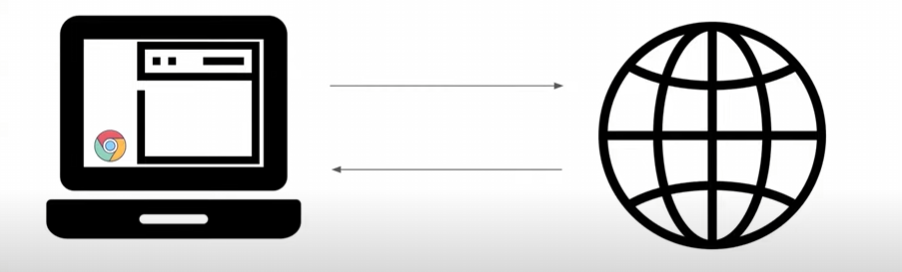
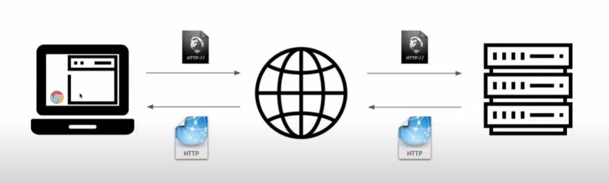
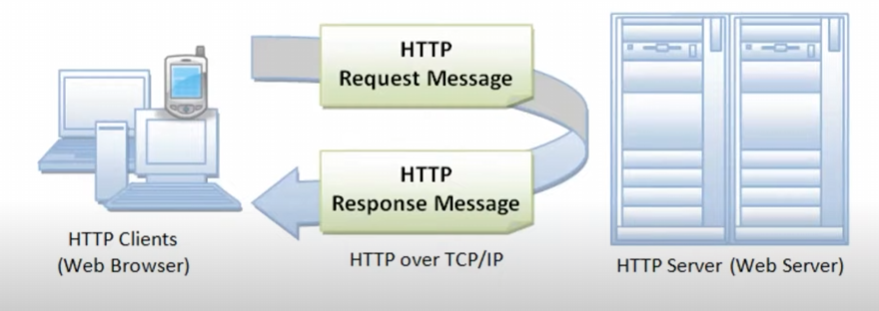
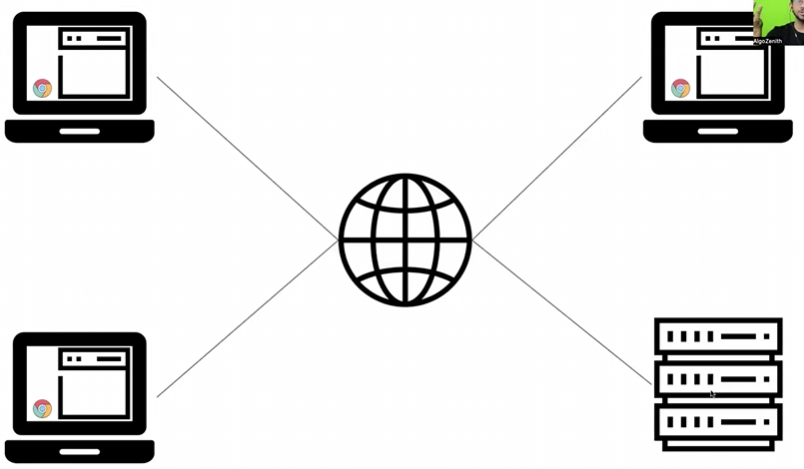
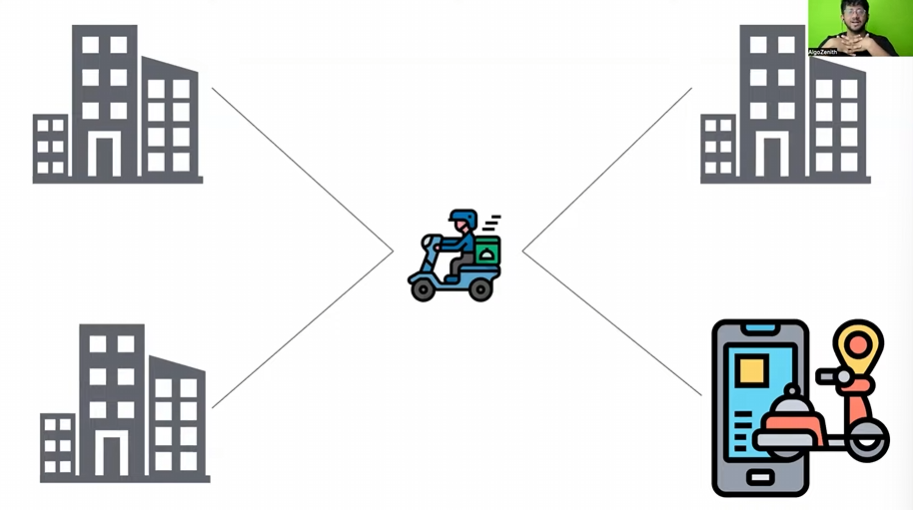
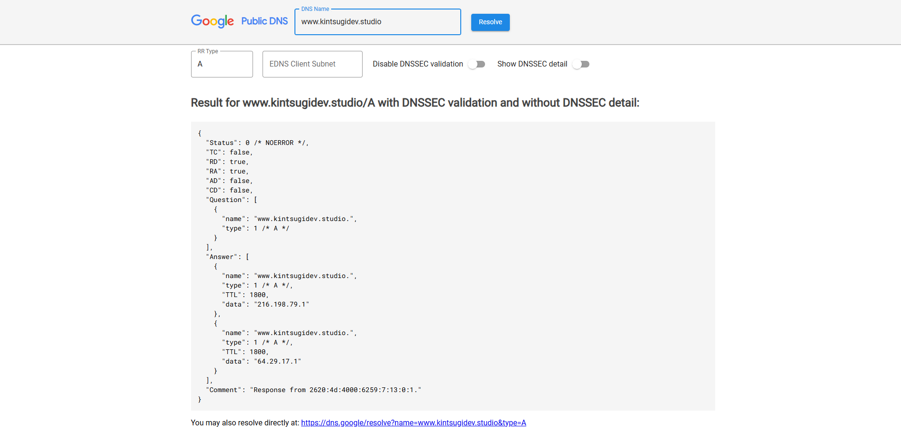
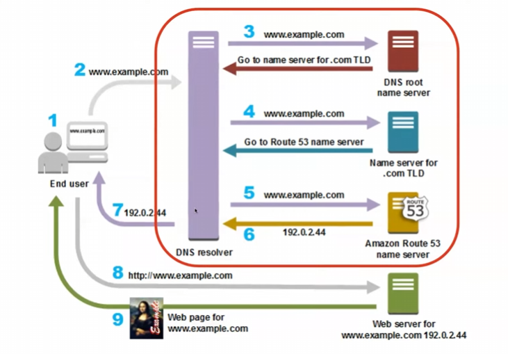
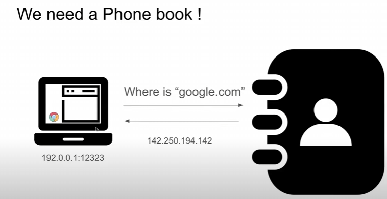
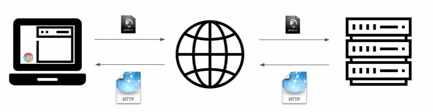
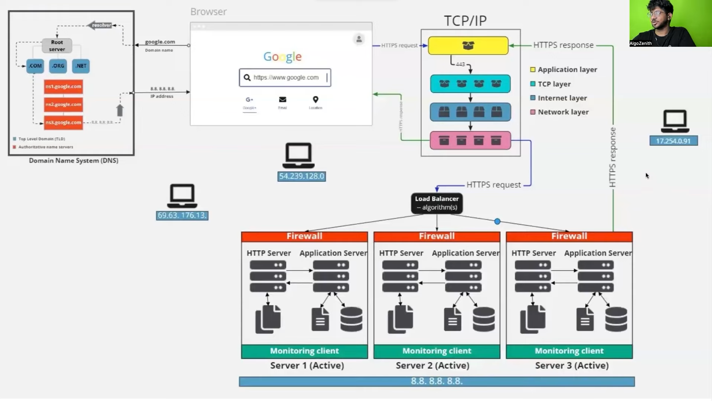

# CN
> “We are all now connected by the Internet, like neurons in a giant brain.” — Stephen Hawking, Theoretical Physicist

- Author: [Kintsugi-Programmer](https://github.com/kintsugi-programmer)

> Disclaimer: The content presented here is a curated blend of my personal learning journey, experiences, open-source documentation, and invaluable knowledge gained from diverse sources. I do not claim sole ownership over all the material; this is a community-driven effort to learn, share, and grow together.

## Table of Contents
- [CN](#cn)
  - [Table of Contents](#table-of-contents)
- [Computer Networks World | in NutShell](#computer-networks-world--in-nutshell)
  - [Computer Networks Fundamentals and Context](#computer-networks-fundamentals-and-context)
    - [Introduction and Subject Scope](#introduction-and-subject-scope)
    - [Transition from Operating Systems (OS)](#transition-from-operating-systems-os)
    - [The Need for the Internet](#the-need-for-the-internet)
  - [Client-Server Model and Basic Flow](#client-server-model-and-basic-flow)
    - [Defining Client and Server](#defining-client-and-server)
    - [Protocols and Data Packets](#protocols-and-data-packets)
    - [Basic Request/Response Flow (HTTP)](#basic-requestresponse-flow-http)
  - [Addressing Systems](#addressing-systems)
    - [The Need for Addressing](#the-need-for-addressing)
    - [**IP Addresses (Computer Identification)**](#ip-addresses-computer-identification)
    - [**Ports (Application Identification)**](#ports-application-identification)
    - [DNS (Domain Name System)](#dns-domain-name-system)
      - [DNS Resolution Process](#dns-resolution-process)
      - [Caching Mechanisms](#caching-mechanisms)
      - [Hierarchical Structure](#hierarchical-structure)
      - [Name Records](#name-records)
  - [High-Level Internet Picture](#high-level-internet-picture)
    - [Infrastructure Components](#infrastructure-components)
    - [Cloud Computing](#cloud-computing)
  - [Web Development Basics (Front-end \& Back-end)](#web-development-basics-front-end--back-end)
    - [Core Front-end Languages](#core-front-end-languages)
      - [Types of HTML](#types-of-html)
    - [Rendering Strategies](#rendering-strategies)
    - [Abstraction in Development (Frameworks)](#abstraction-in-development-frameworks)
    - [API Calls and Routing](#api-calls-and-routing)
  - [The Network Stack (OSI \& TCP/IP Models)](#the-network-stack-osi--tcpip-models)
    - [Introduction to the Stack](#introduction-to-the-stack)
    - [Layered Architecture](#layered-architecture)
    - [Encapsulation Process (Adding Headers)](#encapsulation-process-adding-headers)
    - [Layer Functionalities](#layer-functionalities)
  - [Detailed Data Packet Transfer Simulation (Hop-to-Hop)](#detailed-data-packet-transfer-simulation-hop-to-hop)
    - [Network Hops](#network-hops)
    - [Key Network Components](#key-network-components)
    - [Addressing Mechanisms (IP vs. MAC Address)](#addressing-mechanisms-ip-vs-mac-address)
    - [Core Tables Maintained](#core-tables-maintained)
    - [Simulation Steps (Detailed Breakdown)](#simulation-steps-detailed-breakdown)
      - [Phase 1: Addressing Resolution via ARP](#phase-1-addressing-resolution-via-arp)
      - [Phase 2: Data Transfer to the Gateway](#phase-2-data-transfer-to-the-gateway)
      - [Phase 3: Data Transfer to the Server (Across Router)](#phase-3-data-transfer-to-the-server-across-router)
  - [Key Network Concepts and Interview Topics](#key-network-concepts-and-interview-topics)
    - [Data Transfer Delivery Types](#data-transfer-delivery-types)
    - [Firewall](#firewall)
    - [Proxy Servers](#proxy-servers)
    - [VPN (Virtual Private Network) vs. Proxy](#vpn-virtual-private-network-vs-proxy)
    - [Generational Wireless Networks (3G, 4G, 5G)](#generational-wireless-networks-3g-4g-5g)
    - [Other Common Interview Questions](#other-common-interview-questions)
- [Chapter 1: Introduction to Computer Network](#chapter-1-introduction-to-computer-network)
  - [Chapter 1.1.: Introduction: Computer Networks and Basic Terminologies](#chapter-11-introduction-computer-networks-and-basic-terminologies)
    - [Computer Networks and its Features](#computer-networks-and-its-features)
      - [Features of Computer Networks](#features-of-computer-networks)
    - [Computer Network Components](#computer-network-components)
  - [Chapter 1.2.: Layering \& Protocols (OSI Model and Its 7 Layers)](#chapter-12-layering--protocols-osi-model-and-its-7-layers)
    - [Introduction to the OSI Model](#introduction-to-the-osi-model)
      - [Principles used to arrive at the Seven Layers:](#principles-used-to-arrive-at-the-seven-layers)
    - [7 Layers of the OSI Model](#7-layers-of-the-osi-model)
      - [1. Physical Layer (Layer 1)](#1-physical-layer-layer-1)
      - [2. Data Link Layer (Layer 2)](#2-data-link-layer-layer-2)
      - [3. Network Layer (Layer 3)](#3-network-layer-layer-3)
      - [4. Transport Layer (Layer 4)](#4-transport-layer-layer-4)
      - [5. Session Layer (Layer 5)](#5-session-layer-layer-5)
      - [6. Presentation Layer (Layer 6)](#6-presentation-layer-layer-6)
      - [7. Application Layer (Layer 7)](#7-application-layer-layer-7)
    - [Layering and Protocols](#layering-and-protocols)
    - [Importance of Layering](#importance-of-layering)
  - [Chapter 1.3.: TCP/IP Model](#chapter-13-tcpip-model)
    - [Overview of the TCP/IP Model Layers](#overview-of-the-tcpip-model-layers)
      - [1. Application Layer](#1-application-layer)
      - [2. Transport Layer](#2-transport-layer)
      - [3. Internet Layer](#3-internet-layer)
      - [4. Network Access Layer](#4-network-access-layer)
    - [Key Differences Between the TCP/IP Model and OSI Model](#key-differences-between-the-tcpip-model-and-osi-model)
    - [Practical Use of the TCP/IP Model](#practical-use-of-the-tcpip-model)
    - [Summary of the TCP/IP Model](#summary-of-the-tcpip-model)
  - [Chapter 1.4.: Network Topologies](#chapter-14-network-topologies)
  - [Chapter 1.5.: Categories of Networks](#chapter-15-categories-of-networks)
  - [Chapter 1.6.: Network Architectures](#chapter-16-network-architectures)
- [Chapter 2: Physical and MAC Layer](#chapter-2-physical-and-mac-layer)
  - [Chapter 2.1.: Physical Layer](#chapter-21-physical-layer)
    - [Different Types of Transmission Media](#different-types-of-transmission-media)
    - [1. Guided (Wired) Media](#1-guided-wired-media)
    - [2. Unguided (Wireless) Media](#2-unguided-wireless-media)
  - [Chapter 2.2.: Transmission Switching](#chapter-22-transmission-switching)
    - [Packet Switching](#packet-switching)
      - [Key Characteristics of Packet Switching](#key-characteristics-of-packet-switching)
      - [Protocols Used](#protocols-used)
      - [How It Works](#how-it-works)
      - [Advantages of Packet Switching](#advantages-of-packet-switching)
      - [Disadvantages of Packet Switching](#disadvantages-of-packet-switching)
      - [Use Cases](#use-cases)
    - [Circuit Switching](#circuit-switching)
      - [Key Characteristics of Circuit Switching](#key-characteristics-of-circuit-switching)
      - [How It Works](#how-it-works-1)
      - [Phases of Circuit Switching](#phases-of-circuit-switching)
      - [Advantages of Circuit Switching](#advantages-of-circuit-switching)
      - [Disadvantages of Circuit Switching](#disadvantages-of-circuit-switching)
      - [Use Cases](#use-cases-1)
    - [Key Differences Between Packet Switching and Circuit Switching](#key-differences-between-packet-switching-and-circuit-switching)
    - [Hybrid Approach (MPLS)](#hybrid-approach-mpls)
  - [Chapter 2.3.: IP Address and MAC Address](#chapter-23-ip-address-and-mac-address)
    - [IP Address](#ip-address)
    - [MAC Address](#mac-address)
    - [Features of IP Address and MAC Address](#features-of-ip-address-and-mac-address)
  - [Chapter 2.4.: Bridges and Repeaters](#chapter-24-bridges-and-repeaters)
    - [Bridge](#bridge)
    - [Repeater](#repeater)
    - [Features of Bridges \& Repeaters](#features-of-bridges--repeaters)
- [Chapter 3: Data Link Layer](#chapter-3-data-link-layer)
- [Chapter 3.1.: Framing, Addressing, Flow Control \& Access Control](#chapter-31-framing-addressing-flow-control--access-control)
  - [Framing](#framing)
  - [Addressing](#addressing)
  - [Flow Control](#flow-control)
  - [Access Control](#access-control)
- [Chapter 3.2.: Error Detection (Parity, CRC), Sliding Window, Stop-and-Wait Protocols](#chapter-32-error-detection-parity-crc-sliding-window-stop-and-wait-protocols)
  - [Error Detection](#error-detection)
    - [Parity](#parity)
    - [Cyclic Redundancy Check (CRC)](#cyclic-redundancy-check-crc)
  - [Sliding Window Protocol](#sliding-window-protocol)
  - [Stop-and-Wait Protocol](#stop-and-wait-protocol)
- [Chapter 4: Network Layer](#chapter-4-network-layer)
  - [Chapter 4.1.: Network Layer and Protocols](#chapter-41-network-layer-and-protocols)
    - [Definition](#definition)
    - [Key Protocols](#key-protocols)
      - [Internet Protocol (IP)](#internet-protocol-ip)
      - [ICMP (Internet Control Message Protocol)](#icmp-internet-control-message-protocol)
      - [ARP (Address Resolution Protocol)](#arp-address-resolution-protocol)
      - [RIP (Routing Information Protocol)](#rip-routing-information-protocol)
      - [OSPF (Open Shortest Path First)](#ospf-open-shortest-path-first)
    - [Port](#port)
    - [Subnetting in Computer Networks](#subnetting-in-computer-networks)
    - [Public and Private IP Addresses](#public-and-private-ip-addresses)
      - [Public IP Addresses](#public-ip-addresses)
      - [Private IP Addresses](#private-ip-addresses)
    - [IPv4 Address and IPv6 Address](#ipv4-address-and-ipv6-address)
      - [IPv4 Address](#ipv4-address)
      - [IPv6 Address](#ipv6-address)
  - [Chapter 4.2.: Network Address Translation (NAT)](#chapter-42-network-address-translation-nat)
  - [Chapter 4.3.: Quality of Service (QoS) in Computer Networks](#chapter-43-quality-of-service-qos-in-computer-networks)
  - [Chapter 4.4.: Internet Control Message Protocol (ICMP)](#chapter-44-internet-control-message-protocol-icmp)
  - [Chapter 4.5.: Routing Protocols \& Routing Table](#chapter-45-routing-protocols--routing-table)
    - [Routing Protocols](#routing-protocols)
    - [Routing Table](#routing-table)
    - [Intradomain \& Interdomain Routing](#intradomain--interdomain-routing)
      - [Intradomain Routing](#intradomain-routing)
      - [Interdomain Routing](#interdomain-routing)
    - [Distance Vector Routing Algorithm](#distance-vector-routing-algorithm)
    - [Link State Routing Algorithm](#link-state-routing-algorithm)
- [Chapter 5: Transport and Application Layer](#chapter-5-transport-and-application-layer)
  - [Chapter 5.1.: Application Layer in OSI Model](#chapter-51-application-layer-in-osi-model)
  - [Chapter 5.2.: World Wide Web (WWW) \& How it Works](#chapter-52-world-wide-web-www--how-it-works)
  - [Chapter 5.3.: Application Layer Protocols in Computer Networks](#chapter-53-application-layer-protocols-in-computer-networks)
    - [Hypertext Transfer Protocol (HTTP)](#hypertext-transfer-protocol-http)
    - [Simple Mail Transfer Protocol (SMTP)](#simple-mail-transfer-protocol-smtp)
    - [File Transfer Protocol (FTP)](#file-transfer-protocol-ftp)
    - [DNS (Domain Name System)](#dns-domain-name-system-1)
  - [Chapter 5.4.: Transport Layer \& Its Protocols](#chapter-54-transport-layer--its-protocols)
    - [Definition](#definition-1)
    - [Key Functions](#key-functions)
    - [Protocols](#protocols)
      - [TCP (Transmission Control Protocol)](#tcp-transmission-control-protocol)
      - [UDP (User Datagram Protocol)](#udp-user-datagram-protocol)
  - [Chapter 5.5.: User Datagram Protocol (UDP)](#chapter-55-user-datagram-protocol-udp)
    - [Definition](#definition-2)
    - [Use Cases](#use-cases-2)
    - [Features](#features)
  - [Chapter 5.6.: Transmission Control Protocol (TCP)](#chapter-56-transmission-control-protocol-tcp)
    - [Definition](#definition-3)
    - [Key Features](#key-features)
    - [TCP 3-Way Handshake](#tcp-3-way-handshake)
      - [Definition](#definition-4)
      - [Steps](#steps)
      - [Purpose](#purpose)
    - [The Two Generals Problem in TCP](#the-two-generals-problem-in-tcp)
      - [Definition](#definition-5)
      - [Relation to TCP](#relation-to-tcp)
    - [TCP Flow Control](#tcp-flow-control)
      - [Definition](#definition-6)
      - [Mechanism](#mechanism)
      - [Purpose](#purpose-1)
    - [Sliding Window](#sliding-window)
      - [Definition](#definition-7)
      - [How It Works](#how-it-works-2)
    - [Go-Back-N ARQ](#go-back-n-arq)
      - [Definition](#definition-8)
      - [Disadvantage](#disadvantage)
    - [Selective Repeat ARQ](#selective-repeat-arq)
      - [Definition](#definition-9)
      - [Advantage](#advantage)
    - [TCP Congestion Control](#tcp-congestion-control)
      - [Definition](#definition-10)
      - [Mechanisms](#mechanisms)
    - [Difference Between TCP and UDP](#difference-between-tcp-and-udp)
- [Others](#others)
  - [OSI Model and Network Concepts](#osi-model-and-network-concepts)
    - [1. What is the OSI Model, and can you describe its layers?](#1-what-is-the-osi-model-and-can-you-describe-its-layers)
      - [Follow-up Questions:](#follow-up-questions)
    - [2. What is the difference between TCP and UDP?](#2-what-is-the-difference-between-tcp-and-udp)
      - [Follow-up Questions:](#follow-up-questions-1)
    - [3. Explain subnetting and its benefits.](#3-explain-subnetting-and-its-benefits)
      - [Follow-up Questions:](#follow-up-questions-2)
    - [4. What is a VLAN, and why is it used?](#4-what-is-a-vlan-and-why-is-it-used)
      - [Follow-up Questions:](#follow-up-questions-3)
    - [5. Describe the role of a router in a network.](#5-describe-the-role-of-a-router-in-a-network)
      - [Follow-up Questions:](#follow-up-questions-4)
    - [6. What is NAT, and how does it work?](#6-what-is-nat-and-how-does-it-work)
      - [Follow-up Questions:](#follow-up-questions-5)
    - [7. Explain the concept of a firewall.](#7-explain-the-concept-of-a-firewall)
      - [Follow-up Questions:](#follow-up-questions-6)
    - [8. What is the purpose of DNS?](#8-what-is-the-purpose-of-dns)
      - [Follow-up Questions:](#follow-up-questions-7)
  - [Virtual Private Network (VPN)](#virtual-private-network-vpn)
    - [Advantages of VPN](#advantages-of-vpn)
    - [Types of VPN](#types-of-vpn)
  - [Addressing and Network Models](#addressing-and-network-models)
    - [IPv4 Address](#ipv4-address-1)
  - [Key Protocols and Differences](#key-protocols-and-differences)
    - [HTTP and HTTPS](#http-and-https)
    - [DNS (Domain Name System)](#dns-domain-name-system-2)
      - [Working of DNS](#working-of-dns)
      - [DNS Forwarder](#dns-forwarder)
    - [SMTP Protocol (Simple Mail Transfer Protocol)](#smtp-protocol-simple-mail-transfer-protocol)
    - [Difference Between TCP and UDP](#difference-between-tcp-and-udp-1)
    - [Protocol Elements](#protocol-elements)
    - [Important Protocols (Other)](#important-protocols-other)
    - [MAC address and IP address](#mac-address-and-ip-address)
  - [Commands, Devices, and Network Concepts](#commands-devices-and-network-concepts)
    - [Configuration Commands](#configuration-commands)
    - [Firewall](#firewall-1)
    - [Core Network Flow: What happens when you enter google.com](#core-network-flow-what-happens-when-you-enter-googlecom)
    - [Hub and Switch](#hub-and-switch)
    - [Subnetting](#subnetting)
    - [Network Reliability and Efficiency](#network-reliability-and-efficiency)
      - [Reliability Factors](#reliability-factors)
      - [Effectiveness and Efficiency Criteria](#effectiveness-and-efficiency-criteria)
    - [Node and Link](#node-and-link)
    - [Gateway and Router](#gateway-and-router)
    - [NIC (Network Interface Card)](#nic-network-interface-card)
    - [POP3 (Post Office Protocol version 3)](#pop3-post-office-protocol-version-3)
    - [IP Address Types](#ip-address-types)
    - [RAID (Redundant Array of Inexpensive/Independent Disks)](#raid-redundant-array-of-inexpensiveindependent-disks)
    - [Utilities](#utilities)
    - [Peer-to-Peer Processes (P2P)](#peer-to-peer-processes-p2p)
    - [Communication Types](#communication-types)


# Computer Networks World | in NutShell

## Computer Networks Fundamentals and Context

### Introduction and Subject Scope

**Computer Networks** is considered a lighter subject compared to Operating Systems (OS). There are only a few fundamental things that need to be known, and understanding these will allow most questions to be answered.

Networks are more important than subjects like Compilers or Computer Organization and Architecture (COA) because networks are essentially the **backbone of the internet today**.

Key topics covered include:
*   The network stack.
*   How actual data transfers happen hop-to-hop.
*   Understanding the ARP protocol, routing tables, MAC address tables, and how sender/receiver tables are populated.
*   How data packets travel and how headers are changed.

### Transition from Operating Systems (OS)

Previously, `OS` was discussed as sitting on the computer and` working as a program manager`. OS manages everything, including:
*   How processes and functions interact.
*   How code gets executed and reaches the core.
*   Managing memory and writing things to disk.

The understanding built around `OS was that it handles everything internally within the computer`.

### The Need for the Internet

People desired more features and wanted to create **the Internet**, allowing computers and things on the globe to connect.

The requirement was to run programs on *some other computer* and receive the results in one's own browser, rather than just running programs compiled and executed on the same computer. This requirement led to the development of ideas on how to support these connections.

Key questions that arose included:
1.  How does the data travel across the network?
2.  How to design independent pieces of software (like Chrome browser or server software).

A common interview question is: **"How does the Internet work?"** or specific details like, **"When you type google.com, how is that served?"**.

## Client-Server Model and Basic Flow

### Defining Client and Server

**Client** 
- A computer or entity 
- where the browser is running, 
- which 
  - **raises a request to view a page**
  - & **receives the result**.

*   Generally, **anything that starts the process** is the client.
*   The client requests a resource or data.

A **Server processes the request sends a response**.
*   A **Web Server** specifically processes HTTP/HTTPS requests received over the internet.
*   Servers can exist for other contexts as well.

### Protocols and Data Packets

People defined certain **Protocols**.
*   A `protocol is like a language needed to communicate`.
*   Protocols are a fixed set of rules.

What is sent on the internet is called **Data Packets**.
*   Anything traveling on the internet is called a data packet.

An example of a protocol is **HTTP** (Hypertext Transfer Protocol). When a user types a URL (e.g., `www.google.com`), an HTTP request is made following the protocol and sent onto the internet.

### Basic Request/Response Flow (HTTP)

1.  The client types a URL (e.g., `www.google.com`).
2.  The client sends an **HTTP request** onto the Internet.
3.  The request travels to the server where the backend/server code resides.
4.  The server reads the HTTP request, processes it, and generates an **HTTP response**.
5.  The HTTP response travels back across the Internet.
6.  The client's browser receives the data and displays it on the web page.

The fundamental challenge in this flow is **how the data travels magically across the internet**.

## Addressing Systems

### The Need for Addressing

Since many computers and web servers (which are also just computers running specific software) are connected to the Internet, a way to know where to send the data is required.

Just like ordering food requires an address for pickup (restaurant) and delivery (user), **some sort of addressing system must be built**.

### **IP Addresses (Computer Identification)**

The required address is known as the **IP Address** (Internet Protocol Address).

Every computer on the internet has an IP Address.
*   Example format: `192.168.1.1`.
*   **IPv4** (Fourth Version of IP) uses numbers separated by dots, generally using 256 numbers possible for each segment.

If a computer's IP address is known, one can type it into the browser to reach that address (e.g., trying to open `8.8.8.8` which is Google’s Public DNS https://dns.google/ ).

### **Ports (Application Identification)**

There is a need for a **two-phase addressing system**:
1.  Which computer should the response go to (IP Address).
2.  Inside that computer, which application/window should receive the response (Port).

Different applications run on different ports within a computer.
*   Example: A web server might be hosted at a specific IP address and a specific port.
*   **HTTP** by default uses port **80**. Web servers typically open at port 80.

### DNS (Domain Name System)

IP addresses are not fixed, or if they are fixed, knowing a new computer's IP address is difficult. People built simpler systems to help identify resources.

People rely on **Domain Names** (e.g., `google.com`).



#### DNS Resolution Process
DNS acts like a **phone book system**.
*   It is a **function that takes a domain name and converts it to its corresponding IP address**.
*   This process is necessary because **IP addresses can change dynamically**.

When a request is made:
1.  The request first goes to the **DNS Resolver**, usually owned by the Internet Service Provider (ISP).
2.  The DNS Resolver checks its **cache**.

#### Caching Mechanisms
*   The DNS Resolver has its own cache to save recently resolved domain names.
*   A **TTL** (Time To Live) defines how long a record stays in the cache. If the same domain (e.g., `example.com`) is asked repeatedly within the TTL, the cached result is returned directly.
*   Caching is implemented at every level (user application, PC, DNS Resolver).
*   When space limits caching, the **LRU (Least Recently Used)** eviction policy is typically used.

#### Hierarchical Structure
If a domain (e.g., `www.example.com`) is new and not in the cache, the DNS Resolver uses a hierarchical structure:
1.  It asks the **DNS Root Name Server** for the Name Server of the Top-Level Domain (TLD), e.g., `.com`.
2.  The Root Server returns the Name Server for the TLD.
3.  The Resolver then asks the TLD Name Server (e.g., the `.com` Name Server) for the name server managing `example.com`.
4.  The TLD Name Server returns the IP address of the **Authoritative Name Server** (often hosted by services like AWS Route 53 or GoDaddy) that knows the final IP address.
5.  The hosting service (e.g., GoDaddy) registers the domain with the TLD name server.

#### Name Records
DNS involves specific record types, such as:
*   **A Records** (Address Records).
*   **C Name Records** (Canonical Name Records).
*   *Note: Detailed understanding of DNS records is often not required in general interviews*.

If multiple IP addresses are returned for a domain (e.g., two addresses for a website), generally any one can be connected to.

## High-Level Internet Picture

The "Internet" symbol (the globe) is often the **biggest piece of illusion** for developers, as the actual data travel path is complex.

### Infrastructure Components

When a request is sent, the flow includes:
1.  **DNS resolution** (Root Name Server, TLD, etc.).
2.  An **HTTP request** is made.
3.  **TCP/IP magic** happens.
4.  The request goes through **Load Balancers**.
5.  The request reaches **Application Servers**.
6.  The response travels back.

All these pieces (Load Balancers, Firewalls, Servers) are built using either hardware or software, and all can be coded. Algorithms are used, for example, in Load Balancer code.



### Cloud Computing

**Cloud computing** provides ready-made templates for infrastructure pieces (like small computers/servers).
*   Users do not need to host their own computers or servers.
*   The cloud provider provides the hardware at a remote location.
*   The user only needs to write the software inside it.

## Web Development Basics (Front-end & Back-end)

Web development involves writing code that runs on two primary locations:

1.  **Front-end:** The piece of software that runs on your browser (e.g., Chrome).
2.  **Back-end:** The piece of software that runs on the web server.

### Core Front-end Languages

To display content on a browser, developers must generally learn three famous languages:

| Language | Full Form | Purpose |
| :--- | :--- | :--- |
| **HTML** | HyperText Markup Language | Used to create the **skeletal structure** or markup. Tells the browser what to put in the head, body, etc.. |
| **CSS** | Cascading Style Sheets | Used for styling, such as defining colors, background colors, height, and width. |
| **JavaScript** | | Used to define interactions (e.g., what happens when clicked, making things pop up or disappear). JS can change the HTML structure, known as the **DOM (Document Object Model)**. |

#### Types of HTML
1.  **Non-semantic HTML:** Uses general tags like `div` for nesting and structure without conveying meaning.
2.  **Semantic HTML:** Uses specific names like `header`, `nav`, or `aside`. These have special purposes and are picked up by automated scrapers/bots, which helps with SEO (Search Engine Optimization) and ranking pages.

When a web server receives a request for a website, it sends all three components: HTML, CSS, and JavaScript.

### Rendering Strategies

When HTML is fetched, it is initially a basic skeleton (`index.html`). Then CSS is requested to style it, and JavaScript is run to handle interactions. Frameworks and libraries (like Angular and React) help developers avoid writing repetitive HTML/CSS code.

Two rendering strategies exist:

1.  **Client-Side Rendering (CSR):**
    *   The server sends the HTML file and JavaScript.
    *   The HTML is initially ugly or incomplete.
    *   The JavaScript downloads and runs on the browser (client), calling other APIs or fetching data to build the rest of the page.
    *   The page is not fully formed or visible until the JavaScript runs. React is a framework that primarily uses CSR.

2.  **Server-Side Rendering (SSR):**
    *   The server sends a **ready-to-render HTML** page.
    *   The HTML loads instantly on the page.
    *   JavaScript arrives later to handle interaction and functionality.
    *   SSR helps with SEO because the content loads immediately. Next.js became popular because it explicitly provided methods for SSR.

### Abstraction in Development (Frameworks)

Frameworks simplify development by providing pre-packaged functionality.

*   **Front-end frameworks:** React, Angular.
*   **Back-end frameworks:** Express (Node/JavaScript), Ruby on Rails, Django (Python).

Frameworks are used to prevent writing the same code repeatedly. Stacks (e.g., MERN, MEAN) are created so that companies can find mass-trained engineers compatible with their existing codebases.

### API Calls and Routing

In web development, code often uses wrapper functions to request data.
**Example React code:**
```javascript
fetch("/api/data") 
// When the app loads, it fetches /api/data.
// When response comes, it uses data to build the page. 
```
*   `/api/data` is called a **route**.
*   The code makes an API call to the server using this route.

The framework provides a massive abstraction layer:
1.  **Front-end:** A simple `fetch` request is sent. The framework handles creating the HTTP request, encrypting it, sending it over the internet, and retrieving the response.
2.  **Back-end:** The server code is set up to detect when a specific route (e.g., `/api/data`) is called. If the request matches the route, a corresponding function runs, and the server generates and sends an HTTP response (e.g., a JSON response).

This abstraction simplifies the process, hiding the complexities of network connections and kernel handling. Specialized engineers (e.g., those in High-Frequency Trading or working for companies like Cisco) often work on optimizing the internals of this stack to reduce latency (e.g., bypassing the kernel and writing their own network stack).

## The Network Stack (OSI & TCP/IP Models)

The complexity of data transfer across the network is handled by the Network Stack. This stack is supported by network engineers.

### Introduction to the Stack

The stack acts as a magical pipe where a data input (e.g., an HTTP packet) is inserted on one end and the exact same data must be output on the other end.

The purpose of the layered approach is similar to OS: breaking the complex problem into parts so that different people can work on independent software/hardware pieces.

### Layered Architecture

The standard model is the **OSI Model**, consisting of seven layers:

1.  Application Layer
2.  Presentation Layer
3.  Session Layer
4.  Transport Layer
5.  Network Layer
6.  Data Link Layer
7.  Physical Layer

The **TCP/IP Model** combines the first three (Application, Presentation, Session) into a single **Application Layer**.

### Encapsulation Process (Adding Headers)

As data moves down the stack, each layer encapsulates the data received from the layer above by adding its own control information in the form of a **header**.

1.  The Application Layer generates the HTTP data/packet.
2.  The Transport Layer takes this HTTP packet and adds its own header.
3.  The Network Layer takes the resultant data and adds its own header.
4.  The Data Link Layer takes the resultant data and adds its own header.

Headers are added to support the specific function that the corresponding layer needs to perform.

### Layer Functionalities

The network stack is present on every computer, router, and device connected to the internet.

| Layer | Function/Role | Details |
| :--- | :--- | :--- |
| **Application Layer** | Generates the HTTP packet. | This is where the application (e.g., React) runs. |
| **Presentation Layer** | Handles data format and encoding. | Determines the language the data is written in (e.g., JSON, encoding type, compression/zipping). Handles optimization/sizing. |
| **Session Layer** | Manages sessions between two end-to-end applications. | Handles credentials, checks progress (checkpoints), and aids in resuming data transfer if data is arriving in parts (synchronization). |
| **Transport Layer** | **End-to-End Guaranteed Delivery**. | Takes data from the application layer and ensures it reaches the transport layer of the destination computer. |
| **Network Layer (L3)** | **Best-effort routing** from computer to computer. | Uses IP addresses (Source IP, Destination IP) to determine the route. No guarantee of delivery; packets may drop. |
| **Data Link Layer (L2)** | **Hop-to-Hop delivery**. | Manages data transfer within a single network segment (from one computer/switch to the next router/hop). Handles collision detection (`CSMA CD`) and traffic framing. |
| **Physical Layer** | Transfers raw **0s and 1s** across the medium (wire/hardware). | This layer is purely hardware. |

**Transport Layer Details:**
*   It works at a **Port-to-Port Level** (Source Port to Destination Port).
*   It uses **Sequence Numbers** to ensure that data pieces (segments) are synchronized and can be reassembled correctly at the destination.
*   It uses **Acknowledgement Numbers**.
*   It handles congestion control and uses the Network Layer as a wrapper/API. If the Network Layer drops a packet, the Transport Layer manages re-sending it.

**Decapsulation (Data Arrival):**
When a data packet arrives at the destination, the process reverses:
1.  The outermost header (L2) is checked. If the MAC address matches, L2 is stripped off.
2.  The L3 (IP) header is checked. If the Destination IP matches, L3 is stripped off.
3.  The Transport (L4) header is checked (Port number). L4 is stripped off, and the data is passed to the correct application running on that port.
4.  The application code (e.g., Python/Node) receives the raw data and the HTTP headers (e.g., the route requested) to process it.

## Detailed Data Packet Transfer Simulation (Hop-to-Hop)

When a packet travels across the internet, it moves between various network devices.

### Network Hops

*   The data starts at the client, passes down the full stack, and goes to the Physical Layer.
*   It travels to the next device, typically a **Router**.
*   The Router decodes the packet up to the Network Layer (L3).
*   The Router checks the Destination IP Address. If the packet is not intended for the Router, the Router looks at its routing tables to see where to forward it.
*   The Network Layer headers are opened repeatedly at every hop (Router) to determine the next destination.
*   The Transport Layer headers are only opened at the final destination server to handle reassembly and application delivery.

### Key Network Components

1.  **Switches:** Generally take data from one place and send it to everyone else in their local network (dumb machine).
2.  **Routers (Gateways):** Smartly connect one entire connection (network) to another connection. A **Getway Router** handles conversion between two potentially large, distinct networks. Routers are powerful, capable of changing L3 data (network layer).

### Addressing Mechanisms (IP vs. MAC Address)

| Address Type | Description | Layer | Flexibility |
| :--- | :--- | :--- | :--- |
| **IP Address** | Logical address (e.g., `192.168.x.x`). | Network Layer (L3). | Can change (e.g., when disconnecting/reconnecting a device, DHCP allocates a new one). |
| **MAC Address** | Physical address of a network chip/hardware. | Data Link Layer (L2). | Fixed at the time of manufacturing; cannot be changed. |

IP addresses are allocated hierarchically (e.g., a router allocates a common network portion, and unique addresses for connected devices). **DHCP (Dynamic Host Configuration Protocol)** is the protocol used to allocate IP addresses dynamically.

### Core Tables Maintained

Three critical tables are maintained for data transfer:

1.  **ARP Table (Address Resolution Protocol Table):** Maps an IP address to a corresponding MAC address. Every computer (sender/receiver) maintains its own ARP table.
2.  **MAC Address Table (Switching Table):** Maintained by Switches. Records which MAC address is connected to which physical port on the switch (e.g., Port 1, Port 2).
3.  **Routing Table:** Maintained by Routers. Defines routing rules based on IP address prefixes (which side/interface handles which IP range).

### Simulation Steps (Detailed Breakdown)

Scenario: A client (`192.168.3.10`) needs to send data to a Server (`192.168.4.142`). The client is connected to a Switch, which connects to a Gateway Router (`.3.1`), which connects to the wider network.

#### Phase 1: Addressing Resolution via ARP

1.  **Packet Generation (L4 & L3):** The client's transport layer adds L4 (TCP) headers (Source Port, Destination Port, Sequence Number). The network layer adds L3 headers (Source IP: `.3.10`, Destination IP: `.4.142`).
2.  **Destination Check:** The client sees that the Destination IP (`.4.142`) is **not** in its local network (based on prefix). The packet must be sent to the **Gateway**.
3.  **Identifying Gateway IP:** The client knows its Gateway is usually `.1` (e.g., `192.168.3.1`).
4.  **ARP Request:** The client needs the MAC address of the Gateway (`.3.1`). It sends an **ARP Request** over the connected wire.
5.  **Switch Learning:** When the ARP Request reaches the Switch, the Switch records the sender's MAC address (e.g., `AAA`) and the port it arrived on (e.g., Port 1) in its MAC Address Table.
6.  **Broadcast:** The Switch forwards (broadcasts) the ARP Request to all connected devices.
7.  **Router Response:** The Router receives the ARP Request for `.3.1`.
    *   The Router first saves the sender's IP/MAC address mapping (`.3.10` / `AAA`) in its own ARP Table.
    *   The Router generates an **ARP Response**, providing its MAC address.
8.  **Targeted Delivery:** The Router sends the ARP Response back to the client. The Switch checks its MAC Address Table, sees that the destination MAC (`AAA`) is on Port 1, and sends the response only to the client.
9.  **Client Learning:** The client receives the ARP Response and saves the Gateway's IP/MAC address mapping in its ARP Table.

#### Phase 2: Data Transfer to the Gateway

1.  **L2 Encapsulation:** Since the client now knows the Gateway's MAC address, it prepares the L2 (Data Link Layer) header.
    *   Source MAC Address: Client's MAC (`AAA`).
    *   Destination MAC Address: Gateway's MAC (`FFF`).
2.  **Forwarding:** The client sends the full L2-L3-L4 packet to the Switch.
3.  **Switch Delivery:** The Switch sees the Destination MAC (`FFF`), looks up its MAC Address Table, and forwards the packet only to the Router's port (e.g., Port 3).
4.  **Decapsulation at Router:** The Router receives the packet, sees its MAC address matches, and **removes the L2 header**.
5.  **L3 Check:** The Router now sees the L3 header (Destination IP: `.4.142`). The Router determines this destination is on its "other side" (or via another network path).

#### Phase 3: Data Transfer to the Server (Across Router)

The Router follows a similar ARP process to find the MAC address of the final destination Server (`.4.142`) within the next segment.

1.  The Router generates a new ARP Request for `.4.142`.
2.  The Switch handles the request/response, populating its table with the Server's MAC address (e.g., `CCC`).
3.  The Router receives the Server's MAC address and updates its ARP table.
4.  The Router encapsulates the packet again with a new L2 header:
    *   Source MAC Address: Router's exit interface MAC.
    *   Destination MAC Address: Server's MAC (`CCC`).
5.  **Final Delivery:** The packet is forwarded to the Switch. The Switch uses its MAC Address Table to send the packet directly to the Server's port.
6.  **Final Decapsulation:** The Server receives the packet, validates the L2 and L3 headers, strips them off, and passes the L4 data up to the application.

This entire process occurs in seconds. When the server sends a response, the process repeats, but is often much faster because the MAC/ARP tables are already populated.

## Key Network Concepts and Interview Topics

### Data Transfer Delivery Types

| Term | Corresponding Layer | Description |
| :--- | :--- | :--- |
| **Guaranteed Delivery** | Transport Layer | Ensures the complete data packet reaches the destination end-to-end. |
| **Computer to Computer** | Network Layer | Best effort to route packet segments between two computers. |
| **Hop to Hop** | Data Link Layer | Ensures data reaches the next sequential point (e.g., from computer to first router). |

### Firewall

A Firewall monitors all incoming data packets.
*   It looks for malicious content.
*   It performs **packet filtering**.
*   It can block traffic at the port level, IP level, or content level.
*   Firewalls are often implemented in corporate networks.

### Proxy Servers

A Proxy Server acts as an intermediary.

| Type | Function | Use Case |
| :--- | :--- | :--- |
| **Forward Proxy** | Sits in front of the client (user/institution). Takes client requests, packages them, and sends them forward. | Institution Access Control: Blocks access to specific sites. Identity Protection: Hides the client's original IP address from the internet. |
| **Reverse Proxy** | Sits in front of the server. Takes incoming requests before they reach the actual server. | Security: Protects against DoS attacks by dropping excessive packets from a single source. Caching: Serves cached responses for repeated requests. Service Routing: Directs requests to the correct internal service. |

Reverse Proxies can be categorized by the layer of data they inspect:
*   **L4 Proxies:** Only see data up to the Transport Layer.
*   **L7 Proxies:** Can see Application Layer data (HTTP headers/content), allowing for better blocking mechanisms. Nginx is a well-known Reverse Proxy software.

### VPN (Virtual Private Network) vs. Proxy

*   **Proxy:** Acts as a replacement/shield. Data still travels over the internet to reach the proxy server, which then raises the request.
*   **VPN:** Provides a higher level of protection by creating a secure, **encrypted pipe** between the user's computer and the VPN server (which acts as the exit point/proxy).
    *   VPN software works at the software level on the computer.
    *   It **encrypts the packets** (including the HTTP request) so that the router or ISP cannot read the data being requested.
    *   It uses **cryptography** and ensures an **end-to-end connection** that bypasses common internet scrutiny.

### Generational Wireless Networks (3G, 4G, 5G)

The main difference between 3G, 4G, and 5G is the **frequency bands** they operate on. Higher generations generally use higher frequency bands, allowing for faster speeds.

### Other Common Interview Questions

*   **TCP vs. UDP:** Need to know the difference and details of each protocol.
*   **Topology:** Questions about how wires are connected (e.g., point-to-point, bus, ring topologies) and their benefits.
*   **Types of Delays** (though considered less important).


# Chapter 1: Introduction to Computer Network

## Chapter 1.1.: Introduction: Computer Networks and Basic Terminologies

### Computer Networks and its Features

A **computer network** is a collection of interconnected computers and other devices that share resources, exchange data, and communicate with each other through various communication channels. These devices, often called nodes, may include computers, printers, and other hardware devices.

#### Features of Computer Networks

- **Resource Sharing:** Users can share hardware resources (e.g., printers, scanners) and software (e.g., applications, data files) over a network.  
- **Data Communication:** Allows data transfer between devices across the network in a fast and secure way.  
- **Scalability:** Networks can grow easily by adding new nodes (computers or devices) without disrupting existing services.  
- **Reliability:** Redundancies and backups in the network can increase fault tolerance, ensuring services are available even during failures.  
- **Security:** Advanced security protocols (like encryption, firewalls, access controls) ensure secure communication over the network.  
- **Centralized Management:** Networks allow centralized administration of software, files, and devices, simplifying maintenance and support.  
- **Cost Efficiency:** Sharing of resources and services across the network reduces the cost for organizations.  
- **File Sharing:** Files and data can be shared easily between multiple users on the same network.  
- **Collaboration:** Enables collaboration between users, allowing them to work on shared documents and projects in real-time.  

### Computer Network Components

Several hardware devices and components are involved in creating and maintaining a network. Key components include:

1. **Network Interface Card (NIC):**  
   - **Function:** A NIC is a hardware component that enables a computer to connect to a network. It can be wired (Ethernet) or wireless (Wi-Fi).  
   - **Role:** Each NIC has a unique MAC address, which is used for data transfer between devices on the network.

2. **Switch:**  
   - **Function:** A switch is a device that connects multiple devices in a local area network (LAN). It uses MAC addresses to forward data to the appropriate device.  
   - **Role:** Switches reduce the possibility of data collisions and manage the flow of data efficiently within a LAN.

3. **Hub:**  
   - **Function:** A hub is a basic networking device that connects multiple devices but does not manage data intelligently like a switch.  
   - **Role:** It broadcasts data to all connected devices, increasing the chance of collisions.

4. **Router:**  
   - **Function:** A router connects different networks together (for example, a LAN to the internet). It directs data between networks using IP addresses.  
   - **Role:** Routers can connect multiple networks and act as a gateway between a local network and the broader internet.

5. **Cables:**  
   Various types of cables are used to transmit data, including:  
   - **Twisted Pair Cables (Ethernet):** Common for LAN connections.  
   - **Coaxial Cable:** Used for internet and cable TV services.  
   - **Fiber Optic Cable:** Transmits data as light, enabling faster speeds over longer distances.

6. **Connectors:**  
   - **Role:** Connectors like RJ45 (used with Ethernet cables) and BNC (used with coaxial cables) are used to establish connections between networking devices and cables.

7. **Modem:**  
   - **Function:** A modem (modulator-demodulator) is used to convert digital signals from a computer into analog signals for transmission over telephone lines and vice versa.  
   - **Role:** Modems allow computers and other devices to access the internet over a telephone line or cable network.

## Chapter 1.2.: Layering & Protocols (OSI Model and Its 7 Layers)

### Introduction to the OSI Model  
The Open Systems Interconnection (OSI) model is a conceptual framework that standardizes the functions of a communication system into seven distinct layers. It helps different networking protocols to work together and ensures interoperability between various network technologies.

#### Principles used to arrive at the Seven Layers:

1.  Create a new layer if a different abstraction is needed.
2.  Each layer should have a well-defined function.
3.  The function of each layer is chosen based on internationally standardized protocols.

***

### 7 Layers of the OSI Model

#### 1. Physical Layer (Layer 1)  
**Function:** This layer is responsible for the physical connection between devices, such as cables, switches, and other hardware. It handles the transmission of raw data bits (0s and 1s) over the network.  
**Examples:** Ethernet cables, hubs, repeaters.

*   It is the lowest layer of the OSI reference model.
*   It is used for the transmission of an unstructured raw bit stream over a physical medium.
*   The physical layer transmits the data either in the form of electrical/optical or mechanical form.
*   The physical layer is mainly used for the physical connection between the devices.
*   Physical connection can be made using twisted-pair cable, fibre-optic, or wireless transmission media.

#### 2. Data Link Layer (Layer 2)  
**Function:** The data link layer handles node-to-node data transfer and error detection. It packages raw bits into frames for transmission.  
**Sub-layers:**  
- **MAC (Media Access Control):** Deals with the control of how devices in a network gain access to data.  
- **LLC (Logical Link Control):** Manages frame synchronization and error checking.  
**Examples:** Switches, network interface cards (NIC).

*   It is used for transferring the data from one node to another node.
*   It receives the data from the network layer and converts the data into **data frames**.
*   It then attaches the physical address to these frames, which are sent to the physical layer.
*   It enables the **error-free transfer of data** from one node to another node.

**Functions of Data Link Layer:**
*   **Frame synchronization:** Converts data into frames and ensures that the destination must recognize the starting and ending of each frame.
*   **Flow control:** Controls the data flow within the network.
*   **Error control:** Detects and corrects the error occurred during the transmission from source to destination.
*   **Addressing:** Attaches the physical address with the data frames so that individual machines can be easily identified.
*   **Link management:** Manages the initiation, maintenance, and termination of the link between the source and destination for the effective exchange of data.

#### 3. Network Layer (Layer 3)  
**Function:** This layer is responsible for determining the best physical path for data to travel from the source to the destination using logical addressing (IP addresses).  
**Examples:** Routers, IP (Internet Protocol), ICMP (Internet Control Message Protocol).

*   The network layer converts the logical address into the physical address.
*   The routing concept means it determines the best route for the packet to travel from source to the destination.

**Functions of Network Layer:**
*   **Routing:** Determines the best route from source to destination.
*   **Logical addressing:** Defines the addressing scheme to identify each device uniquely.
*   **Packetizing:** Receives the data from the upper layer and converts the data into **packets**.
*   **Internetworking:** Provides the logical connection between different types of networks for forming a bigger network.
*   **Fragmentation:** A process of dividing the packets into fragments.

#### 4. Transport Layer (Layer 4)  
**Function:** Ensures reliable data transfer between devices or hosts by providing flow control, error checking, and recovery of data. It breaks data into segments and ensures the correct delivery order.  
**Protocols:**  
- **TCP (Transmission Control Protocol):** Reliable communication.  
- **UDP (User Datagram Protocol):** Faster, connectionless communication.

*   It delivers the message through the network and provides error checking so that no error occurs during the transfer of data.
*   **It provides two kinds of services:**
    *   **Connection-oriented transmission:** The receiver sends the acknowledgement to the sender after the packet has been received.
    *   **Connectionless transmission:** The receiver does not send the acknowledgement to the sender.

#### 5. Session Layer (Layer 5)  
**Function:** Manages and controls the establishment, maintenance, and termination of communication sessions between devices. It handles session restoration and synchronization.  
**Examples:** RPC (Remote Procedure Call), NetBIOS.

*   The main responsibility is beginning, maintaining, and ending the communication between the devices.
*   The session layer also reports the error coming from the upper layers.
*   The session layer establishes and maintains the session between the two users.

#### 6. Presentation Layer (Layer 6)  
**Function:** This layer translates or formats data for the application layer. It handles encryption, compression, and data translation between different formats.  
**Examples:** SSL (Secure Socket Layer), encryption formats like ASCII, EBCDIC.


*   The presentation layer is also known as a **Translation layer**.
*   It translates the data from one format to another format.
*   At the sender side, this layer translates the data format used by the application layer to the common format.
*   At the receiver side, this layer translates the common format into a format used by the application layer.
**Functions of Presentation Layer:**
*   Character code translation.
*   Data conversion.
*   Data compression.
*   Data encryption.


#### 7. Application Layer (Layer 7)  
**Function:** The topmost layer that interacts directly with end-users. It provides services such as email, file transfer, and web browsing.  
**Protocols:** HTTP (HyperText Transfer Protocol), FTP (File Transfer Protocol), SMTP (Simple Mail Transfer Protocol), DNS (Domain Name System).

*   Application layer enables the user to access the network.
*   It is the **topmost layer** of the OSI reference model.
*   **Application layer protocols** include File Transfer Protocol (FTP), Simple Mail Transfer Protocol (SMTP), Domain Name System (DNS), etc..
*   The most widely used application protocol is **HTTP** (Hypertext Transfer Protocol). A user sends the request for the web page using HTTP.
***

### Layering and Protocols  
Each layer in the OSI model has a specific set of protocols that define how data should be handled at that level. Protocols are sets of rules that define how to transmit and receive data across networks. Here’s a brief overview of key protocols per layer:

- **Physical Layer:** Ethernet (for wired networks), IEEE 802.11 (Wi-Fi)  
- **Data Link Layer:** Ethernet (802.3), ARP (Address Resolution Protocol)  
- **Network Layer:** IP (Internet Protocol), ICMP  
- **Transport Layer:** TCP (guaranteed delivery, reliable), UDP (non-guaranteed, faster)  
- **Session Layer:** PPTP (Point-to-Point Tunneling Protocol), SMB (Server Message Block)  
- **Presentation Layer:** TLS/SSL (encryption protocols), JPEG, ASCII  
- **Application Layer:** HTTP, SMTP, FTP, DNS

***

### Importance of Layering

- **Simplifies Design:** By breaking down communication into layers, developers can focus on a specific function without worrying about the entire process.  
- **Interoperability:** Layering ensures that hardware and software developed by different vendors can work together.  
- **Troubleshooting:** By isolating issues at a specific layer, it becomes easier to diagnose and resolve network problems.  
- **Scalability and Flexibility:** Networks can be modified or expanded without affecting the whole system, as each layer works independently.

## Chapter 1.3.: TCP/IP Model

The TCP/IP Reference Model is a **compressed version of the OSI model** with only 4 layers. It was developed by the US Department of Defence (DoD) in the 1860s. The name of this model is based on 2 standard protocols used: TCP (Transmission Control Protocol) and IP (Internet Protocol).

| Layer Name | Functionality | Examples |
| :--- | :--- | :--- |
| **1. Link** | Decides which links, such as serial lines or classic Ethernet, must be used to meet the needs of the connectionless internet layer. | Sonet, Ethernet. |
| **2. Internet** | The most important layer which holds the whole architecture together. It delivers the IP packets where they are supposed to be delivered. | IP, ICMP. |
| **3. Transport** | Functionality is almost the same as the OSI transport layer. It enables peer entities on the network to carry on a conversation. | TCP, UDP (User Datagram Protocol). |
| **4. Application** | Contains all the higher-level protocols. | HTTP, SMTP, RTP, DNS. |

The TCP/IP model, also known as the Internet Protocol Suite, is a conceptual framework used for network communications. It consists of four layers that work together to manage data transmission over networks, such as the internet. Each layer handles a specific set of functions to ensure that data can travel from one device to another, even if they are located on different networks. The TCP/IP model is simpler and more practical than the OSI model and has become the foundational model for network communication.

### Overview of the TCP/IP Model Layers

The TCP/IP model consists of the following four layers:

- **Application Layer**
- **Transport Layer**
- **Internet Layer**
- **Network Access Layer**

Each layer serves specific purposes and utilizes various protocols to facilitate communication.

#### 1. Application Layer

**Description:**
The Application Layer is the top layer in the TCP/IP model, responsible for providing network services directly to the applications running on a device. This layer includes protocols that manage data formatting, file transfer, email transmission, and other end-user services.

**Functions of the Application Layer:**

- Facilitates communication between network applications.
- Provides network services such as file transfer, email, and web browsing.
- Manages user interface aspects and displays information in a readable format.

**Key Protocols in the Application Layer:**

- **HTTP (HyperText Transfer Protocol):** Used for web page requests and responses.
- **HTTPS (HTTP Secure):** HTTP with encryption for secure communication.
- **FTP (File Transfer Protocol):** Used for file transfers between systems.
- **SMTP (Simple Mail Transfer Protocol):** Used for sending emails.
- **POP3 (Post Office Protocol) and IMAP (Internet Message Access Protocol):** Used for retrieving emails.
- **DNS (Domain Name System):** Resolves domain names to IP addresses.
- **SNMP (Simple Network Management Protocol):** Used for network management and monitoring.
- **DHCP (Dynamic Host Configuration Protocol):** Assigns IP addresses dynamically to devices.

**Comparison with the OSI Model:**

The Application Layer in TCP/IP combines functions of the OSI Model's Application, Presentation, and Session layers. It handles data formatting, session management, and provides a user interface.

#### 2. Transport Layer

**Description:**
The Transport Layer is responsible for ensuring reliable data transfer between devices. It provides end-to-end communication and error-checking mechanisms to ensure that data is delivered correctly and in the correct order. The two main protocols used at this layer are TCP (Transmission Control Protocol) and UDP (User Datagram Protocol).

**Functions of the Transport Layer:**

- Establishes, maintains, and terminates connections between devices.
- Provides error-checking, data integrity, and flow control.
- Segments data into smaller units (called segments) for easier transmission.
- Reassembles segments at the receiving end in the correct order.

**Key Protocols in the Transport Layer:**

- **TCP (Transmission Control Protocol):**
  - Connection-oriented protocol that establishes a reliable connection before data transfer.
  - Ensures data integrity and delivery through acknowledgments, retransmissions, and flow control.
  - Suitable for applications where reliability is essential, such as web browsing, file transfers, and email.

- **UDP (User Datagram Protocol):**
  - Connectionless protocol that sends data without establishing a connection.
  - Faster than TCP but does not guarantee delivery or order, making it less reliable.
  - Suitable for real-time applications like video streaming, gaming, and VoIP where speed is prioritized over reliability.

**Comparison with the OSI Model:**

The Transport Layer in TCP/IP corresponds to the Transport Layer in the OSI model. It handles similar functions like segmentation, error correction, and flow control, ensuring reliable data delivery.

#### 3. Internet Layer

**Description:**
The Internet Layer is responsible for logical addressing, routing, and packet forwarding. It allows data to be sent across multiple networks, making it essential for creating an interconnected global internet. This layer determines the best path for data to travel from the source to the destination, managing IP addresses and packet routing.

**Functions of the Internet Layer:**

- Provides logical addressing using IP addresses.
- Routes packets across different networks.
- Fragments large packets into smaller ones if necessary for compatibility with underlying network protocols.
- Manages packet headers to ensure accurate delivery.

**Key Protocols in the Internet Layer:**

- **IP (Internet Protocol):**
  - The primary protocol for addressing and routing packets across networks.
  - Two versions in use: IPv4 (32-bit addresses) and IPv6 (128-bit addresses).
  - IP is a connectionless and unreliable protocol, meaning it does not guarantee delivery.

- **ICMP (Internet Control Message Protocol):** Used for error messages and network diagnostics (e.g., ping).
- **ARP (Address Resolution Protocol):** Resolves IP addresses to MAC addresses on a local network.
- **RARP (Reverse Address Resolution Protocol):** Used by devices to request their own IP address if only a MAC address is known (mostly replaced by DHCP).

**Comparison with the OSI Model:**

The Internet Layer in TCP/IP maps to the OSI model’s Network Layer, performing similar functions like logical addressing, routing, and path selection for data packets.

#### 4. Network Access Layer

**Description:**
The Network Access Layer, also known as the Link Layer or Data Link Layer, is the bottom layer of the TCP/IP model. It handles the physical transmission of data between devices on the same network. This layer includes protocols that manage hardware addressing, access control, and the actual transmission of data over the physical medium.

**Functions of the Network Access Layer:**

- Defines how data is physically sent over network media (e.g., cables or wireless).
- Handles frame encapsulation and de-encapsulation, preparing packets for transmission over the physical network.
- Uses MAC addresses to ensure data reaches the correct device on a local network.
- Manages data link protocols and hardware addressing.

**Key Protocols in the Network Access Layer:**

- **Ethernet:** A widely-used protocol for wired LANs, managing MAC addressing, and data framing.
- **PPP (Point-to-Point Protocol):** A protocol for direct communication between two network nodes, often used in WAN connections.
- **Wi-Fi (IEEE 802.11):** A wireless networking protocol used for local area networks.

**Comparison with the OSI Model:**

The Network Access Layer combines functions of the OSI model’s Data Link and Physical Layers, encompassing both the hardware aspects of data transmission and data link functions like framing and error detection.

### Key Differences Between the TCP/IP Model and OSI Model

| Aspect                  | TCP/IP Model                                | OSI Model                                                           |
|-------------------------|---------------------------------------------|---------------------------------------------------------------------|
| Number of Layers        | 4                                           | 7                                                                   |
| Application Layer       | Combines OSI’s Application, Presentation, and Session Layers | Three separate layers: Application, Presentation, and Session       |
| Network Interface Layer | Combines OSI’s Physical and Data Link Layers| Two separate layers: Physical and Data Link                         |
| Primary Use             | Used as the foundation for the Internet     | Mostly used as a theoretical reference model                       |
| Layer Independence      | Layers are more flexible and can overlap    | Layers are more distinct and rigid                                  |

### Practical Use of the TCP/IP Model

The TCP/IP model is used extensively in real-world networks, especially for internet communications. Each layer has specific protocols and tools for testing and managing network communication:

- **Application Layer Protocols:** Use tools like `curl` for HTTP requests or `ping` to test network latency.
- **Transport Layer Protocols:** Tools like `netstat` or `traceroute` show TCP connections, routing paths, and check the health of connections.
- **Internet Layer Protocols:** Routing protocols like BGP and OSPF function at this layer; commands like `ipconfig` (Windows) or `ifconfig` (Linux) help manage IP settings.
- **Network Access Layer Protocols:** Network interface controllers (NICs) and physical networking hardware, including switches and routers, operate at this layer, using Ethernet standards for local data transfer.

### Summary of the TCP/IP Model

The TCP/IP model is streamlined with only four layers compared to the OSI model’s seven. The model is practical and closely aligns with internet protocols, making it highly effective for real-world network communication. Understanding each layer, along with its protocols and functions, is crucial for managing, troubleshooting, and designing robust network systems, whether for a private LAN or the global internet.

## Chapter 1.4.: Network Topologies

| Topology      | Description                                                                                                                                                                       | Advantages                                                                                                                                                         | Disadvantages                                                                                                                        |
|---------------|-----------------------------------------------------------------------------------------------------------------------------------------------------------------------------------|--------------------------------------------------------------------------------------------------------------------------------------------------------------------|-------------------------------------------------------------------------------------------------------------------------------------|
| Bus Topology  | All devices are connected to a single central cable (backbone). Data travels along this cable, and each device listens for the data addressed to it.                              | - Simple and easy to install.<br>- Requires less cabling.<br>- Cost-effective for small networks.<br>- Easy to extend by connecting more devices.                   | - Entire network fails if the central cable fails.<br>- Limited by the number of devices (signal degradation).<br>- High collision rate with heavy traffic. |
| Ring Topology | Devices are connected in a circular fashion, and data travels in one direction (or sometimes both) around the ring, passing through each device.                                 | - No data collisions due to unidirectional flow.<br>- Predictable performance since each device has equal access.                                                  | - If one device or connection fails, it can disrupt the entire network.<br>- Troubleshooting and adding/removing devices can be difficult.                |
| Star Topology | All devices are connected to a central hub or switch. The hub acts as the central point for data communication between devices.                                                  | - Centralized management simplifies troubleshooting.<br>- Failure of one device doesn’t affect others.<br>- Easy to add or remove devices.                          | - If the central hub/switch fails, the entire network goes down.<br>- Requires more cabling than bus and ring topologies.                              |
| Tree Topology | A combination of star and bus topology, where groups of star-configured networks are connected to a central bus.                                                                  | - Scalable and allows for easy expansion.<br>- Centralized management.<br>- Hierarchical structure allows for segmentation of different network parts.            | - Failure of the backbone will disrupt the entire network.<br>- Requires a lot of cabling and hardware.                                          |
| Mesh Topology | Every device is connected to every other device. Can be fully connected (each device has a direct link to all others) or partially connected.                                    | - High redundancy and fault tolerance (failure of one link doesn’t affect the network).<br>- Data can be routed along multiple paths.                              | - Expensive and complex to install due to extensive cabling.<br>- Maintenance is challenging, especially in large networks.                         |

> Hybrid Topology
> *   A hybrid topology is a combination of different topologies to form a resulting topology.
> *   If a star topology is connected with another star topology, it remains a star topology.
> *   If a star topology is connected with a different topology, then it becomes a Hybrid topology.
> *   It provides **flexibility** as it can be implemented in a different network environment.

## Chapter 1.5.: Categories of Networks

| Network Type | Description | Range/Location | Example Devices |
| :--- | :--- | :--- | :--- |
| **PAN (Personal Area Network)** | Created for personal use. Generally, personal devices are connected to this network. | Range limit is up to **10 meters**. | Computers, telephones, fax, printers. |
| **LAN (Local Area Network)** | Used for a small geographical location. | Office, hospital, school. | N/A |
| **HAN (House Area Network)** | Actually a LAN that is used within a house. | Within a house. | Personal computers, phones, printers. |
| **CAN (Campus Area Network)** | A connection of devices within a campus area which links to other departments of the organization within the same campus. | Campus area. | N/A |
| **MAN (Metropolitan Area Network)** | Used to connect devices which span to large cities like metropolitan cities. | Over a wide geographical area. | N/A |
| **WAN (Wide Area Network)** | Used over a wide geographical location. | May range to connect cities and countries. | N/A |
| **GAN (Global Area Network)** | Uses satellites to connect devices. | Over the global area. | N/A |


| Network Type | Description                                                                                                    | Advantages                                                                                       | Disadvantages                                                                                  |
|--------------|----------------------------------------------------------------------------------------------------------------|--------------------------------------------------------------------------------------------------|-----------------------------------------------------------------------------------------------|
| LAN          | A network that connects computers and devices within a small geographic area, such as a single building or campus. | - High data transfer speed.<br>- Cost-effective for small-scale networks.<br>- Easy to maintain and troubleshoot. | - Limited coverage to a specific area.<br>- Expanding the network can increase costs.         |
| WAN          | A network that spans a large geographic area, often connecting multiple LANs across cities, countries, or even globally. | - Can cover large distances.<br>- Facilitates global communication.<br>- Allows organizations to connect remote branches. | - High setup and maintenance costs.<br>- Lower data transfer speeds compared to LANs.<br>- Complex management. |
| PAN          | A small network that connects personal devices (e.g., smartphones, laptops, wearables) within a short range, typically around 10 meters. | - Low cost and easy to set up.<br>- Useful for personal device connectivity (e.g., Bluetooth, Wi-Fi). | - Limited range and coverage.<br>- Suitable only for personal use or small areas.             |
| MAN          | A network that covers a larger geographic area than a LAN but is smaller than a WAN, often spanning a city or large campus. | - Covers a large area such as a city.<br>- Can provide high-speed internet or connectivity for a city or region. | - Expensive to build and maintain.<br>- More complex to manage than LAN.                     |


## Chapter 1.6.: Network Architectures

| Architecture         | Description                                                                                                      | Advantages                                                                                      | Disadvantages                                                |
|----------------------|------------------------------------------------------------------------------------------------------------------|-------------------------------------------------------------------------------------------------|-------------------------------------------------------------|
| Peer-to-Peer (P2P)   | In a peer-to-peer architecture, each device (or “peer”) acts as both a client and server. All devices share resources directly without a centralized server. | - Easy to set up and maintain.<br>- Low cost (no need for dedicated servers).<br>- Each peer can share files or resources directly. | - Lack of centralized management.<br>- Security is harder to enforce.<br>- Not scalable for large networks. |
| Client-Server        | In a client-server architecture, clients (end-user devices) request services or resources from centralized servers, which respond to these requests.               | - Centralized management of data and resources.<br>- Easy to enforce security and control.<br>- Scalable for larger networks. | - Higher cost due to the need for dedicated servers.<br>- Server failure can lead to the entire network being down. |

# Chapter 2: Physical and MAC Layer

## Chapter 2.1.: Physical Layer

### Different Types of Transmission Media

Transmission media refers to the physical path through which data is transmitted from one device to another in a network. There are two main types: guided (wired) and unguided (wireless).

### 1. Guided (Wired) Media

These involve a physical connection for transmitting data. Examples include:

| Media Type | Description | Advantages | Disadvantages |
|------------|-------------|------------|---------------|
| **Twisted Pair Cable** | Consists of two insulated copper wires twisted together to reduce interference. Used for LANs (Ethernet cables). | - Inexpensive and easy to install.<br>- Widely used in LANs and telephone networks. | - Limited bandwidth and shorter transmission distance.<br>- Susceptible to electromagnetic interference. |
| **Coaxial Cable** | A single copper conductor with an insulating layer and metallic shield. Used for cable TV and internet connections. | - More resistant to interference compared to twisted pair.<br>- Higher bandwidth. | - Bulkier and more expensive than twisted pair.<br>- Still limited over long distances. |
| **Fiber Optic Cable** | Uses light to transmit data via glass or plastic fibers. Ideal for high-speed, long-distance transmission. | - Extremely high bandwidth.<br>- Immune to electromagnetic interference.<br>- Long-distance capability. | - Expensive to install and maintain.<br>- Fragile and difficult to splice or repair. |

### 2. Unguided (Wireless) Media

These use electromagnetic waves to transmit data without a physical conductor.

| Media Type | Description | Advantages | Disadvantages |
|------------|-------------|------------|---------------|
| **Radio Waves** | Used for wireless communication in open spaces (e.g., Wi-Fi, Bluetooth). Works over long distances. | - Easy to deploy.<br>- Wide area coverage. | - Prone to interference and security vulnerabilities.<br>- Limited bandwidth. |
| **Microwaves** | High-frequency signals used for long-distance communication (e.g., satellite links, cellular networks). | - Suitable for long distances.<br>- Can carry large amounts of data. | - Requires line-of-sight communication.<br>- Affected by weather conditions. |
| **Infrared** | Uses infrared light for short-range communication (e.g., remote controls, some wireless devices). | - Secure, as signals do not pass through walls.<br>- Low interference. | - Limited to line-of-sight and short-range.<br>- Cannot pass through solid objects. |

## Chapter 2.2.: Transmission Switching

Transmission switching refers to how data is transmitted across a network. Two primary methods used are packet switching and circuit switching, each suited for different types of network communication.

### Packet Switching

Packet switching is the most common method used in modern computer networks, including the internet. In this technique, data is divided into small chunks or "packets" that are transmitted independently across the network.

#### Key Characteristics of Packet Switching

- **Data Fragmentation**: Large data is broken into small, manageable packets before transmission.
- **Dynamic Routing**: Each packet can take a different route to the destination, depending on network traffic and availability.
- **Reassembly**: At the destination, packets are reassembled in the correct order to reconstruct the original message.
- **Stateless**: There is no dedicated path between the sender and receiver, meaning that each packet is treated independently by the network.

#### Protocols Used

**TCP/IP**: Transmission Control Protocol (TCP) and Internet Protocol (IP) are commonly used for packet switching, where TCP handles reordering and IP routes packets to their destination.

#### How It Works

1. **Data is divided**: Data (such as a file or message) is broken into multiple small packets.
2. **Packets are labeled**: Each packet contains information about its origin, destination, and sequence number to facilitate reassembly.
3. **Packets travel independently**: Each packet may follow different paths through the network depending on current traffic conditions.
4. **Reassembly at the destination**: Once all packets reach the destination, they are reassembled in the correct order based on their sequence number.

#### Advantages of Packet Switching

- **Efficient Use of Network Resources**: Since no dedicated path is required, network bandwidth can be shared among many users, making it ideal for bursty data traffic like web browsing, emails, and file downloads.
- **Scalability**: Network resources can be dynamically allocated as needed, making it more scalable for large networks like the internet.
- **Fault Tolerance**: If a network link fails, packets can be rerouted to another path, ensuring the continuity of data transmission.
- **Cost-Effective**: Since multiple devices can use the same network resources, packet switching is more cost-efficient, especially in large networks.

#### Disadvantages of Packet Switching

- **Out-of-Order Delivery**: Packets may arrive at their destination in different orders and must be reassembled, potentially causing delays.
- **Packet Loss**: Some packets may be lost during transmission, especially in congested networks, leading to the need for retransmission.
- **Latency and Jitter**: Network congestion or varying paths can cause delays (latency) or variations in the time it takes packets to reach the destination (jitter), making it less ideal for real-time applications like voice or video.

#### Use Cases

- **Internet Traffic**: Web browsing, email, file transfers, and most data-intensive services use packet switching.
- **Video Streaming**: Services like Netflix and YouTube use adaptive streaming protocols over packet-switched networks.
- **VoIP (Voice over IP)**: Although voice communication traditionally used circuit switching, modern VoIP services now use packet switching, despite potential latency issues.

### Circuit Switching

Circuit switching is a traditional technique primarily used in telephone networks. In this method, a dedicated communication path (or "circuit") is established between two devices for the entire duration of the communication.

#### Key Characteristics of Circuit Switching

- **Dedicated Path**: A direct communication path is established between the sender and receiver before data transfer begins, and it remains active throughout the session.
- **Connection-Oriented**: A connection must be set up before data transmission can occur. The connection is reserved solely for the communicating parties.
- **Fixed Bandwidth**: The circuit provides a guaranteed, fixed bandwidth throughout the communication session.
- **Continuous Transmission**: Data is transmitted as a continuous stream without breaks.

#### How It Works

1. **Connection Establishment**: A dedicated communication path is set up between the sender and receiver before any data is transmitted. This is known as the "setup" phase.
2. **Data Transmission**: Once the path is established, data is transmitted along the dedicated path.
3. **Disconnection**: After the communication session is complete, the connection is terminated, and the path is released for other uses.

#### Phases of Circuit Switching

1. **Setup Phase**: The connection is established.
2. **Data Transfer Phase**: Data is transmitted along the path.
3. **Teardown Phase**: The connection is closed, and resources are freed.

#### Advantages of Circuit Switching

- **Guaranteed Bandwidth**: Since a dedicated path is reserved for the duration of the communication, users are guaranteed a fixed bandwidth, making it suitable for real-time communication like voice and video calls.
- **Low Latency**: Once the circuit is established, there is minimal delay or jitter because the data is sent along a direct, uninterrupted path.
- **Continuous Transmission**: Ideal for continuous data streams, ensuring no data loss during transmission.

#### Disadvantages of Circuit Switching

- **Inefficient Resource Usage**: Resources (e.g., bandwidth) are reserved even when no data is being transmitted, making it inefficient for bursty traffic or idle periods.
- **Expensive**: Circuit switching can be more costly than packet switching, especially for long-duration calls or large-scale networks, because dedicated paths must be maintained.
- **Setup Time**: Establishing the connection can introduce a delay before actual data transmission begins, which can be problematic for very short messages or applications.

#### Use Cases

- **Traditional Telephone Networks**: Circuit switching is the basis of the Public Switched Telephone Network (PSTN) and is used for voice calls.
- **Leased Lines**: Some businesses use circuit-switched networks for point-to-point communication, particularly when consistent bandwidth is essential.
- **Private Communications**: Dedicated circuits can be used for secure, uninterrupted communication between fixed locations.

### Key Differences Between Packet Switching and Circuit Switching

| Feature | Packet Switching | Circuit Switching |
|---------|------------------|-------------------|
| **Connection Type** | No dedicated path. Data is broken into packets and sent independently. | Dedicated path is established for the entire session. |
| **Efficiency** | Efficient use of network resources. Multiple users can share the same bandwidth. | Less efficient. Bandwidth is reserved for one connection, even if not used fully. |
| **Data Delivery** | Packets may take different paths and arrive out of order. | Data is sent in a continuous stream along the dedicated path. |
| **Delay (Latency)** | Packets may experience delays or jitter, especially under network congestion. | Minimal delay once the circuit is established. |
| **Cost** | More cost-effective due to shared resources. | More expensive due to reserved resources. |
| **Best Suited For** | Data communication (e.g., emails, file transfers, web browsing). | Real-time communication (e.g., voice and video calls). |
| **Failure Handling** | Packets can be rerouted if a path fails, ensuring higher fault tolerance. | A single failure in the circuit can disrupt the communication session. |
| **Overhead** | Packet headers add overhead for reassembly and routing. | Minimal overhead once the circuit is established. |
| **Bandwidth Utilization** | Dynamic, can adjust to traffic needs. | Fixed, reserved for the duration of the connection. |

### Hybrid Approach (MPLS)

**Multiprotocol Label Switching (MPLS)** is a hybrid approach that incorporates elements of both packet and circuit switching. It is commonly used in enterprise networks to create virtual circuits for high-priority traffic, combining the efficiency of packet switching with the performance guarantees of circuit switching.

## Chapter 2.3.: IP Address and MAC Address

### IP Address

**Definition:** An IP address (Internet Protocol address) is a logical address assigned to each device connected to a network, used for identifying devices and routing data.

**Types:**
- **IPv4:** A 32-bit address written in dotted decimal format (e.g., 192.168.1.1).
- **IPv6:** A 128-bit address written in hexadecimal (e.g., 2001:0db8:85a3:0000:0000:8a2e:0370:7334).

**Role:** Used for identifying devices across networks (local or global) and enabling data routing from source to destination.

**Dynamic vs. Static IP:**
- **Static IP:** Manually assigned and does not change.
- **Dynamic IP:** Automatically assigned by DHCP (Dynamic Host Configuration Protocol).

### MAC Address

**Definition:** A MAC address (Media Access Control address) is a unique 48-bit identifier assigned to the network interface card (NIC) of each device, usually written in hexadecimal format (e.g., 00:1A:2B:3C:4D:5E).

**Role:** Operates at the Data Link Layer (Layer 2 of the OSI model) and is used for device identification within a local network.

**Permanent Address:** Unlike IP addresses, MAC addresses are permanent and hardcoded into the device's network interface.

### Features of IP Address and MAC Address

| Feature      | IP Address                                                                 | MAC Address                                         |
|--------------|-----------------------------------------------------------------------------|-----------------------------------------------------|
| **Function** | Identifies devices over the network (Layer 3, Network Layer).               | Uniquely identifies a device within a local network (Layer 2). |
| **Addressing** | Logical address assigned by network or ISP (dynamic or static).             | Physical address, burned into the NIC by the manufacturer. |
| **Format**   | IPv4: 32-bit (e.g., 192.168.0.1)<br>IPv6: 128-bit address                    | 48-bit hexadecimal (e.g., 00:1A:2B:3C:4D:5E)         |
| **Scope**    | Global (used for routing across multiple networks).                         | Local (within the same LAN segment).                |

## Chapter 2.4.: Bridges and Repeaters

Bridges and repeaters are network devices that enhance network performance by extending network segments and reducing data collisions.

### Bridge

**Definition:** A bridge is a device that connects and filters traffic between two or more network segments, operating at the Data Link Layer (Layer 2). It uses MAC addresses to forward or filter traffic based on the destination.

**Function:** Bridges reduce traffic by dividing the network into separate segments, only forwarding necessary data between them. This reduces collisions and enhances performance.

### Repeater

**Definition:** A repeater amplifies and regenerates signals over long distances, operating at the Physical Layer (Layer 1). It ensures that the signal does not degrade as it travels across the network.

**Function:** Repeaters do not filter traffic or distinguish between devices; they simply extend the network by regenerating weak signals.

### Features of Bridges & Repeaters

| Feature           | Bridge                                                                     | Repeater                                                          |
|-------------------|----------------------------------------------------------------------------|-------------------------------------------------------------------|
| **Layer**         | Operates at Data Link Layer (Layer 2) of the OSI model.                    | Operates at Physical Layer (Layer 1) of the OSI model.            |
| **Function**      | Connects two or more network segments, filtering and forwarding traffic based on MAC addresses. | Regenerates weak signals to extend network range.                |
| **Traffic Control** | Reduces network traffic by filtering and forwarding only necessary data.  | Does not filter traffic; simply amplifies signals for long-distance communication. |
| **Network Type**  | Used in local networks (LANs) to divide network segments and manage traffic. | Used in any network where signals need to be strengthened, including LANs and WANs. |
| **Collision Reduction** | Helps in reducing collisions by segmenting the network.               | Does not reduce collisions or manage traffic; just boosts signals. |
| **Cost**          | More expensive and complex than repeaters, as it filters traffic.          | Inexpensive and simple device for extending the network.          |
| **Use Case**      | Ideal for reducing congestion in larger LANs or connecting different network types (e.g., wired to wireless). | Useful for extending a network’s physical distance limitations. |

# Chapter 3: Data Link Layer
# Chapter 3.1.: Framing, Addressing, Flow Control & Access Control

## Framing

**Definition:** Framing is the process of dividing a continuous stream of data into smaller, manageable units called frames. These frames are critical in network communication for synchronization, error detection, and addressing.

**Purpose:**
- Allows receivers to detect the boundaries between frames.
- Helps recover from errors by retransmitting a specific frame rather than the entire data stream.

**Types of Framing:**
- **Fixed-size framing:** Each frame is of a constant size (e.g., ATM cells, which are always 53 bytes).
- **Variable-size framing:** Each frame can have a different size, with start and end delimiters (e.g., Ethernet, HDLC).

**Example:**
In the Ethernet frame structure, the frame consists of a preamble, start frame delimiter (SFD), destination and source MAC addresses, the payload, and a CRC field for error checking. This frame ensures data integrity and communication across LANs.

## Addressing

**Definition:** Addressing is the method by which devices or nodes in a network are uniquely identified for data transmission. Addressing occurs at multiple layers of the OSI model.

- **Layer 2 (Data Link Layer) Addressing:**
  - **MAC Address:** A unique identifier assigned to a network interface card (NIC) used for communication within a local network.
  - **Example:** Ethernet frames use MAC addresses (48-bit) in the header for device-level communication.

- **Layer 3 (Network Layer) Addressing:**
  - **IP Address:** Logical address assigned to devices participating in a network, used for communication across different networks.
  - **Example:** IPv4 addresses (32-bit) or IPv6 addresses (128-bit) are used in the IP header for routing across the internet.

## Flow Control

**Definition:** Flow control is a technique used to ensure that the sender does not overwhelm the receiver by sending data too quickly. It prevents buffer overflow at the receiver side.

**Methods of Flow Control:**
- **Stop-and-Wait:** The sender transmits a single frame and waits for an acknowledgment before sending the next frame. Simple but inefficient for high-latency networks.
- **Sliding Window Protocol:** The sender can send multiple frames before needing an acknowledgment, controlled by the size of the window.

**Example:** TCP uses a sliding window mechanism to adjust the flow of data dynamically based on the receiver's buffer capacity. It prevents congestion and data loss in high-speed networks.

## Access Control

**Definition:** Access control is the process of managing how multiple devices share and access the communication medium without interference, especially in broadcast networks.

**Access Control Techniques:**
- **CSMA/CD (Carrier Sense Multiple Access with Collision Detection):** Used in wired Ethernet networks. Devices listen to the medium before transmitting. If a collision is detected, devices wait for a random backoff time before retransmitting.
- **CSMA/CA (Collision Avoidance):** Used in wireless networks like Wi-Fi. Devices check for an idle channel before sending data and use acknowledgments to ensure transmission.

**Example:** Wi-Fi uses CSMA/CA with Request to Send (RTS) and Clear to Send (CTS) signals to minimize collisions in a wireless environment.

# Chapter 3.2.: Error Detection (Parity, CRC), Sliding Window, Stop-and-Wait Protocols

## Error Detection

### Parity
**Definition:** Parity is a simple error detection mechanism that adds an extra bit (parity bit) to a byte or word of data. It ensures that the total number of 1-bits in the data either remains even (even parity) or odd (odd parity).

**Usage:** Parity can detect single-bit errors but cannot correct errors or detect multi-bit errors.

**Types:**
- **Even Parity:** The parity bit is set to ensure that the total number of 1-bits is even.  
- **Odd Parity:** The parity bit is set to ensure that the total number of 1-bits is odd.

**Example:**  
For the byte `1011001`, an even parity bit would be `0`, and for odd parity, it would be `1`.

***

### Cyclic Redundancy Check (CRC)
**Definition:** CRC is a more robust error-detection method used to detect accidental changes to raw data. It treats the data as a binary number, divides it by a pre-determined divisor (generator polynomial), and appends the remainder (CRC value) to the data. The receiver performs the same division and checks if the remainder matches.

**Advantages:**
- More effective than parity checks.  
- Capable of detecting burst errors (multiple-bit errors).

**Example:**  
Ethernet frames use CRC-32 to detect errors in the transmitted frame. The sender computes the CRC of the frame data, and the receiver recomputes the CRC to verify the data’s integrity.

***

## Sliding Window Protocol

**Definition:** The sliding window protocol is a flow control and error control mechanism used in reliable transmission protocols. It allows the sender to send multiple frames before needing an acknowledgment from the receiver. The size of the window controls how many frames can be in transit without acknowledgment.

**Working:**
1. Sender maintains a window of frames that can be sent without waiting for an acknowledgment.  
2. The receiver also has a window of frames that it expects to receive.  
3. After receiving a frame, the receiver sends an acknowledgment, and the window slides forward.  
4. If no acknowledgment is received within a certain timeout, the sender retransmits the unacknowledged frames.

**Variations:**
- **Go-Back-N ARQ (Automatic Repeat reQuest):** The sender can transmit several frames but must retransmit the entire window if a single frame is lost.  
- **Selective Repeat ARQ:** Only the erroneous or lost frames are retransmitted, which is more efficient.

**Example:**  
TCP (Transmission Control Protocol) uses a sliding window protocol for reliable data transmission. The window size is adjusted dynamically based on network congestion and the receiver’s buffer size (using TCP’s congestion control algorithms like AIMD).

***

## Stop-and-Wait Protocol

**Definition:** The stop-and-wait protocol is a simple form of error control and flow control. In this protocol, the sender sends one frame and waits for an acknowledgment (ACK) from the receiver before sending the next frame.

**Mechanism:**
1. The sender transmits a frame and waits for an acknowledgment.  
2. If the sender receives the acknowledgment, it sends the next frame.  
3. If no acknowledgment is received within a timeout period, the sender retransmits the frame.

**Pros:**
- Simple and easy to implement.  
- Suitable for low-latency, low-error networks.

**Cons:**
- Inefficient in high-latency networks due to idle time while waiting for acknowledgments.

**Example:**  
The Stop-and-Wait ARQ (Automatic Repeat reQuest) protocol is used to ensure that each frame is received correctly before proceeding to the next. If an acknowledgment is not received, the sender retransmits the frame, ensuring reliability.

# Chapter 4: Network Layer
## Chapter 4.1.: Network Layer and Protocols

### Definition  
Network layer protocols are responsible for packet forwarding, including routing through different routers across networks.

***

### Key Protocols

#### Internet Protocol (IP)  
The core protocol of the network layer responsible for addressing and routing packets across networks.

- **IPv4**  
  - Uses 32-bit addressing (e.g., `192.168.1.1`).  
- **IPv6**  
  - Uses 128-bit addressing (e.g., `2001:0db8:85a3:0000:0000:8a2e:0370:7334`).  

#### ICMP (Internet Control Message Protocol)  
Used for error reporting and diagnostic purposes (e.g., ping, traceroute).

#### ARP (Address Resolution Protocol)  
Maps a 32-bit IP address to a 48-bit MAC address within the local network.

#### RIP (Routing Information Protocol)  
A distance-vector routing protocol.

#### OSPF (Open Shortest Path First)  
A link-state routing protocol.

***

### Port

**Definition:**  
A port is a logical identifier that helps distinguish different services or processes on a networked device. It is a 16-bit number associated with an IP address.

**Port Ranges:**  
- **Well-known Ports:** 0–1023 (e.g., HTTP on port 80, HTTPS on port 443)  
- **Registered Ports:** 1024–49151  
- **Dynamic/Private Ports:** 49152–65535  

***

### Subnetting in Computer Networks

**Definition:**  
Subnetting is the process of dividing a larger network into smaller, logical sub-networks (subnets) to improve routing efficiency and manageability.

**Key Concepts:**  
- **Subnet Mask:** A 32-bit number used to differentiate the network and host portions of an IP address.  
  - Example: `255.255.255.0` (/24) indicates that the first 24 bits represent the network.  
- **CIDR (Classless Inter-Domain Routing):** A method of allocating IP addresses and routing that allows for flexible subnetting.  
  - Example: A /24 subnet provides 256 addresses (2^8).  

**Benefits:**  
- Reduces broadcast traffic  
- Improves security  
- Efficiently allocates IP addresses  

***

### Public and Private IP Addresses

#### Public IP Addresses  
Assigned by the Internet Assigned Numbers Authority (IANA) for unique identification on the internet.  
- Example: `172.217.16.78` (Google)

#### Private IP Addresses  
Used within private networks and not routable on the public internet.  

**Ranges:**  
- `10.0.0.0` to `10.255.255.255`  
- `172.16.0.0` to `172.31.255.255`  
- `192.168.0.0` to `192.168.255.255`  

- Example: `192.168.1.1` (common in home networks)  
- **NAT (Network Address Translation):** Maps private IPs to a public IP for internet communication.

***

### IPv4 Address and IPv6 Address

#### IPv4 Address  
**Definition:** A 32-bit address divided into four octets (8 bits each), written in dotted-decimal notation (e.g., `192.168.0.1`).  
**Total Addresses:** ~4.3 billion (2^32).  
**Challenges:** Exhaustion of IPv4 addresses due to internet growth.

#### IPv6 Address  
**Definition:** A 128-bit address, written in hexadecimal and separated by colons (e.g., `2001:0db8:85a3:0000:0000:8a2e:0370:7334`).  
**Total Addresses:** ~340 undecillion (2^128), addressing the issue of IPv4 exhaustion.  
**Key Features:**  
- Supports auto-configuration  
- Enhanced security with IPsec  
- Simpler routing

## Chapter 4.2.: Network Address Translation (NAT)

**Definition:** NAT is a technique used to map private IP addresses within a local network to a single public IP address or a pool of public IP addresses.

**Types:**
- **Static NAT:** One-to-one mapping of private to public IPs.
- **Dynamic NAT:** Maps private IPs to a pool of public IP addresses.
- **PAT (Port Address Translation):** Multiple private IPs are mapped to a single public IP using different ports (also known as NAT Overload).

**Purpose:** Conserves public IP addresses and adds a layer of security by hiding internal IPs.

***

## Chapter 4.3.: Quality of Service (QoS) in Computer Networks

**Definition:** QoS refers to mechanisms that manage network resources to ensure the performance of specific types of traffic (e.g., voice, video).

**Key Features:**
- **Traffic Shaping:** Controls the traffic entering a network to ensure compliance with bandwidth limits.
- **Prioritization:** Assigning different priorities to different types of traffic (e.g., VoIP gets higher priority over HTTP traffic).
- **Congestion Management:** Mechanisms like RED (Random Early Detection) and WRED to avoid congestion.

**Application:** Used in real-time applications such as video conferencing, where latency and jitter must be minimized.

***

## Chapter 4.4.: Internet Control Message Protocol (ICMP)

**Definition:** ICMP is used for diagnostic and error-reporting purposes in network devices. It does not transport application data.

**Common Uses:**
- **Ping:** Sends ICMP Echo Request packets to check network connectivity.
- **Traceroute:** Uses ICMP to trace the path packets take through a network by recording the IP addresses of routers they pass through.

**Types:**
- **ICMP Type 0:** Echo Reply (used in ping).
- **ICMP Type 8:** Echo Request (used in ping).
- **ICMP Type 3:** Destination Unreachable.

## Chapter 4.5.: Routing Protocols & Routing Table

### Routing Protocols
**Definition:** Routing protocols define how routers communicate with each other to propagate information that enables packet forwarding.

**Types:**
- **Distance Vector:** Routes are advertised based on distance (e.g., RIP).
- **Link State:** Each router has a full view of the network (e.g., OSPF).
- **Hybrid:** Combines features of distance vector and link-state protocols (e.g., EIGRP).

***

### Routing Table
**Definition:** A routing table stores the routes to different network destinations.

**Structure:**
- **Destination Network:** The IP address range of the destination.
- **Next Hop:** The IP address of the next router along the path.
- **Metric:** The distance or cost to the destination.

***

### Intradomain & Interdomain Routing

#### Intradomain Routing
**Definition:** Routing within a single autonomous system (AS). These protocols are optimized for routing within an organization.
- **Example:** OSPF (Open Shortest Path First), RIP (Routing Information Protocol).

#### Interdomain Routing
**Definition:** Routing between different autonomous systems (ASes) over the public internet.
- **Example:** BGP (Border Gateway Protocol) is the protocol used for interdomain routing, enabling internet-scale routing.

***

### Distance Vector Routing Algorithm
**Definition:** Distance Vector Routing uses distance (hop count or cost) to determine the best path to a destination.

**Working:**
1. Each router maintains a table (vector) of the distance to each destination.
2. Routers exchange their tables with their immediate neighbors.
3. Routers update their table if they find a shorter path.

**Example:** RIP (Routing Information Protocol) uses hop count as a metric, where each hop is considered a distance of 1.

**Drawbacks:** Slow convergence and prone to routing loops.

***

### Link State Routing Algorithm
**Definition:** Link State Routing algorithms require each router to have a complete map of the network topology. Routers calculate the shortest path to every other router.

**Working:**
1. Each router uses LSAs (Link State Advertisements) to share information about its direct links with all other routers.
2. Routers build a topology map and apply Dijkstra's algorithm to compute the shortest path.

**Example:** OSPF (Open Shortest Path First) uses link-state routing to quickly adapt to changes in the network.

**Advantages:** Faster convergence and loop-free.


# Chapter 5: Transport and Application Layer
## Chapter 5.1.: Application Layer in OSI Model

**Definition:** The application layer (Layer 7) is the topmost layer of the OSI model, responsible for providing network services directly to end-users. It interacts with software applications to implement communication functionalities such as email, file transfer, and web browsing.

**Functions:**
- Identifying communication partners
- Establishing communication
- Ensuring that data is in a format usable by applications

**Example Protocols:** HTTP, FTP, SMTP, DNS

***

## Chapter 5.2.: World Wide Web (WWW) & How it Works

**Definition:** The World Wide Web is an information system that allows documents (webpages) to be accessed via the internet using browsers.

**How It Works:**
1. A user enters a URL in the web browser.
2. The browser sends an HTTP/HTTPS request to the web server.
3. The web server processes the request and sends back the HTML content.
4. The browser renders the webpage.

**Key Technologies:**
- HTTP/HTTPS for communication
- HTML/CSS for webpage structure and design
- Web browsers to access and display content

***

## Chapter 5.3.: Application Layer Protocols in Computer Networks

**Common Protocols:**
- **HTTP/HTTPS (Hypertext Transfer Protocol):** Used for web traffic
- **SMTP (Simple Mail Transfer Protocol):** Used for sending emails
- **FTP (File Transfer Protocol):** Used for file transfer between a client and a server
- **DNS (Domain Name System):** Used for domain name resolution
- **DHCP (Dynamic Host Configuration Protocol):** Automatically assigns IP addresses to devices on a network

***

### Hypertext Transfer Protocol (HTTP)

**Definition:** HTTP is an application-layer protocol used for transferring hypertext documents (web pages) on the World Wide Web. It defines how messages are formatted and transmitted, and how web servers and browsers should respond to requests.

**Key Concepts:**
- **HTTP Methods:**
  - **GET:** Requests data from the server
  - **POST:** Submits data to be processed to the server
- **Stateless Protocol:** Each request is independent and unrelated to previous ones
- **HTTPS:** A secure version of HTTP that uses SSL/TLS encryption to protect data during transmission

***

### Simple Mail Transfer Protocol (SMTP)

**Definition:** SMTP is a protocol for sending email messages between servers. It is part of the TCP/IP protocol suite and is used by most email systems for sending emails.

**How it Works:**
1. SMTP client establishes a connection to the SMTP server
2. The client sends the email content and recipient details
3. The SMTP server forwards the email to the recipient's mail server

**Ports:**
- **Port 25:** Default port for SMTP
- **Port 587:** Used for SMTP with authentication

***

### File Transfer Protocol (FTP)

**Definition:** FTP is a protocol used to transfer files between a client and a server over a network.

**How it Works:**
1. The user connects to an FTP server using a username and password
2. Files can be uploaded or downloaded to/from the server

**Modes:**
- **Active Mode:** The server initiates the data connection
- **Passive Mode:** The client initiates the data connection

**Ports:**
- **Port 21:** Control connection
- **Port 20:** Data connection

***

### DNS (Domain Name System)

**Definition:** DNS is a hierarchical and decentralized naming system that translates human-readable domain names (e.g., www.google.com) into IP addresses (e.g., 172.217.16.78).

**How It Works:**
1. A user enters a domain name in the browser
2. The DNS resolver queries multiple DNS servers to find the corresponding IP address
3. The browser uses the IP address to connect to the web server

**Components:**
- **DNS Resolver:** Local server that handles queries
- **Root DNS Servers:** Top-level servers that respond to queries about top-level domains (TLDs)
- **Authoritative DNS Servers:** Servers with specific domain information
  
## Chapter 5.4.: Transport Layer & Its Protocols

### Definition  
The transport layer (Layer 4 of the OSI model) provides reliable data transfer services to the upper layers. It is responsible for ensuring data is delivered error-free, in sequence, and without loss or duplication.

***

### Key Functions  
- **Segmentation:** Breaking data into smaller segments.  
- **Flow Control:** Preventing overwhelming the receiver.  
- **Error Control:** Ensuring data integrity.  
- **Multiplexing:** Distinguishing data streams from different applications.  

***

### Protocols  

#### TCP (Transmission Control Protocol)  
- Provides reliable, connection-oriented communication.  

#### UDP (User Datagram Protocol)  
- Provides fast, connectionless communication.  

***

## Chapter 5.5.: User Datagram Protocol (UDP)

### Definition  
UDP is a connectionless, unreliable transport protocol. It does not provide acknowledgment, retransmission, or sequencing, making it faster but less reliable than TCP.

### Use Cases  
Suitable for applications where speed is more critical than reliability, such as video streaming, gaming, and VoIP.

### Features  
- **No Connection Establishment:** No need to establish a connection before data transfer.  
- **No Flow Control or Error Recovery:** Relies on the application for error handling.  
- **Faster Transmission:** Due to minimal overhead.  

***

## Chapter 5.6.: Transmission Control Protocol (TCP)

### Definition  
TCP is a connection-oriented transport protocol that provides reliable data transmission. It ensures data is delivered accurately and in order.

### Key Features  
- **Connection-Oriented:** A connection must be established before data transfer.  
- **Reliability:** Uses acknowledgments, retransmission, and error checking.  
- **Flow Control:** Prevents sender from overwhelming the receiver.  
- **Congestion Control:** Adapts to network conditions to prevent congestion.  

***

### TCP 3-Way Handshake  

#### Definition  
The TCP 3-Way Handshake is the process of establishing a connection between a client and a server in a reliable manner.

#### Steps  
1. **SYN:** The client sends a SYN (synchronize) packet to initiate the connection.  
2. **SYN-ACK:** The server responds with a SYN-ACK (synchronize-acknowledge) packet.  
3. **ACK:** The client sends an ACK (acknowledge) packet, establishing the connection.  

#### Purpose  
Ensures both the client and server are ready for communication and synchronizes sequence numbers.

***

### The Two Generals Problem in TCP

#### Definition  
The Two Generals Problem is a theoretical problem that demonstrates the difficulty of achieving consensus over an unreliable communication channel. It illustrates that reliable communication over an unreliable network (like TCP over IP) can never guarantee absolute certainty about message delivery.

#### Relation to TCP  
TCP solves this by using acknowledgments and retransmissions to minimize uncertainty, but it cannot completely eliminate it, highlighting that perfect reliability is unattainable in asynchronous networks.

***

### TCP Flow Control

#### Definition  
TCP flow control ensures that the sender does not overwhelm the receiver with more data than it can process.

#### Mechanism  
- Uses a **sliding window** mechanism where the receiver advertises the amount of buffer space available.  
- The sender adjusts its transmission rate according to the receiver’s advertised window size.

#### Purpose  
Prevents data loss by ensuring the sender transmits data at a rate the receiver can handle.

***

### Sliding Window

#### Definition  
Sliding window is a flow control mechanism that allows the sender to send multiple frames before needing an acknowledgment, controlled by a “window size.”

#### How It Works  
The sender can transmit a certain number of frames within the window without waiting for an acknowledgment.

***

### Go-Back-N ARQ

#### Definition  
In Go-Back-N ARQ, the sender can send multiple frames, but if an error occurs in one frame, all subsequent frames must be retransmitted.

#### Disadvantage  
Inefficient in networks with high latency or packet loss.

***

### Selective Repeat ARQ

#### Definition  
Selective Repeat ARQ allows only the erroneous frames to be retransmitted, making it more efficient than Go-Back-N.

#### Advantage  
Reduces the number of retransmissions, improving throughput.

***

### TCP Congestion Control

#### Definition  
TCP congestion control prevents network congestion by adjusting the rate of data transmission based on the network’s current state.

#### Mechanisms  
- **Slow Start:** TCP starts with a small congestion window (cwnd) and increases it exponentially until packet loss occurs.  
- **Congestion Avoidance:** After slow start, TCP increases the window size linearly to avoid congestion.  
- **Fast Retransmit:** When packet loss is detected, TCP retransmits the lost packet before waiting for a timeout.  
- **Fast Recovery:** Instead of going back to slow start, TCP reduces the window size and enters congestion avoidance mode.  

***

### Difference Between TCP and UDP

| Feature               | TCP                                                            | UDP                                       |
|-----------------------|----------------------------------------------------------------|-------------------------------------------|
| Connection            | Connection-oriented                                            | Connectionless                            |
| Reliability           | Provides reliability (ack, retransmit)                         | Unreliable, no error recovery             |
| Flow Control          | Uses sliding window for flow control                           | No flow control                           |
| Congestion Control    | Uses congestion control mechanisms                             | No congestion control                     |
| Use Case              | Suitable for file transfer, web traffic                        | Suitable for streaming, gaming            |
| Speed                 | Slower due to overhead                                         | Faster due to minimal overhead            |


# Others
## OSI Model and Network Concepts

### 1. What is the OSI Model, and can you describe its layers?

The **OSI (Open Systems Interconnection) model** is a conceptual framework that standardizes the functions of a telecommunication or computing system into seven abstraction layers. This model was developed by the International Organization for Standardization (ISO) to guide interoperability between different products and software.

The seven OSI layers are:

1. **Physical Layer:** Responsible for the transmission of raw binary data over a physical medium (e.g., Ethernet cables).
2. **Data Link Layer:** Provides node-to-node data transfer and handles error detection and correction. Protocols include Ethernet and PPP.
3. **Network Layer:** Manages routing and forwarding of packets between networks. Protocols include IP and ICMP.
4. **Transport Layer:** Provides reliable data transfer with flow control, error correction, and retransmission (TCP) or fast, connectionless transfer (UDP).
5. **Session Layer:** Manages and controls connections between computers, handling sessions and dialogues.
6. **Presentation Layer:** Transforms data formats for interoperability, encrypts, and compresses data.
7. **Application Layer:** Provides network services to end-user applications. Protocols include HTTP, FTP, and SMTP.

**Explanation:** The OSI model’s seven layers help troubleshoot and design networks by separating responsibilities and ensuring interoperability between different types of hardware and software.

#### Follow-up Questions:
- **What are some protocols associated with each layer?**
  - Application Layer: HTTP, FTP, SMTP
  - Presentation Layer: SSL/TLS, JPEG, MPEG
  - Session Layer: NetBIOS, RPC, PPTP
  - Transport Layer: TCP, UDP
  - Network Layer: IP, ICMP, BGP, OSPF
  - Data Link Layer: Ethernet, PPP, ARP
  - Physical Layer: Ethernet, DSL, Wi-Fi standards
- **How does the OSI model compare to the TCP/IP model?**
  - OSI Application, Presentation, and Session layers map to the TCP/IP Application layer.
  - OSI Transport layer maps directly to the TCP/IP Transport layer.
  - OSI Network layer maps to the TCP/IP Internet layer.
  - OSI Data Link and Physical layers combine into the TCP/IP Network Access layer.

---

### 2. What is the difference between TCP and UDP?

- **TCP (Transmission Control Protocol):** Connection-oriented protocol that ensures reliable data transfer by establishing a connection between sender and receiver before data transmission. It uses error checking, flow control, and retransmission for lost packets. Commonly used for web browsing, file transfers, and emails.

- **UDP (User Datagram Protocol):** Connectionless protocol that sends data without establishing a dedicated connection and does not guarantee delivery. UDP is faster but less reliable than TCP. It’s suitable for applications that can tolerate some packet loss, like video streaming, VoIP, and gaming.

**Explanation:** TCP provides reliability with a three-way handshake, acknowledgments, and retransmissions, making it suitable for scenarios where accuracy is critical. UDP, on the other hand, is suitable for real-time communication where speed is more important than reliability.

#### Follow-up Questions:
- **When would you choose UDP over TCP?**
  - UDP is preferred in real-time applications where speed is essential and packet loss is acceptable, such as live video streaming, VoIP, and online gaming.
- **How does TCP ensure reliable transmission?**
  - TCP uses acknowledgments, sequencing, and retransmissions. The sender waits for an acknowledgment (ACK) from the receiver before sending more data, retransmitting if an ACK isn’t received. TCP also checks data integrity with checksums.

---

### 3. Explain subnetting and its benefits.

Subnetting is the practice of dividing a larger IP network into smaller, manageable sub-networks (**subnets**). This helps improve network performance, enhance security, and optimize IP address usage within an organization. By breaking down a network, you can reduce broadcast traffic and better organize the network for specific departments or functions.

**Example Calculation:**

For example, a `/24` network (`255.255.255.0`) with 256 IP addresses can be divided into smaller subnets with different subnet masks. A `/26` subnet would allow 64 IP addresses, organizing devices by function or location and conserving address space.

**Explanation:** Subnetting helps manage IP addresses more efficiently and isolate different parts of the network, improving performance by reducing broadcast traffic and enhancing security by segmenting networks.

#### Follow-up Questions:
- **How do you calculate the number of hosts in a subnet?**
  - The number of usable host addresses is `(2^{(32 - subnet mask bits)} - 2)`. For example, a `/26` subnet allows 64 total IPs, with 62 usable for hosts.
- **What are the benefits of subnetting a network?**
  - Subnetting improves network performance by reducing broadcast domains, enhances security by isolating groups, and conserves IP addresses by allocating specific subnets for each department or function.

---

### 4. What is a VLAN, and why is it used?

A **VLAN (Virtual Local Area Network)** is a logical grouping of devices on different physical LANs into a single broadcast domain. It enables network administrators to segment networks based on function, department, or project, rather than physical location. VLANs improve network management and security by isolating sensitive data and reducing broadcast traffic.

**Explanation:** VLANs make it easier to manage large networks by creating virtual boundaries within the same physical network infrastructure, reducing congestion and isolating traffic for better security and performance.

#### Follow-up Questions:
- **How does VLAN tagging work?**
  - VLAN tagging, typically using IEEE 802.1Q standard, adds a 4-byte tag to Ethernet frames to indicate VLAN membership, allowing switches to route frames to the correct VLAN.
- **What is the difference between access and trunk ports?**
  - Access ports carry traffic for a single VLAN and connect end devices, while trunk ports carry traffic for multiple VLANs between switches.

---

### 5. Describe the role of a router in a network.

A **router** connects multiple networks and directs data packets between them. Routers analyze packet headers to determine the best path for forwarding data across networks, often through IP addresses. They use routing tables and protocols (like OSPF, BGP) to efficiently route traffic to its destination.

**Explanation:** Routers enable communication between different networks and connect local networks to the internet. They make forwarding decisions based on IP addresses, while switches operate within a network using MAC addresses.

#### Follow-up Questions:
- **How does a router differ from a switch?**
  - A router connects different networks and makes decisions based on IP addresses. A switch connects devices within the same network, using MAC addresses to forward packets.
- **What is the difference between static and dynamic routing?**
  - Static routing manually configures routes and does not adapt to network changes. Dynamic routing automatically adjusts routes based on current network conditions using routing protocols like OSPF or RIP.

---

### 6. What is NAT, and how does it work?

**NAT (Network Address Translation)** allows multiple devices on a local network to share a single public IP address for internet access. When a device on the internal network communicates with the internet, NAT translates its private IP address to the public IP of the router, tracking connections so that incoming responses are routed back to the correct device.

**Explanation:** NAT conserves IP addresses and provides a layer of security by hiding internal IP addresses. NAT variants like SNAT (Source NAT) and DNAT (Destination NAT) control how source and destination IPs are translated.

#### Follow-up Questions:
- **What are the types of NAT?**
  1. Static NAT: Maps a single private IP to a public IP permanently.
  2. Dynamic NAT: Maps a private IP to a public IP from a pool dynamically.
  3. PAT (Port Address Translation): Allows multiple devices to share a single public IP by mapping them to unique ports.
- **How does NAT provide a security benefit?**
  - NAT hides the internal IP structure of a network, making it harder for attackers to directly access internal devices from the internet.

---

### 7. Explain the concept of a firewall.

A **firewall** is a security device (hardware or software) that monitors and filters incoming and outgoing network traffic based on security rules. It serves as a barrier between a trusted internal network and an untrusted external network (like the internet), helping prevent unauthorized access and attacks.

**Explanation:** Firewalls operate on rules defined by network administrators and can operate on multiple layers, from filtering IP addresses to more advanced content inspection.

#### Follow-up Questions:
- **What is the difference between a stateful and a stateless firewall?**
  - Stateless firewalls examine each packet individually based on rules, while stateful firewalls track the state of connections, allowing packets if they belong to an established connection.
- **What is the purpose of a DMZ in network security?**
  - A DMZ (Demilitarized Zone) is a network segment that sits between the internal network and the internet. It hosts public-facing services (like web servers) and isolates them from the internal network to minimize security risks.

---

### 8. What is the purpose of DNS?

**DNS (Domain Name System)** resolves human-readable domain names (e.g., `www.example.com`) into IP addresses, allowing users to access websites without remembering IP addresses. DNS servers use a hierarchical structure to store and retrieve information, directing users to the correct IP address for the requested domain.

**Explanation:** DNS simplifies internet navigation, enabling domain names instead of IP addresses. This hierarchical, distributed database is essential for the functionality of the internet.

#### Follow-up Questions:
- **What are DNS records, and what types are common?**
  - DNS records define mappings between domain names and IP addresses or other information. Common types include:
    - **A Record:** Maps domain to IPv4.
    - **AAAA Record:** Maps domain to IPv6.
    - **CNAME Record:** Alias from one domain name to another.
    - **MX Record:** Mail exchange server.
- **What is DNS caching, and how does it improve performance?**
  - DNS caching stores DNS query results locally for a specified duration (TTL). It reduces DNS lookup time and decreases DNS server load by resolving domain names faster.

## Virtual Private Network (VPN)

**VPN** or the **Virtual Private Network** is a private WAN (Wide Area Network) built on the internet. It allows the creation of a secured tunnel (protected network) between different networks using the internet (public network). By using the VPN, a client can connect to the organization’s network remotely.

### Advantages of VPN

1.  VPN is used to connect offices in different geographical locations remotely. It is cheaper when compared to WAN connections.
2.  VPN is used for secure transactions and confidential data transfer between multiple offices located in different geographical locations.
3.  VPN keeps an organization’s information secured against any potential threats or intrusions by using **virtualization**.
4.  VPN encrypts the internet traffic and disguises the online identity.

### Types of VPN

1.  **Access VPN:**
    *   Used to provide connectivity to remote mobile users and telecommuters.
    *   It serves as an alternative to dial-up connections or ISDN (Integrated Services Digital Network) connections.
    *   It is a low-cost solution and provides a wide range of connectivity.
2.  **Site-to-Site VPN (Router-to-Router VPN):**
    *   Commonly used in large companies having branches in different locations to connect the network of one office to another in different locations.
    *   **Sub-categories:**
        *   **Intranet VPN:** Useful for connecting remote offices in different geographical locations using shared infrastructure (internet connectivity and servers) with the same accessibility policies as a private WAN (wide area network).
        *   **Extranet VPN:** Uses shared infrastructure over an intranet, and connects suppliers, customers, partners, and other entities using dedicated connections.

## Addressing and Network Models

### IPv4 Address

An **IP address** is a **32-bit dynamic address** of a node in the network. An IPv4 address has **4 octets of 8-bit each**. Each number in an octet has a value up to 255.

IPv4 classes are differentiated based on the number of hosts it supports on the network. There are **five types of IPv4 classes** (Class A, B, C, D, or E) which are based on the first octet of the IP addresses.

| IPv4 Class | IPv4 Start Address | IPv4 End Address | Usage |
| :--- | :--- | :--- | :--- |
| A | 0.0.0.0 | 127.255.255.255 | Used for Large Network |
| B | 128.0.0.0 | 191.255.255.255 | Used for Medium Size Network |
| C | 192.0.0.0 | 223.255.255.255 | Used for Local Area Network |
| D | 224.0.0.0 | 239.255.255.255 | Reserved for Multicasting |
| E | 240.0.0.0 | 255.255.255.254 | Study and R&D |

## Key Protocols and Differences

### HTTP and HTTPS

| Feature | HTTP (HyperText Transfer Protocol) | HTTPS (HyperText Transfer Protocol Secure) |
| :--- | :--- | :--- |
| **Definition** | Defines the set of rules and standards on how information can be transmitted on the World Wide Web (WWW). | Advanced and secured version of HTTP (Secure HTTP). |
| **Function** | Helps web browsers and web servers communicate. | Enables secure transactions by encrypting communication. Also helps identify network servers securely. |
| **State** | A **'stateless protocol'** where each command is independent with respect to the previous command. | N/A |
| **Layer** | Application layer protocol built upon the TCP. | Application layer, uses SSL/TLS protocol on top of HTTP to provide security. |
| **Default Port** | Uses port 80 by default. | Uses port 443 by default. |

### DNS (Domain Name System)

**DNS** is an acronym that stands for Domain Name System. It was introduced by Paul Mockapetris and Jon Postel in 1983.

*   It is a naming system for all the resources over the internet, including physical nodes and applications.
*   It is used to locate resources easily over a network.
*   DNS is an internet system that maps the domain names to their associated IP addresses.
*   Without DNS, users must know the IP address of the web page they want to access.

#### Working of DNS

1.  If a user wants to visit a website (e.g., "shaurya"), the user types `https://www.shaurya.com` into the address bar of the web browser.
2.  Once the domain name is entered, the domain name system translates the domain name into the IP address.
3.  The IP address can be easily interpreted by the computer.
4.  Using the IP address, the computer can locate the web page requested by the user.

#### DNS Forwarder

A **forwarder** is used with a DNS server when the server receives DNS queries that cannot be resolved quickly. It forwards those requests to external DNS servers for resolution. A DNS server configured as a forwarder will behave differently than a DNS server which is not configured as a forwarder.

### SMTP Protocol (Simple Mail Transfer Protocol)

**SMTP** sets the rule for communication between servers. This set of rules helps the software transmit emails over the internet. SMTP supports both **End-to-End** and **Store-and-Forward** methods. It is in **always-listening mode on port 25**.

### Difference Between TCP and UDP

| Feature | TCP (Transmission Control Protocol) | UDP (User Datagram Protocol) |
| :--- | :--- | :--- |
| **Connection Type** | Connection-oriented protocol. | Connectionless protocol. |
| **Speed** | Comparatively slower than UDP. | A much faster, simpler, and efficient protocol. |
| **Reliability** | Provides extensive error checking mechanisms. Provides flow control and acknowledgment of data. Retransmission of lost data packets is possible. | Has only the basic error checking mechanism using checksums. Retransmission of lost data packets is not possible. |

### Protocol Elements

A **protocol** is a set of rules used to govern all the aspects of information communication.

The main elements of a protocol are:

*   **Syntax:** Specifies the structure or format of the data. It also specifies the order in which data is presented.
*   **Semantics:** Specifies the meaning of each section of bits.
*   **Timing:** Specifies two characteristics: When data should be sent and how fast it can be sent.

### Important Protocols (Other)

| Protocol | Full Name | Layer | Description/Function | Default Port |
| :--- | :--- | :--- | :--- | :--- |
| **DHCP** | Dynamic Host Configuration Protocol | Application | Used to auto-configure devices on IP networks enabling them to use TCP and UDP-based protocols. DHCP servers auto-assign IPs and other network configurations to devices. Helps get the subnet mask, IP address, and resolve DNS. | 67 |
| **FTP** | File Transfer Protocol | Application | Used to transfer files and data reliably and efficiently between hosts. Can also be used to download files from remote servers to your computer. | 27 |
| **ICMP** | Internet Control Message Protocol | Network | Used for error handling. Mainly used by network devices like routers for diagnosing network connection issues. Crucial for error reporting and testing if the data is reaching the preferred destination in time. | 7 |
| **ARP** | Address Resolution Protocol | Network | Used to convert the **logical address (IP address)** to the device's **physical address (MAC address)**. Can also be used to get the MAC address of devices when communicating over the local network. | N/A |
| **RIP** | Routing Information Protocol | N/A (Accessed by Routers) | Accessed by routers to send data from one network to another. It is a **dynamic protocol** used to find the best route from source to destination using the hop count algorithm. Routers use it to exchange network topology information. Can be used by small or medium-sized networks. | N/A |

### MAC address and IP address

| Feature | MAC (Media Access Control) Address | IP Address (Internet Protocol Address) |
| :--- | :--- | :--- |
| **Purpose** | Used to ensure the **physical address** of a computer. Uniquely identifies the devices on a network. | Used to uniquely identify the connection of a network with that device taking part in a network. |
| **Provider** | Provided by the NIC Card’s Manufacturer. | Provided by the Internet Service Provider. |
| **Use** | Both are used to uniquely define a device on the internet. | Both are used to uniquely define a device on the internet. |

## Commands, Devices, and Network Concepts

### Configuration Commands

*   **Ipconfig (Internet Protocol Configuration):** A command used in **Microsoft operating systems** to view and configure network interfaces.
*   **Ifconfig (Interface Configuration):** A command used in **MAC, Linux, and UNIX operating systems** to view and configure network interfaces.

### Firewall

The **firewall** is a network security system used to monitor the incoming and outgoing traffic. It blocks traffic based on the firewall security policies. It acts as a wall between the internet (public network) and the networking devices (a private network). It can be a hardware device, a software program, or a combination of both. It adds a layer of security to the network.

### Core Network Flow: What happens when you enter google.com

1.  **Browser Cache Check:** Check the browser cache first; if the content is fresh and present, display the same.
2.  **DNS Lookup (if needed):** If the content is not fresh or present, the browser checks if the IP of the URL is present in the cache (browser and OS). If not, the OS is requested to perform a **DNS lookup using UDP** to get the corresponding IP address of the URL from the DNS server. This is done to establish a new TCP connection.
3.  **TCP Connection:** A new TCP connection is set between the browser and the server using **three-way handshaking**.
4.  **HTTP Request:** An HTTP request is sent to the server using the TCP connection.
5.  **HTTP Response:** The web servers running on the Servers handle the incoming HTTP request and send the HTTP response.
6.  **Connection Management:** The browser processes the HTTP response sent by the server and may close the TCP connection or reuse the same for future requests.
7.  **Caching:** If the response data is cacheable, the browser caches the same.
8.  **Rendering:** The browser decodes the response and renders the content.

### Hub and Switch

| Feature | Hub | Switch |
| :--- | :--- | :--- |
| **Function** | Used to transmit the signal to each port (except the port from which the signal was received). | Used to enable connection establishment and connection termination on the basis of need. |
| **OSI Layer** | Operated on the **Physical layer**. | Operated on the **Data link layer**. |
| **Packet Filtering**| Not available. | Available. |
| **Type** | Active Hub, Passive Hub. | A type of **full duplex transmission mode** and also called an efficient bridge. |

### Subnetting

A **subnet** is a network inside a network achieved by the process called **subnetting**.

*   Subnetting helps divide a network into subnets.
*   It is used for getting a higher routing efficiency and enhances the security of the network.
*   It reduces the time to extract the host address from the routing table.

### Network Reliability and Efficiency

#### Reliability Factors

The reliability of a network can be measured by the following factors:

*   **Downtime:** Defined as the required time to recover.
*   **Failure Frequency:** The frequency when the network fails to work the way it is intended.
*   **Catastrophe:** Indicates that the network has been attacked by some unexpected event such as fire or earthquake.

#### Effectiveness and Efficiency Criteria

There are mainly two criteria which make a network effective and efficient:

1.  **Performance:** Performance can be measured in many ways like transmit time and response time.
2.  **Reliability:** Reliability is measured by frequency of failure.
3.  **Robustness:** Robustness specifies the quality or condition of being strong and in good condition.
4.  **Security:** Specifies how to protect data from unauthorized access and viruses.

### Node and Link

A network is a connection setup of two or more computers directly connected by some physical mediums like optical fiber or coaxial cable.

*   The physical medium of connection is known as a **link**.
*   The computers that the link is connected to are known as **nodes**.

### Gateway and Router

A node that is connected to two or more networks is commonly known as a **gateway**. It is also known as a **router**. Both are used to forward messages from one network to another. Both the gateway and router regulate the traffic in the network.

**Difference:**

*   A **router** sends the data between **two similar networks**.
*   A **gateway** sends the data between **two dissimilar networks**.

### NIC (Network Interface Card)

**NIC** stands for Network Interface Card.

*   It is a peripheral card attached to the PC to connect to a network.
*   Every NIC has its own **MAC address** that identifies the PC on the network.
*   It provides a wireless connection to a local area network.
*   NICs were mainly used in desktop computers.

### POP3 (Post Office Protocol version 3)

**POP3** is responsible for accessing the mail service on a client machine. POP3 works on two models:

1.  Delete mode.
2.  Keep mode.

### IP Address Types

*   **Private IP Address:** There are three ranges of IP addresses that have been reserved for IP addresses. They are not valid for use on the internet. If you want to access the internet on these private IPs, you must use a proxy server or NAT server.
*   **Public IP Address:** An address taken by the Internet Service Provider which facilitates communication on the internet.

### RAID (Redundant Array of Inexpensive/Independent Disks)

**RAID** is a method used to provide **Fault Tolerance** by using multiple Hard Disc Drives.

### Utilities

*   **Netstat:** It is a command line utility program. It gives useful information about the current TCP/IP setting of a connection.
*   **Ping:** The "ping" is a utility program that allows you to check the connectivity between the network devices. You can ping devices using its IP address or name.

### Peer-to-Peer Processes (P2P)

The processes on each machine that communicate at a given layer are called **peer-to-peer processes** (P2P).

### Communication Types

| Type | Description | Common Use |
| :--- | :--- | :--- |
| **Unicasting** | The message is sent to a **single node** from the source. | Commonly used in networks to establish a new connection. |
| **Anycasting** | The message is sent to **any of the nodes** from the source. | Mainly used to get the content from any of the servers in the Content Delivery System. |
| **Multicasting** | The message is sent to a **subset of nodes** from the source. | Used to send the same data to multiple receivers. |
| **Broadcasting** | The message is sent to **all the nodes** in a network from a source. | DHCP and ARP in the local network use broadcasting. |

---
End-of-File

The [god-stack](https://github.com/kintsugi-programmer/god-stack) repository, authored by Kintsugi-Programmer, is less a comprehensive resource and more an Artifact of Continuous Research and Deep Inquiry into Computer Science and Software Engineering. It serves as a transparent ledger of the author's relentless pursuit of mastery, from the foundational algorithms to modern full-stack implementation.

> Made with 💚 [Kintsugi-Programmer](https://github.com/kintsugi-programmer)