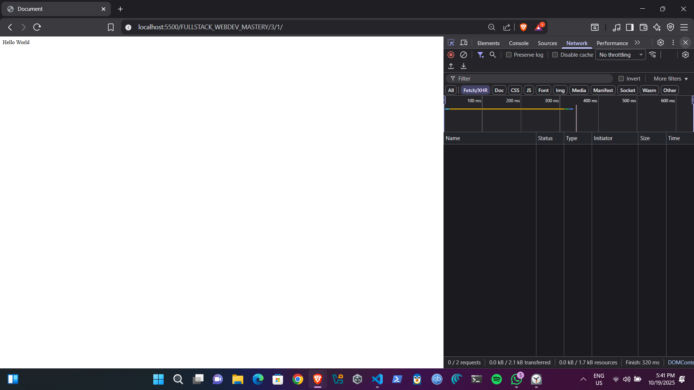
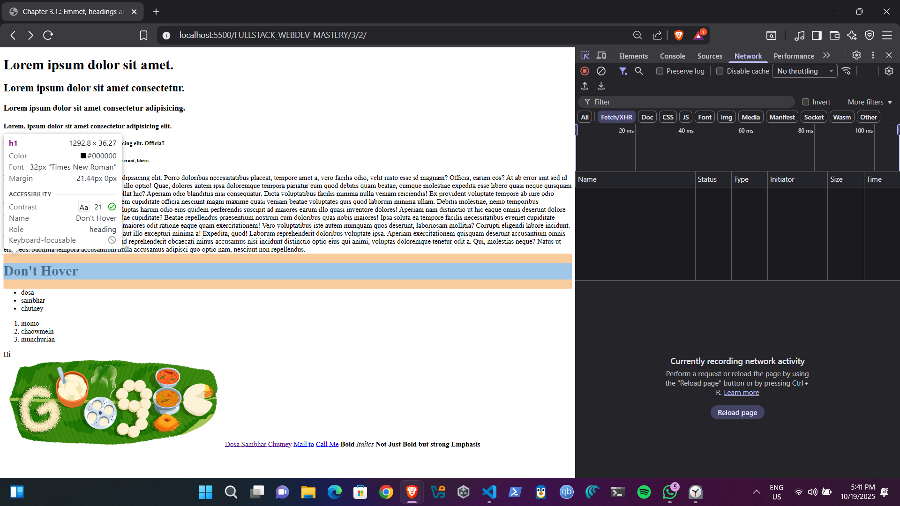
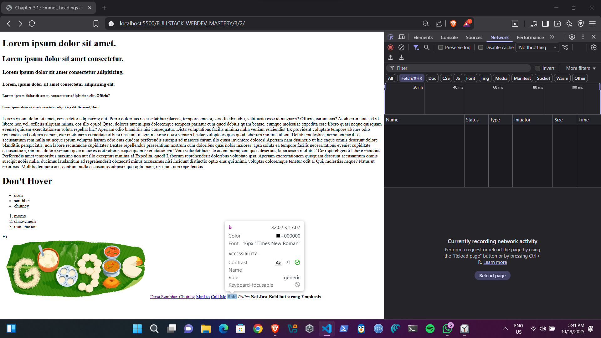

# FULLSTACK_WEBDEV_MASTERY
> “Measuring programming progress by lines of code is like measuring aircraft building progress by weight.” — Bill Gates

- Author: [Kintsugi-Programmer](https://github.com/kintsugi-programmer)

> Disclaimer: The content presented here is a curated blend of my personal learning journey, experiences, open-source documentation, and invaluable knowledge gained from diverse sources. I do not claim sole ownership over all the material; this is a community-driven effort to learn, share, and grow together.

# Chapters
- [Chapter 1: Before Web Dev Journey](#chapter-1-before-web-dev-journey)
- [Chapter 2: Basics of Web Development](#chapter-2-basics-of-web-development)
- [Chapter 3: HTML](#chapter-3-html)

# Table of Contents
- [FULLSTACK\_WEBDEV\_MASTERY](#fullstack_webdev_mastery)
- [Chapters](#chapters)
- [Table of Contents](#table-of-contents)
- [Chapter 1: Before Web Dev Journey](#chapter-1-before-web-dev-journey)
  - [Chapter 1.1.: Course Roadmap Overview](#chapter-11-course-roadmap-overview)
    - [1. Introduction](#1-introduction)
    - [2. Phase 1: 2024 Roadmap](#2-phase-1-2024-roadmap)
      - [2.1 Beginner Track](#21-beginner-track)
      - [2.2 JavaScript Path](#22-javascript-path)
      - [2.3 Back-End Foundation](#23-back-end-foundation)
      - [2.4 Full-Stack Projects](#24-full-stack-projects)
    - [3. Phase 2: 2025 Preview](#3-phase-2-2025-preview)
    - [4. Phase 3: Late 2025 Preview](#4-phase-3-late-2025-preview)
    - [5. How to Use This Roadmap](#5-how-to-use-this-roadmap)
  - [Chapter 1.2.: Course Introduction: Instructor Overview and Key Highlights](#chapter-12-course-introduction-instructor-overview-and-key-highlights)
    - [1. Instructor Background](#1-instructor-background)
    - [2. Professional Journey](#2-professional-journey)
    - [3. Course Vision and Scope](#3-course-vision-and-scope)
    - [4. Teaching Philosophy](#4-teaching-philosophy)
    - [5. Student Outcomes](#5-student-outcomes)
  - [Chapter 1.3.: AI in Web Development: Addressing Anxiety and Embracing the Future](#chapter-13-ai-in-web-development-addressing-anxiety-and-embracing-the-future)
    - [1. Understanding AI Anxiety](#1-understanding-ai-anxiety)
    - [2. Historical Parallel: Automating Boilerplate](#2-historical-parallel-automating-boilerplate)
    - [3. AI as a Developer’s Assistant](#3-ai-as-a-developers-assistant)
    - [4. Realistic Impact on Workflow](#4-realistic-impact-on-workflow)
    - [5. The Enduring Importance of Foundations](#5-the-enduring-importance-of-foundations)
    - [6. Navigating the Hype](#6-navigating-the-hype)
    - [7. Looking Ahead: AI in This Course](#7-looking-ahead-ai-in-this-course)
  - [Chaptet 1.4.: Web Development Career Pathways](#chaptet-14-web-development-career-pathways)
    - [1. Scope of Web Development](#1-scope-of-web-development)
    - [2. Core Components](#2-core-components)
    - [3. Learning Pathways \& Specializations](#3-learning-pathways--specializations)
    - [4. Career Routes](#4-career-routes)
      - [4.1 Freelancing](#41-freelancing)
      - [4.2 Product Development (SaaS)](#42-product-development-saas)
      - [4.3 Salaried Employment](#43-salaried-employment)
    - [5. Salary Expectations](#5-salary-expectations)
    - [6. Realistic Outlook](#6-realistic-outlook)
  - [Chapter 1.5.: Essential Web Development Tools](#chapter-15-essential-web-development-tools)
    - [1. Core Toolset](#1-core-toolset)
      - [1.1 Code Editor](#11-code-editor)
      - [1.2 Web Browser](#12-web-browser)
    - [2. Supporting Utilities](#2-supporting-utilities)
      - [2.1 Terminal (Command Line Interface)](#21-terminal-command-line-interface)
      - [2.2 Package Managers \& Runtimes](#22-package-managers--runtimes)
    - [3. Online Development Environments](#3-online-development-environments)
    - [4. Workflow Recommendations](#4-workflow-recommendations)
    - [5. Next Steps](#5-next-steps)
  - [Chapter 1.6.: Complete Guide to Web Development Tools and Setup](#chapter-16-complete-guide-to-web-development-tools-and-setup)
    - [Essential Requirements for Web Development](#essential-requirements-for-web-development)
      - [Minimum Hardware Requirements](#minimum-hardware-requirements)
    - [The Two Essential Tools](#the-two-essential-tools)
      - [1. Code Editor: Visual Studio Code](#1-code-editor-visual-studio-code)
      - [Alternative Code Editors](#alternative-code-editors)
      - [2. Browser: Google Chrome](#2-browser-google-chrome)
        - [Chrome Developer Tools Features](#chrome-developer-tools-features)
        - [Browser Alternatives](#browser-alternatives)
    - [Additional Development Tools](#additional-development-tools)
      - [Terminal Applications](#terminal-applications)
      - [Online Development Environments](#online-development-environments)
    - [The Three Pillars of Web Development](#the-three-pillars-of-web-development)
      - [HTML (HyperText Markup Language)](#html-hypertext-markup-language)
      - [CSS (Cascading Style Sheets)](#css-cascading-style-sheets)
      - [JavaScript](#javascript)
    - [Getting Started: Setup Process](#getting-started-setup-process)
      - [Step 1: Download and Install VS Code](#step-1-download-and-install-vs-code)
      - [Step 2: Set Up Chrome](#step-2-set-up-chrome)
      - [Step 3: Create Your First Project](#step-3-create-your-first-project)
    - [Professional Development Practices](#professional-development-practices)
  - [Chapter 1.7.: VS Code Complete Setup Guide: From Installation to Pro Productivity](#chapter-17-vs-code-complete-setup-guide-from-installation-to-pro-productivity)
    - [Installation and Initial Setup](#installation-and-initial-setup)
      - [Download and Installation](#download-and-installation)
      - [First Launch Configuration](#first-launch-configuration)
    - [Theme Customization and Appearance](#theme-customization-and-appearance)
      - [Installing Custom Themes](#installing-custom-themes)
      - [Font Configuration](#font-configuration)
    - [Essential Extensions](#essential-extensions)
      - [Live Preview/Live Server](#live-previewlive-server)
      - [Productivity Extensions](#productivity-extensions)
    - [Keyboard Shortcuts and Navigation](#keyboard-shortcuts-and-navigation)
      - [Essential Shortcuts](#essential-shortcuts)
      - [Terminal Integration](#terminal-integration)
    - [Settings Configuration](#settings-configuration)
      - [settings.json Customization](#settingsjson-customization)
      - [Accessing Settings](#accessing-settings)
    - [Advanced Productivity Features](#advanced-productivity-features)
      - [Code Navigation and Editing](#code-navigation-and-editing)
      - [Workspace Management](#workspace-management)
      - [Code Snippets](#code-snippets)
    - [HTML Development Features](#html-development-features)
      - [Emmet Integration](#emmet-integration)
      - [HTML Shortcuts](#html-shortcuts)
    - [Best Practices for Setup](#best-practices-for-setup)
      - [Performance Optimization](#performance-optimization)
      - [Settings Sync](#settings-sync)
    - [Troubleshooting Common Issues](#troubleshooting-common-issues)
      - [Extension Conflicts](#extension-conflicts)
      - [Performance Issues](#performance-issues)
    - [VSC Shortcuts CheatSheet](#vsc-shortcuts-cheatsheet)
- [Chapter 2: Basics of Web Development](#chapter-2-basics-of-web-development)
  - [Chapter 2.1.: How the Internet Works](#chapter-21-how-the-internet-works)
    - [What is the Internet?](#what-is-the-internet)
    - [Understanding IP Addresses: The Digital Address System](#understanding-ip-addresses-the-digital-address-system)
    - [The Role of Internet Service Providers (ISPs)](#the-role-of-internet-service-providers-isps)
    - [Domain Name System (DNS): The Internet's Phone Book](#domain-name-system-dns-the-internets-phone-book)
    - [Data Transmission Through Packet Switching](#data-transmission-through-packet-switching)
    - [The TCP/IP Protocol Stack](#the-tcpip-protocol-stack)
    - [HTTP Requests and Responses](#http-requests-and-responses)
    - [Analyzing Network Activity with Browser Tools](#analyzing-network-activity-with-browser-tools)
    - [Web Hosting and Cloud Infrastructure](#web-hosting-and-cloud-infrastructure)
    - [The Engineering Marvel Behind Internet Connectivity](#the-engineering-marvel-behind-internet-connectivity)
  - [Chapter 2.2.: How the Web Works and the Roles of Front-end, Back-end, and Databases](#chapter-22-how-the-web-works-and-the-roles-of-front-end-back-end-and-databases)
    - [1. Client-Server Architecture](#1-client-server-architecture)
      - [1.1 HTTP Request](#11-http-request)
      - [1.2 Server Processing](#12-server-processing)
      - [1.3 HTTP Response](#13-http-response)
    - [2. Roles of HTML, CSS, and JavaScript](#2-roles-of-html-css-and-javascript)
    - [3. Front-end vs. Back-end](#3-front-end-vs-back-end)
      - [3.1 Front-end (Client Side)](#31-front-end-client-side)
      - [3.2 Back-end (Server Side)](#32-back-end-server-side)
      - [3.3 Communication Between Front-end and Back-end](#33-communication-between-front-end-and-back-end)
    - [4. Databases: Types and Roles](#4-databases-types-and-roles)
      - [4.1 Relational Databases (SQL)](#41-relational-databases-sql)
      - [4.2 NoSQL Databases](#42-nosql-databases)
      - [4.3 In-Memory Stores](#43-in-memory-stores)
    - [5. Common Industry Icons and Nomenclature](#5-common-industry-icons-and-nomenclature)
    - [6. Putting It All Together: Application Flow](#6-putting-it-all-together-application-flow)
    - [7. Next Steps](#7-next-steps)
  - [Chapter 2.3.: Front End, Back End, APIs, and Client–Server Architecture](#chapter-23-front-end-back-end-apis-and-clientserver-architecture)
    - [1. Front End](#1-front-end)
    - [2. Back End](#2-back-end)
    - [3. API (Application Programming Interface)](#3-api-application-programming-interface)
    - [4. Client–Server Interaction Flow](#4-clientserver-interaction-flow)
      - [Diagrammatic Summary](#diagrammatic-summary)
    - [Next Steps](#next-steps)
- [Chapter 3: HTML](#chapter-3-html)
  - [Chapter 3.1.:HTML Fundamentals](#chapter-31html-fundamentals)
    - [What is HTML?](#what-is-html)
      - [Key Characteristics of HTML](#key-characteristics-of-html)
    - [Core HTML Document Structure](#core-html-document-structure)
      - [Essential Components](#essential-components)
        - [1. Document Type Declaration (DOCTYPE)](#1-document-type-declaration-doctype)
        - [2. Root HTML Element](#2-root-html-element)
        - [3. Head Section (Metadata Container)](#3-head-section-metadata-container)
        - [4. Body Section (Visible Content)](#4-body-section-visible-content)
    - [HTML Tag System and Syntax](#html-tag-system-and-syntax)
      - [Tag Structure](#tag-structure)
      - [Self-Closing Elements](#self-closing-elements)
    - [HTML5 Semantic Elements and Accessibility](#html5-semantic-elements-and-accessibility)
      - [Semantic vs Non-Semantic Elements](#semantic-vs-non-semantic-elements)
      - [Accessibility Benefits of Semantic HTML](#accessibility-benefits-of-semantic-html)
    - [VS Code and Emmet for Efficient HTML Development](#vs-code-and-emmet-for-efficient-html-development)
      - [Emmet Abbreviation System](#emmet-abbreviation-system)
        - [Essential Emmet Shortcuts](#essential-emmet-shortcuts)
      - [Enabling Emmet in VS Code](#enabling-emmet-in-vs-code)
    - [Live Server Extension for Development](#live-server-extension-for-development)
      - [Purpose and Benefits](#purpose-and-benefits)
      - [Installation and Usage\[21\]](#installation-and-usage21)
    - [HTML Whitespace and Browser Behavior](#html-whitespace-and-browser-behavior)
      - [Important Browser Characteristics](#important-browser-characteristics)
      - [Best Practices for Code Organization](#best-practices-for-code-organization)
    - [Professional HTML Development Workflow](#professional-html-development-workflow)
      - [File Organization](#file-organization)
      - [Development Environment Setup](#development-environment-setup)
      - [Quality Assurance](#quality-assurance)
    - [Advanced Considerations](#advanced-considerations)
      - [SEO and Performance](#seo-and-performance)
      - [Scalability and Maintainability](#scalability-and-maintainability)
      - [Integration with Other Technologies](#integration-with-other-technologies)
    - [Code](#code)
  - [](#)
  - [Chapter 3.12.: Emmet, headings and block vs inline](#chapter-312-emmet-headings-and-block-vs-inline)
    - [I. Introduction and Lecture Structure](#i-introduction-and-lecture-structure)
    - [II. Approach to Learning HTML and Documentation](#ii-approach-to-learning-html-and-documentation)
      - [A. Core Philosophy of Learning](#a-core-philosophy-of-learning)
      - [B. Analyzing HTML Documentation](#b-analyzing-html-documentation)
    - [III. Writing Basic HTML Code](#iii-writing-basic-html-code)
      - [A. File Setup and Naming Convention](#a-file-setup-and-naming-convention)
      - [B. Generating Initial HTML Structure](#b-generating-initial-html-structure)
      - [C. Emmet Shortcuts for Content](#c-emmet-shortcuts-for-content)
    - [IV. HTML Headings and Paragraphs](#iv-html-headings-and-paragraphs)
      - [A. Heading Tags (H1 to H6)](#a-heading-tags-h1-to-h6)
      - [B. Paragraph Tag (`p`)](#b-paragraph-tag-p)
    - [V. Emmet: Essential Toolkit](#v-emmet-essential-toolkit)
      - [A. Emmet Abbreviations Examples](#a-emmet-abbreviations-examples)
    - [VI. Working with Images and Links](#vi-working-with-images-and-links)
      - [A. Image Injection (``)](#a-image-injection-img)
      - [B. Link Injection (Anchor Tag `<a>`)](#b-link-injection-anchor-tag-a)
        - [1. Standard External/Internal Links](#1-standard-externalinternal-links)
        - [2. Specialized Links](#2-specialized-links)
    - [VII. Core HTML Terminology](#vii-core-html-terminology)
      - [A. Universal Attribute: Title](#a-universal-attribute-title)
    - [VIII. Headings and Lists](#viii-headings-and-lists)
      - [A. Introduction to Lists](#a-introduction-to-lists)
      - [B. Unordered List (`<ul>`)](#b-unordered-list-ul)
      - [C. Ordered List (`<ol>`)](#c-ordered-list-ol)
    - [IX. Understanding Content Flow](#ix-understanding-content-flow)
      - [A. Block Level vs. Inline Elements](#a-block-level-vs-inline-elements)
        - [1. Block Level Elements](#1-block-level-elements)
        - [2. Inline Elements](#2-inline-elements)
      - [B. Identifying Element Type using Developer Tools](#b-identifying-element-type-using-developer-tools)
    - [X. Semantic vs. Visual Tags (Strong/B and Em/I)](#x-semantic-vs-visual-tags-strongb-and-emi)
    - [XI. Conclusion](#xi-conclusion)
    - [Code](#code-1)
  - [](#-1)

# Chapter 1: Before Web Dev Journey

## Chapter 1.1.: Course Roadmap Overview

- Resource: https://www.udemy.com/course/web-dev-master/

**Main Takeaway:** This course offers a structured, project-based journey from beginner to advanced, covering web fundamentals, front-end and back-end development, full-stack projects, and future topics—empowering you to build production-ready applications and stay current with evolving technologies.

***

### 1. Introduction  
Welcome! This video walks through:
- How **beginners**, **intermediates**, and **advanced** learners can navigate the course  
- The **current roadmap** (Phase 1: 2024) and upcoming **Phase 2** (2025) and **Phase 3** (late 2025)  
- Where to find updates: downloadable attachments, website, Discord  

### 2. Phase 1: 2024 Roadmap  
#### 2.1 Beginner Track  
1. **Web Development Fundamentals**  
   - Learn without any programming prerequisites  
   - Understand client-server architecture, impact of AI, and trending frameworks  
2. **HTML Basics**  
   - Hands-on coding challenges with instant feedback  
3. **CSS Mastery**  
   - Selectors, Flexbox, Grid, production-ready projects, coding challenges  
4. **Utility Frameworks**  
   - Bootstrap vs. Tailwind: differences, hands-on projects, and challenges  

#### 2.2 JavaScript Path  
1. **Core JavaScript**  
   - Foundation, OOP patterns, DOM & BOM concepts  
2. **Advanced JavaScript & Updates**  
   - Regularly updated advanced topics based on feedback  
3. **Front-End Projects**  
   - Fun, challenging, and essential demos to solidify skills  

#### 2.3 Back-End Foundation  
1. **Node.js Essentials**  
   - V8 engine, building web servers, event emitters  
2. **Databases**  
   - MongoDB design, Express integration—mega full-stack project  
3. **Advanced Database Topics**  
   - Aggregation pipelines, advanced queries  
4. **Deployment**  
   - VPS deployment on AWS/DigitalOcean without one-click tools  

#### 2.4 Full-Stack Projects  
- Q&A system with Next.js, Prisma, Neon (SQL)  
- Additional production-grade applications  

> **Navigation Tip:** After completing JavaScript and back-end fundamentals, you may choose to pivot to front-end (React) before diving deeper into back-end. The recommended path is back-end first for stronger logic control.

### 3. Phase 2: 2025 Preview  
- **Microservices Architecture**: Message queues (RabbitMQ), WebSockets, WebRTC  
- **Containerization & Deployment**: Dockerizing Node.js/React, advanced VPS workflows  
- **New Projects**: Two major applications recorded in early 2025  

### 4. Phase 3: Late 2025 Preview  
- **AI-Centric Development**: TensorFlow.js, machine-learning demos  
- **Additional Frameworks**: Angular (latest version) based on community demand  
- **Ongoing Updates**: Driven by learner feedback  

### 5. How to Use This Roadmap  
- **Beginners:** Follow the roadmap sequentially from web fundamentals to full-stack projects.  
- **Intermediates:** Jump to sections of interest—Node.js, databases, or front-end frameworks.  
- **Advanced Users:** Dive directly into advanced topics and full-stack projects.  
- **Stay Updated:** Check the roadmap video and pinned attachments for label changes and new releases.  

***

Thank you for joining this journey. Your feedback on Discord and course reviews drives continuous improvement. Let’s build the world’s most comprehensive web development course—together!

## Chapter 1.2.: Course Introduction: Instructor Overview and Key Highlights

**Main Takeaway:** Instructor Hitesh brings 15 years of software engineering and teaching experience—spanning cybersecurity, mobile and web development, leadership roles, and entrepreneurship—to deliver a single, comprehensive software engineering course that emphasizes best practices, scalability, and real-world projects.

### 1. Instructor Background
- **Name Pronunciation:** “Hitesh” (feel free to call him *Mister H*)
- **Teaching Experience:** 15 years of writing and teaching code
- **Student Impact:** Millions of learners coached; many have advanced from their first developer role up to senior levels ,SDE1 => SDE2 => SDE3 => Further...

### 2. Professional Journey
- **Cybersecurity Professional:** Launched career ensuring systems' security
- **Python Programmer → Mobile App Developer:** Transitioned into software development
- **Web Developer:** Over a decade building web applications
- **Software Engineer & Consultant:** Worked at top companies as an engineer, then adviser
- **Startup Founder & CTO:** Built and scaled a startup to acquisition; led 200-person technical team
- **Senior Director at PW (India’s EdTech Unicorn):** Oversaw large-scale educational technology initiatives
- **YouTube Content Creator:**  
  - Channel 1: ~1 million subscribers  
  - Channel 2: ~300 thousand subscribers (growing)

### 3. Course Vision and Scope
- **Beyond “Web Dev”:** Framed as a *software engineering* course, not just HTML/CSS/JavaScript
- **Comprehensive Curriculum:**  
  - Each module acts as a standalone mini-course  
  - Covers coding best practices, architecture, scalability, and real-world workflows
- **High-Quality Production:**  
  - Custom subtitles for accessibility  
  - Professional audio/video standards  
  - Engaging narratives and storytelling

### 4. Teaching Philosophy
- **Simplify Complexity:** Transforms the toughest topics into easy-to-understand lessons
- **Hands-On Projects:** Real code exercises that reflect industry standards
- **Scalability Focus:**  
  - All concepts and codebases built to support millions of users  
  - Emphasis on performance, maintainability, and growth

### 5. Student Outcomes
- **Skill Mastery:** From foundational HTML/CSS to advanced software engineering principles
- **Career Advancement:**  
  - Ready for junior to senior developer roles  
  - Equipped for real-world technical challenges
- **One-Stop Resource:** Aims to be the single best global destination for aspiring web and software engineers

***

Welcome aboard this journey to master software engineering and web development under the guidance of an industry veteran who has done it all—and continues to innovate and teach at scale. Let’s get started!
## Chapter 1.3.: AI in Web Development: Addressing Anxiety and Embracing the Future

**Key Takeaway:** AI is a powerful assistant for web developers but will **not** replace the need for strong foundational skills. Embrace AI tools to accelerate routine tasks while investing in solid fundamentals to navigate complexity, collaborate effectively, and architect robust solutions.

### 1. Understanding AI Anxiety  
Many learners worry that AI advances will render developer roles obsolete. This fear is fueled by sensational headlines, venture-capital–backed hype, and clickbait content. However, practical experience over 15+ years shows that each wave of tooling ultimately augments human capability rather than replaces it.

### 2. Historical Parallel: Automating Boilerplate  
- **Then:** Manually writing every HTML tag and boilerplate by hand.  
- **Now:** IDEs and snippet-based tools generate boilerplate instantly, freeing developers to focus on business logic.  
- **Lesson:** Just as snippet tools became indispensable yet didn’t replace developers, AI-powered coding assistants offer similar gains without eliminating essential human roles.

### 3. AI as a Developer’s Assistant  
AI tools excel at:  
- Generating repetitive or boilerplate code  
- Prototyping components and UI layouts  
- Suggesting syntax corrections and refactorings  
- Surface-level debugging hints  

These capabilities translate to faster shipping of features and more time for high-value work.

### 4. Realistic Impact on Workflow  
Empirical breakdown of a typical software engineer’s time allocation:  
- **20% Writing code**  
- **30% Debugging and bugfixing**  
- **50% Non-coding activities** (meetings, requirements gathering, architecture discussions)  

AI primarily accelerates the 20% and partially assists with debugging, but **cannot** replace human-driven decision-making, client interaction, or strategic design.

### 5. The Enduring Importance of Foundations  
Regardless of tooling trends—jQuery → React → tomorrow’s frameworks—the core skills remain crucial:  
- **HTML/CSS fundamentals**  
- **JavaScript language mastery**  
- **Problem-solving and algorithmic thinking**  
- **Debugging methodologies**  
- **Architectural design and technology evaluation**  

Strong foundations enable developers to troubleshoot AI-generated code, choose appropriate technologies, and design scalable, maintainable systems.

> At the end of day; "Solid Foundations" helps; rest are just tools to do work faster - Hitesh
### 6. Navigating the Hype  
AI hype often serves marketing and funding agendas. When evaluating AI tools:  
- Focus on **productivity gains** for concrete tasks.  
- Verify the **accuracy** and **security** of generated code.  
- Maintain **critical thinking**—always review and test AI suggestions.  
- Avoid over-reliance; use AI as a complement, not a crutch.

### 7. Looking Ahead: AI in This Course  
Later in the curriculum, you will:  
- Explore specific AI-powered plugins and IDE integrations.  
- Learn workflows that incorporate AI for templating, linting, and prototyping.  
- Develop strategies for validating and debugging AI-assisted code.  

However, the immediate focus remains on building robust, tool-agnostic skills that underlie all web development.

***

*Embrace AI to enhance your efficiency, but anchor your growth in the fundamentals—these skills will remain valuable regardless of how AI evolves.*

## Chaptet 1.4.: Web Development Career Pathways

**Key Takeaway:** Web development underpins virtually all modern software products—mobile apps like Uber, AI services like ChatGPT, SaaS platforms, and more. Mastery of front-end, back-end, databases, and DevOps opens diverse career opportunities: freelancing, product building, salaried roles, and leadership positions, with salary potential from \$100K to \$500K+.

```
            +-------------------------+
            |         web dev         |
            +-------------------------+
               /      |         \
              /       |          \
     +--------+   +--------+   +---------+
     | product|   | SDE/SWE|   |freelance|
     +--------+   +--------+   +---------+
                     |
              +-------------+
              |             |
       +------------+   +-----------+
       | front end  |   |  backend  |
       +------------+   +-----------+
           |  JR/SR      |  JR/SR
                 \       /
                +---------------+
                |   full stack  |
                +---------------+
                   JR / SR

```

### 1. Scope of Web Development
> Web Dev is just big umbrella; where all engineering branches comes - Hitesh
Web development is not limited to websites—it’s the backbone of nearly every digital service.
- **Mobile App Back-Ends:**  
  -  Account creation, OTP authentication, payment processing, and data storage for apps like Uber.  
  -  APIs and server logic manage data flow between client apps and databases.  
- **AI Interfaces:**  
  -  ChatGPT’s login, session management, conversation history retrieval, and UI design rely on web-development skills.  
  -  Advanced data handling with vector databases, embedding storage, and search functionality.

### 2. Core Components
1. **Front End:**  
   Design and implementation of user interfaces, interactive elements, and responsive layouts.  
2. **Back End:**  
   Business logic, server-side code, API development, authentication, and integration with databases.  
3. **Databases:**  
   - SQL (relational): structured schemas, complex queries  
   - NoSQL (document/graph): flexible schemas, high-scale reads/writes  
4. **DevOps & Hosting:**  
   Deployment pipelines, containerization, cloud services (AWS, Azure, Google Cloud), monitoring, and scaling.

### 3. Learning Pathways & Specializations
- **Focused Mastery:** Deep expertise in one area (e.g., front end with React/Vue, back end with Node.js/Express or Django).  
- **Full Stack:** Proficiency across front end and back end to deliver end-to-end solutions and manage small teams or startups.

### 4. Career Routes

#### 4.1 Freelancing
- Build custom solutions for clients (e.g., gym membership systems, salon appointment apps).  
- Flexible projects, direct client interaction, variable income based on project scope and rates.

#### 4.2 Product Development (SaaS)
- Create software products (e.g., background-removal tools, niche B2B platforms).  
- Scale user base; potential for recurring revenue and high growth (example: serving 12 million users).

#### 4.3 Salaried Employment
- **Roles & Titles:**  
  -  Junior Developer (SDE I): entry-level, basic project contributions  
  -  Senior Developer (SDE II+ / SWE): code ownership, mentorship, architecture decisions  
- **Specialized Tracks:** Front End Engineer, Back End Engineer, Full Stack Engineer, DevOps Engineer.
- **Advancement:** Team Lead → Project Manager → Solutions Architect → CTO.

### 5. Salary Expectations
- **Range:** Approximately \$100,000 to \$200,000 median in high–purchasing-power regions; top earners up to \$500,000+.  
- **Factors Influencing Salary:**  
  -  Geographic location and cost of living
     -  High Salary Regions Mostly also have High Cost of Living  
  -  Company size and industry  
  -  Individual skill set, experience level, and niche expertise  
  -  Remote vs. on-site roles  
- **Global Dynamics:** Remote work enables high-quality engineers in lower-cost regions to earn international market rates.

### 6. Realistic Outlook

> IT Field is not that easy as it's looks like, lots of people left prog. just after HTML/CSS.

> Real Programming starts after JS

> Harder Efforts => Higher You are gonna paid, That's a Fact, Nobody can change it at all !!!

- **Entry Difficulty:** Basic HTML/CSS is foundational but not true programming; JavaScript and back-end logic mark the start of substantive development.  
- **Effort vs. Reward:** Higher technical complexity and proficiency command higher compensation.  
- **Continuous Learning:** Evolving technologies (e.g., vector search, cloud-native architectures) require ongoing skill development.

***

These notes outline the vast landscape of web development, practical real-world applications, and the multifaceted career opportunities it offers. Continuous skill enhancement and hands-on project experience are essential to unlocking higher roles and salaries.

## Chapter 1.5.: Essential Web Development Tools

**Key Takeaway:**  
A minimal setup—consisting of a modern code editor and a web browser—empowers you to start web development on any Windows, macOS, or Linux machine. Mastering one editor and one browser’s developer tools dramatically accelerates your workflow.

***

### 1. Core Toolset

#### 1.1 Code Editor  
- Purpose: Plain‐text editing with syntax highlighting, code completion, and project/file navigation.  
- Recommended Choice: **Visual Studio Code** (free, open source, cross-platform)  
  - Highly customizable via extensions (linters, formatters, language support)  
  - Integrated terminal, file explorer, debugger, Git integration  
- Alternatives (equally valid): Sublime Text, Vim, Zed, Atom
  - Each offers unique performance or UX benefits  
  - Professionals choose one and master its shortcuts and plugins  

#### 1.2 Web Browser  
- Purpose: Render and debug HTML/CSS/JavaScript in real time  
- Recommended Choice: **Google Chrome**  
  - Rich DevTools: DOM/CSS inspector, JavaScript console, network/throttling, performance, security audits  
  - Device emulation (mobile viewport, touch simulation)  
  - Extensions for Redux, Lighthouse, accessibility checks  
- Alternatives: Firefox, Safari, Arc Browser  
  - Core debugging features largely comparable  

***

### 2. Supporting Utilities

#### 2.1 Terminal (Command Line Interface)  
- Purpose: Run package managers, build tools, version control, local servers  
- Built-in Options:  
  - Windows Terminal, macOS Terminal, Linux shells (bash, zsh)  
- Enhanced Options:  
  - **Warp**, iTerm2, Hyper  
  - Offer multi-pane support, fuzzy search, workflow acceleration  

#### 2.2 Package Managers & Runtimes  
- Node.js & npm or Yarn: Essential for modern JavaScript frameworks and tooling  
- Language-specific managers (pip for Python, gem for Ruby) as needed  

***

### 3. Online Development Environments

- Zero-install, browser-based editors facilitate quick prototyping and tutorials  
  - **CodePen**: Split view for HTML, CSS, JS; instant live preview  
  - **StackBlitz**, **Replit**, **Blitz**: Full-stack sandbox, GitHub integration, cloud hosting  
- Use cases: Learning snippets, sharing demos, collaborative coding  

***

### 4. Workflow Recommendations

1. **Pick One Editor & One Browser**  
   - Avoid tool fatigue; invest time mastering shortcuts, plugins, and workflows  
2. **Set Up Your Environment Early**  
   - Install VS Code (or your chosen editor) and Chrome (or chosen browser) first  
   - Configure key extensions: Prettier, ESLint, Live Server, GitLens  
3. **Learn Developer Tools Thoroughly**  
   - Inspect elements, modify CSS in real time, debug JavaScript in the console  
   - Simulate network conditions, device viewports, offline mode  
4. **Leverage Terminals for Efficiency**  
   - Run local servers, interact with Git, automate tasks via npm scripts or Makefiles  
5. **Experiment with Online Editors**  
   - Use CodePen for isolated UI experiments  
   - Use StackBlitz or Replit for full-stack demos without local setup  

***

### 5. Next Steps

- **Video Tutorial**: Guided installation and configuration of VS Code  
  - Cover extension recommendations, key keyboard shortcuts, integrated terminal usage  
- **Deep Dive**: Chrome DevTools walkthrough  
  - DOM/CSS inspection, JavaScript debugging, performance profiling, accessibility audits  

By establishing this streamlined toolset and workflow foundation, you’ll maximize productivity and focus on learning web development fundamentals rather than wrestling with setup or configuration.

## Chapter 1.6.: Complete Guide to Web Development Tools and Setup

### Essential Requirements for Web Development

Web development has remarkably low hardware requirements compared to other forms of programming. As the instructor mentioned, web development tools are **cross-platform compatible**, working seamlessly across Windows, Mac, and Linux systems. The beauty of web development lies in its accessibility - you can get started with almost any computer you have.[1]

#### Minimum Hardware Requirements

For effective web development, your system should meet these specifications:

**Processor**: Intel Core i3 or AMD Ryzen 3 (minimum), Intel Core i5 or AMD Ryzen 5 (recommended)[2]
**RAM**: 8GB minimum, 16GB recommended for running multiple applications simultaneously[3][2]
**Storage**: 256GB SSD minimum, 512GB SSD recommended for faster performance[2]
**Display**: 1920x1080 (Full HD) minimum resolution for better workspace visibility[2]

The good news is that **integrated graphics are sufficient** for web development - dedicated graphics cards are only necessary for graphic design work.[4][2]

### The Two Essential Tools

#### 1. Code Editor: Visual Studio Code

Visual Studio Code stands as the **most popular code editor among developers in 2025**. It's Microsoft's open-source, cross-platform editor that has become the industry standard for several compelling reasons:[5][6]

**Key Features of VS Code**:
- **Extensive Extension Marketplace**: Access to thousands of plugins for enhanced functionality[7][5]
- **Integrated Git Support**: Built-in version control for seamless code management[7][5]
- **IntelliSense**: Advanced code completion and syntax highlighting[5][7]
- **Integrated Terminal**: Run commands directly within the editor[8][7]
- **Cross-platform Support**: Available for Windows, macOS, and Linux[7][5]
- **Live Server Extension**: Preview web pages locally during development[9]

**Essential VS Code Extensions for Web Development**:
- **Prettier**: Code formatting for consistent style across teams[10][9]
- **Path Intellisense**: Auto-completion for file paths[10]
- **Live Server**: Local development server for testing[9]
- **GitLens**: Enhanced Git capabilities[11]
- **Auto Close/Rename Tag**: Automatic HTML tag management[12]

#### Alternative Code Editors

While VS Code dominates the market, other excellent options include:

**Sublime Text**: Known for **exceptional speed and lightweight performance**, perfect for handling large files. It features multi-caret editing and a clean interface, though it requires a paid license for full functionality.[6][5]

**Vim/Neovim**: **Highly configurable and lightning-fast** editors preferred by power users who favor keyboard shortcuts over mouse navigation. However, they have a steep learning curve for beginners.[6][5]

> Zed(backed by AtomDevs), Cursor etc.

#### 2. Browser: Google Chrome

Chrome remains the **preferred browser for web development** due to its comprehensive developer tools and widespread usage among end-users.[13][14]

##### Chrome Developer Tools Features

**Elements Panel**: 
- Inspect and modify HTML/CSS in real-time[15][13]
- View box model diagrams for layout debugging[15]
- Toggle element states like :hover and :active[15]

**Console**:
- Interactive JavaScript execution environment[16][13]
- Advanced logging with `console.table()` for structured data[16]
- Error tracking and debugging capabilities[13][16]

**Network Panel**:
- Monitor request/response cycles[13]
- Simulate different connection speeds (3G, 4G, offline mode)[13]
- Analyze loading performance and optimize resource delivery[13]

**Device Simulation**:
- **Responsive design testing** across multiple device sizes[13]
- Touch simulation for mobile development[13]
- Viewport adjustment for various screen resolutions[13]

##### Browser Alternatives

**Firefox Developer Edition**: Specifically designed for developers with enhanced tools for CSS Grid, Flexbox layouts, and accessibility evaluation. It offers **strong privacy features** and open-source transparency.[17][14]

**Microsoft Edge**: Features **AI-powered error assistance** in the console and excellent DOM visualization. It provides comparable performance to Chrome with additional privacy features.[18]

### Additional Development Tools

#### Terminal Applications

Modern terminals enhance the development workflow:
- **Warp**: A modern terminal with enhanced features and better user experience
- **Built-in Terminal**: Each operating system provides adequate terminal functionality for basic needs
- **Integrated Terminal in VS Code**: Eliminates the need for separate terminal applications[7]

#### Online Development Environments

For those who prefer browser-based development:

**CodePen**: Excellent for **rapid prototyping and learning**. It provides separate panels for HTML, CSS, and JavaScript with real-time preview capabilities.[19]

**StackBlitz**: **Browser-based IDE** with full project support and npm package management.[19]

**Replit**: **Collaborative coding platform** perfect for team projects and educational purposes.[19]

### The Three Pillars of Web Development

#### HTML (HyperText Markup Language)
HTML provides the **structural foundation** of web pages, defining elements like headings, paragraphs, lists, and buttons. It creates the skeleton that browsers interpret and display.[20]

#### CSS (Cascading Style Sheets)
CSS handles the **visual presentation** of web content, controlling colors, fonts, layouts, and responsive design across different devices. Modern frameworks like **Tailwind CSS** and **Bootstrap** streamline this process.[21][20]

#### JavaScript
JavaScript adds **interactivity and dynamic behavior** to websites, enabling user interactions, form validation, and content manipulation. It's the programming language that brings web pages to life.[22][20]

### Getting Started: Setup Process

#### Step 1: Download and Install VS Code
1. Visit the official Visual Studio Code website
2. Download the appropriate version for your operating system
3. Follow the installation prompts
4. Install essential extensions for web development

#### Step 2: Set Up Chrome
1. Download Google Chrome if not already installed
2. Familiarize yourself with Developer Tools (F12 or Ctrl+Shift+I)
3. Explore the Elements, Console, and Network panels

#### Step 3: Create Your First Project
1. Create a new folder in VS Code (File > Open Folder)
2. Create HTML, CSS, and JavaScript files
3. Use the Live Server extension to preview your work locally
4. Utilize Chrome DevTools for debugging and testing

### Professional Development Practices

**Master Your Tools**: As emphasized in the content, **knowing your code editor thoroughly makes you a faster developer**. Focus on learning keyboard shortcuts and customizing your environment for maximum efficiency.[5]

**Stick with One Setup**: Professional developers typically **choose one set of tools and master them** rather than constantly switching between different options. This approach allows for deeper expertise and improved workflow efficiency.

**Cross-Browser Testing**: While Chrome is excellent for development, always **test your projects across multiple browsers** to ensure compatibility for all users.[18]

The web development landscape offers numerous tool choices, but starting with VS Code and Chrome provides a solid foundation that scales from beginner projects to professional applications. These tools' combination of power, accessibility, and community support makes them ideal for anyone beginning their web development journey.

[1](https://www.reddit.com/r/learnprogramming/comments/qie409/where_do_i_write_my_code/)
[2](https://www.linkedin.com/pulse/minimum-device-requirements-web-development-fazlay-rabbi-3blwc)
[3](https://training.certstaff.com/News/108/System-Requirements-for-Web-Development)
[4](https://www.weetechsolution.com/blog/how-to-choose-a-laptop-for-web-development)
[5](https://www.devopsschool.com/blog/top-10-code-editors-tools-in-2025-features-pros-cons-comparison/)
[6](https://dualite.dev/blog/best-code-editors)
[7](https://code.visualstudio.com/docs/introvideos/basics)
[8](https://code.visualstudio.com/docs/getstarted/getting-started)
[9](https://www.browserstack.com/guide/best-vs-code-extensions)
[10](https://www.syncfusion.com/blogs/post/top-vs-code-extensions)
[11](https://www.jit.io/blog/vscode-extensions-for-2023)
[12](https://www.youtube.com/watch?v=NpYiXVu1KCc)
[13](https://www.indeed.com/career-advice/career-development/how-to-use-chrome-developer-tools)
[14](https://www.browserstack.com/guide/best-browsers-for-web-development)
[15](https://www.browserstack.com/guide/chrome-developer-tools)
[16](https://dev.to/arjun98k/top-10-chrome-devtools-features-every-developer-should-know-in-2025-40kp)
[17](https://www.geeksforgeeks.org/techtips/which-browser-has-the-best-developer-tools/)
[18](https://www.reddit.com/r/webdev/comments/1et7doa/which_browser_has_the_best_devtools/)
[19](https://www.pluralsight.com/resources/blog/upskilling/how-to-get-started-writing-code)
[20](https://www.freecodecamp.org/news/html-css-and-javascript-explained-for-beginners/)
[21](https://www.browserstack.com/guide/web-development-tools)
[22](https://www.w3schools.com/html/html_scripts.asp)
[23](https://learn.shayhowe.com/html-css/writing-your-best-code/)
[24](https://www.youtube.com/watch?v=SeybVD0NMQI)
[25](https://froala.com/blog/general/10-best-front-end-development-tools/)
[26](https://automatonarmy.com/best-ai-for-coding/)
[27](https://www.freecodecamp.org/news/learn-to-code-book/)
[28](https://www.monocubed.com/blog/web-development-tools/)
[29](https://developer.chrome.com/docs/devtools)
[30](https://budibase.com/blog/how-to-make-a-web-app/)
[31](https://spacelift.io/blog/software-development-tools)
[32](https://towardsthecloud.com/blog/best-vscode-extensions-python)
[33](https://chromewebstore.google.com/detail/web-developer/bfbameneiokkgbdmiekhjnmfkcnldhhm)
[34](https://dev.to/umeshtharukaofficial/getting-started-with-vscode-a-beginners-guide-2mic)
[35](https://webbylab.com/blog/chrome-devtools-feature-guide/)
[36](https://dev.to/aneeqakhan/top-5-ai-based-code-editors-for-coding-in-2025-obm)
[37](https://code.visualstudio.com/docs/python/python-tutorial)
[38](https://www.syncfusion.com/blogs/post/chrome-devtools-2024-top-5-features)
[39](https://maxwellj.vivaldi.net/2025/04/03/code-editors-my-top-7-picks/)
[40](https://www.easyproject.com/documentation/article/hardware-and-software-requirements-for-the-server-solution)
[41](https://www.w3schools.com/html/)
[42](https://www.geeksforgeeks.org/javascript/learn-web-development-basics-with-html-css-and-javascript/)
[43](https://dev.to/snehasishkonger/firefox-vs-chrome-developer-tools-a-comparative-analysis-3lkc)

## Chapter 1.7.: VS Code Complete Setup Guide: From Installation to Pro Productivity

Visual Studio Code has become the go-to code editor for millions of developers worldwide, and for good reason. This comprehensive guide will walk you through setting up VS Code from scratch, covering everything from basic installation to advanced productivity features that will transform your coding workflow.

> Hitesh actually did session offical session in Microsoft about how to Setup VSC and keep it light !!!

### Installation and Initial Setup

#### Download and Installation

Getting VS Code up and running is straightforward across all platforms. Visit the official website and download the appropriate version for your operating system. The installation process is simple:[1][2][3]

**Windows**: Double-click the installer and follow the setup wizard. Accept the license agreement, choose installation location, and optionally create a desktop shortcut.[2][3]

**Mac**: Download the zip file, extract it, and drag the VS Code app to your Applications folder. You can then launch it from Spotlight search or the Applications folder.[3]

**Linux**: VS Code provides packages for various Linux distributions, making installation seamless across Ubuntu, Debian, Red Hat, and other systems.[1]

#### First Launch Configuration

When you first launch VS Code, you'll be greeted with a welcome screen offering theme selection and basic setup options. The default theme is "Dark Modern," but you can explore various options including light themes and high contrast versions.[2][3]

### Theme Customization and Appearance

#### Installing Custom Themes

The VS Code marketplace offers thousands of themes to personalize your coding environment. Some popular themes include:[4][5][6]

- **One Dark Pro**: A refined version of Atom's One Dark theme[6]
- **Dracula Official**: Known for its vibrant purple and pink color scheme[6]
- **Night Owl**: Designed specifically for night owls who code late[6]
- **Monokai Pro**: A professional version of the classic Monokai theme[6]

To install themes, use the keyboard shortcut **Ctrl+K Ctrl+T** (Windows/Linux) or **Cmd+K Cmd+T** (Mac) to open the theme picker. You can also browse additional themes directly from the marketplace.[5]

#### Font Configuration

Customizing your editor font can significantly improve readability and coding comfort. Here's how to configure fonts:[7][8][9]

1. Open Settings with **Ctrl+,** (Windows/Linux) or **Cmd+,** (Mac)[7]
2. Navigate to **Text Editor > Font** settings[7]
3. Modify the **Font Family** field

Popular coding fonts include:
- **Fira Code**: Free font with programming ligatures[9]
- **Consolas**: Default Windows font with excellent readability[10]
- **Operator**: Premium font ($200) designed specifically for coding[9]

Example font configuration in settings.json:[11]
```json
{
  "editor.fontFamily": "Fira Code, Consolas, monospace",
  "editor.fontSize": 16,
  "editor.fontLigatures": true
}
```

### Essential Extensions

#### Live Preview/Live Server

For web development, the Live Preview extension by Microsoft is essential. It provides real-time preview of your HTML, CSS, and JavaScript changes:[12][13][14]

**Installation**: Search for "Live Preview" in the Extensions panel (**Ctrl+Shift+X**) and install the Microsoft version.[14][12]

**Usage**: Click the "Show Preview" button in the top-right corner of your HTML file, or use the Command Palette to start the preview server.[13][14]

#### Productivity Extensions

The VS Code ecosystem offers over 30,000 extensions. Here are must-have productivity boosters:[15][16][17]

- **Prettier**: Code formatter supporting JavaScript, TypeScript, CSS, and more[15]
- **ESLint**: JavaScript linter for error detection and code quality[17]
- **Path Intellisense**: Auto-completion for file paths[15]
- **Live Share**: Real-time collaborative editing[17]
- **GitLens**: Enhanced Git integration with blame annotations and history[16]

### Keyboard Shortcuts and Navigation

#### Essential Shortcuts

Mastering keyboard shortcuts is crucial for productivity. Here are the most important ones:[18][19][20]

**File Navigation**:
- **Ctrl+P** (Windows/Linux) or **Cmd+P** (Mac): Quick file opener[19][20]
- **Ctrl+Shift+P** (Windows/Linux) or **Cmd+Shift+P** (Mac): Command Palette[20][19]

**Editing**:
- **Ctrl+D** (Windows/Linux) or **Cmd+D** (Mac): Select next occurrence of current word[19]
- **Alt+Up/Down** (Windows/Linux) or **Option+Up/Down** (Mac): Move lines up/down[19]
- **Ctrl+/** (Windows/Linux) or **Cmd+/** (Mac): Toggle line comment[18]

**Multi-cursor Editing**:
- **Ctrl+Alt+Up/Down** (Windows/Linux) or **Cmd+Option+Up/Down** (Mac): Add cursor above/below[19]
- **Alt+Click**: Add cursor at clicked position[19]

#### Terminal Integration

VS Code's integrated terminal is a powerful feature:[20][17]
- **Ctrl+`** (all platforms): Toggle terminal visibility[21][36]
- Supports multiple terminal instances and can be dragged into the editor area[20]

### Settings Configuration

#### settings.json Customization

VS Code's settings.json file is where the real customization magic happens. Here's a sample configuration for optimal productivity:[21][11]

```json
{
  "editor.fontSize": 16,
  "editor.fontFamily": "Fira Code, Consolas, monospace",
  "editor.tabSize": 2,
  "editor.wordWrap": "on",
  "editor.minimap.enabled": false,
  "editor.formatOnSave": true,
  "files.autoSave": "afterDelay",
  "workbench.colorTheme": "One Dark Pro",
  "terminal.integrated.fontSize": 14
}
```

#### Accessing Settings

Multiple ways to access your settings:[11][21]
- **Ctrl+,** (Windows/Linux) or **Cmd+,** (Mac) to open Settings UI[11]
- Click the "Open Settings (JSON)" icon in the top-right corner of Settings[21]
- Use Command Palette: **Preferences: Open Settings (JSON)**[11]

### Advanced Productivity Features

#### Code Navigation and Editing

VS Code offers sophisticated code navigation features:[18][20]

**Go to Definition**: **F12** to navigate to function/variable definitions[18]
**Peek Definition**: **Alt+F12** to preview definitions inline[18]
**Find All References**: **Shift+F12** to see all usages[18]

#### Workspace Management

Effective workspace organization boosts productivity:[17]
- Use multi-root workspaces for related projects
- Set up project-specific settings
- Leverage workspace-specific extensions

#### Code Snippets

Create custom snippets for frequently used code patterns:[17]
1. Go to **Preferences > User Snippets**
2. Choose the language or create global snippets
3. Define your snippet with prefix, body, and description

### HTML Development Features

#### Emmet Integration

VS Code includes built-in Emmet support for rapid HTML development. Type abbreviations and press **Tab** to expand:
- `!` + **Tab**: Creates HTML5 boilerplate
- `h1` + **Tab**: Creates `<h1></h1>` tags
- `div.container` + **Tab**: Creates `<div class="container"></div>`

#### HTML Shortcuts

Essential HTML shortcuts for faster development:
- **Ctrl+Shift+K** (Windows/Linux) or **Cmd+Shift+K** (Mac): Delete entire line
- **Alt+Shift+Up/Down**: Duplicate lines
- **Ctrl+L** (Windows/Linux) or **Cmd+L** (Mac): Select entire line

### Best Practices for Setup

#### Performance Optimization

Keep VS Code running smoothly:[22][1]
- Disable unnecessary extensions
- Use workspace-specific extensions when possible
- Regular cleanup of unused extensions
- Monitor memory usage through built-in performance tools

#### Settings Sync

Use VS Code's built-in Settings Sync to maintain consistency across devices:[17]
- Sign in with Microsoft or GitHub account
- Sync settings, extensions, and keyboard shortcuts
- Access your setup from any VS Code installation

### Troubleshooting Common Issues

#### Extension Conflicts

If VS Code behaves unexpectedly:
- Disable extensions one by one to identify conflicts
- Use VS Code's safe mode for debugging
- Check the Output panel for error messages

#### Performance Issues

For slow performance:
- Disable minimap if not needed: `"editor.minimap.enabled": false`[11]
- Reduce file watching: `"files.watcherExclude"`
- Limit extension auto-updates during work hours

This comprehensive setup guide provides the foundation for a professional VS Code environment. Remember that the best setup is one that matches your specific workflow and preferences. Start with these basics and gradually customize as you discover what works best for your coding style and projects. The time invested in properly configuring VS Code will pay dividends in improved productivity and coding enjoyment.

[1](https://code.visualstudio.com/docs/setup/setup-overview)
[2](https://www.youtube.com/watch?v=cu_ykIfBprI)
[3](https://www.youtube.com/watch?v=bN6DE-4uFNo)
[4](https://junocollege.com/blog/cool-vs-code-themes-for-developers/)
[5](https://code.visualstudio.com/docs/configure/themes)
[6](https://dev.to/ikoichi/23-best-vs-code-themes-in-2024-45g1)
[7](https://www.alphr.com/vs-code-how-to-change-font/)
[8](https://learn.microsoft.com/en-us/visualstudio/extensibility/ux-guidelines/fonts-and-formatting-for-visual-studio?view=vs-2022)
[9](https://www.youtube.com/watch?v=04czwin8qRA)
[10](https://stackoverflow.com/questions/29960057/which-font-is-used-in-visual-studio-code-editor-and-how-to-change-fonts)
[11](https://peerlist.io/blog/engineering/vscode-settingsjson-a-complete-guide)
[12](https://www.geeksforgeeks.org/installation-guide/how-to-enable-live-server-on-visual-studio-code/)
[13](https://www.youtube.com/watch?v=3f8a0EtXz0c)
[14](https://marketplace.visualstudio.com/items?itemName=ms-vscode.live-server)
[15](https://www.syncfusion.com/blogs/post/top-vs-code-extensions)
[16](https://www.freecodecamp.org/news/best-vscode-extensions/)
[17](https://www.nearsure.com/blog/visual-studio-code-tips-and-tricks-to-boost-your-productivity)
[18](https://code.visualstudio.com/docs/configure/keybindings)
[19](https://www.wearedevelopers.com/en/magazine/200/vs-code-shortcuts)
[20](https://code.visualstudio.com/docs/introvideos/productivity)
[21](https://stackoverflow.com/questions/65908987/how-to-open-visual-studio-codes-settings-json-file)
[22](https://code.visualstudio.com/docs/configure/settings)
[23](https://www.youtube.com/watch?v=lxRAj1Gijic)
[24](https://stackoverflow.com/questions/36506539/how-do-i-get-visual-studio-code-to-trust-our-self-signed-proxy-certificate)
[25](https://code.visualstudio.com/docs/getstarted/getting-started)
[26](https://learn.microsoft.com/en-us/visualstudio/ide/default-keyboard-shortcuts-in-visual-studio?view=vs-2022)
[27](https://dev.to/pas8/best-vs-code-setup-20fe)
[28](https://www.youtube.com/watch?v=mpk4Q5feWaw)
[29](https://dev.to/best_codes/7-best-vs-code-extensions-for-faster-development-2024-edition-3j56)
[30](https://www.youtube.com/watch?v=nhEHXQGVmaQ)
[31](https://betterprogramming.pub/my-7-recommended-settings-for-visual-studio-code-96fbd9f5e21a)
[32](https://stackoverflow.com/questions/66869413/visual-studio-code-does-not-detect-virtual-environments)
[33](https://www.jit.io/blog/vscode-extensions-for-2023)
[34](https://code.visualstudio.com/docs/reference/default-keybindings)
[35](https://www.codemag.com/Article/2408031/VS-Code-Tips)
[36](https://code.visualstudio.com/shortcuts/keyboard-shortcuts-windows.pdf)
[37](https://www.reddit.com/r/vscode/comments/1b4x3sk/best_theme_2024/)
[38](https://www.youtube.com/watch?v=ZVGutgqBMUM)
[39](https://gist.github.com/mrmartineau/ea3b428124bc1e31cd46dfa55469d781)
[40](https://code.visualstudio.com/docs/getstarted/tips-and-tricks)
[41](https://www.youtube.com/watch?v=QmQFVghf0H4)
[42](https://www.youtube.com/watch?v=ifTF3ags0XI)

### VSC Shortcuts CheatSheet

These are some of the most common shortcuts of VSCode. You don't need to memorize them initially—as you learn to code, they will eventually come to you.

**Official List of all commands**

| Category               | Action                                | Mac Shortcut            | Windows/Linux Shortcut  |
|------------------------|---------------------------------------|-------------------------|-------------------------|
| **Open/View**          | Open Command Palette                 | Shift+Cmd+P             | Shift+Ctrl+P            |
|                        | Access Settings                      | Cmd+,                   | Ctrl+,                  |
|                        | Toggle Terminal                      | Ctrl+\`                  | Ctrl+\`                  |
|                        | Create New Terminal                  | Shift+Ctrl+\`            | Shift+Ctrl+\`            |
|                        | Toggle Sidebar                       | Cmd+B                   | Ctrl+B                  |
|                        | Open New Window/Instance             | Shift+Cmd+N             | Shift+Ctrl+N            |
|                        | Close Window                         | Cmd+W                   | Ctrl+W                  |
| **Working With Files** | Sidebar Focus                        | Shift+Cmd+E             | Shift+Ctrl+E            |
|                        | Open File/Folder From Sidebar        | Cmd+Down                | Ctrl+Down               |
|                        | Change File Tabs                     | Cmd+Tab                 | Ctrl+PageUp             |
|                        | Quick File Open                      | Cmd+P                   | Ctrl+P                  |
|                        | Open File From Explorer              | Cmd+O                   | Ctrl+O                  |
|                        | New File                             | Cmd+N                   | Ctrl+N                  |
|                        | Save                                 | Cmd+S                   | Ctrl+S                  |
|                        | Save As                              | Shift+Cmd+S             | Shift+Ctrl+S            |
|                        | Close File                           | Cmd+W                   | Ctrl+W                  |
|                        | Delete File                          | Cmd+Delete              | Ctrl+Delete             |
|                        | Reopen Files                         | Shift+Cmd+T             | Shift+Ctrl+T            |
|                        | Zoom In                              | Cmd++                   | Ctrl++                  |
|                        | Zoom Out                             | Cmd+-                   | Ctrl+-                  |
|                        | Split Editor                         | Cmd+\\                  | Ctrl+\\                 |
| **Code Editing**       | Go To Start Of Line                  | Cmd+Left                | Home                    |
|                        | Go To End Of Line                    | Cmd+Right               | End                     |
|                        | Move By Word                         | Option+Left/Right       | Alt+Left/Right          |
|                        | Go To Start Of File                  | Cmd+Up                  | Ctrl+Home               |
|                        | Go To End Of File                    | Cmd+Down                | Ctrl+End                |
|                        | Cut Line                             | Cmd+X                   | Ctrl+X                  |
|                        | Copy Line                            | Cmd+C                   | Ctrl+C                  |
|                        | Paste                                | Cmd+V                   | Ctrl+V                  |
|                        | Move Line Up                         | Option+Up               | Alt+Up                  |
|                        | Move Line Down                       | Option+Down             | Alt+Down                |
|                        | Copy Line Up                         | Shift+Option+Up         | Shift+Alt+Up            |
|                        | Copy Line Down                       | Shift+Option+Down       | Shift+Alt+Down          |
|                        | Remove Line                          | Shift+Cmd+K             | Shift+Ctrl+K            |
|                        | Insert Line Below                    | Cmd+Enter               | Ctrl+Enter              |
|                        | Insert Line Above                    | Shift+Cmd+Enter         | Shift+Ctrl+Enter        |
|                        | Jump To Matching Bracket             | Shift+Cmd+\\            | Shift+Ctrl+\\           |
|                        | Add Line Comment                     | Cmd+/                   | Ctrl+/                  |
|                        | Add Block Comment                    | Shift+Option+A          | Shift+Alt+A             |
|                        | Highlight Code (Expand Selection)    | Shift+Any Direction     | Shift+Any Direction     |
|                        | Select Next Match                    | Cmd+D                   | Ctrl+D                  |
|                        | De-select Match                      | Cmd+U                   | Ctrl+U                  |
|                        | Add Cursor                           | Option+Click            | Alt+Click               |
|                        | Go to Symbol (Functions, vars, etc.) | Cmd+Shift+O             | Ctrl+Shift+O            |

*End of VSCode Shortcuts*

# Chapter 2: Basics of Web Development

## Chapter 2.1.: How the Internet Works

Understanding how the internet functions is crucial for any aspiring web developer. The process of connecting one computer to another across the globe represents some of the most impressive engineering achievements of our time. This comprehensive explanation will demystify the internet's core concepts and operations.


```
+----------------------------------+
|      YOUR COMPUTER (Client)      |
|      ----------------------      |
|   Browser requests "chaicode.com"  |
|         [ TCP/IP Stack ]         |
|        - Application (HTTP)      |
|        - Transport   (TCP)       |
|        - Internet    (IP)        |
|        - Link        (Ethernet)  |
+----------------------------------+
                 |
                 v 1. Request Sent
                 |
+----------------------------------+
|     YOUR ISP (e.g., Verizon)     |
|     ------------------------     |
|      Receives the request &      |
|     needs to find the IP for     |
|        "chaicode.com"            |
+----------------------------------+
                 |
                 v 2. DNS Lookup Initiated
                 |
+----------------------------------+
|    DNS Resolution (Phone Book)   |
|    ---------------------------   |
|   A. ISP's DNS Resolver queried  |
|                 |                |
|                 v                |
|   B. Root Server -> TLD Server   |
|      ('.')         ('.com')      |
|                 |                |
|                 v                |
|   C. Authoritative Name Server   |
|      (for chaicode.com)          |
|                 |                |
|                 v                |
|   D. IP Address is Returned      |
|      (e.g., 203.0.113.72)        |
+----------------------------------+
                 |
                 v 3. Request sent to IP
                 |
+----------------------------------+
|  THE INTERNET (Network of Networks) |
|  -------------------------------- |
| Request is broken into packets   |
| [Req P1]              [Req P2]   |
|    |                     |       |
|    v                     v       |
| (Router)              (Router)   |
|    |                     |       |
|    \                     /       |
|     v                   v        |
|            (Router)              |
|               |                  |
|               v                  |
|      Packets head to server      |
+----------------------------------+
                 |
                 v 4. Packets Arrive
                 |
+----------------------------------+
|      WEB SERVER (e.g., AWS)      |
|      ----------------------      |
|       IP: 203.0.113.72           |
|   - Processes HTTP Request       |
|   - Fetches Website Content      |
|   - Prepares HTTP Response       |
|         [ TCP/IP Stack ]         |
+----------------------------------+
                 ^
                 | 5. Response Sent Back
                 |
+----------------------------------+
|  THE INTERNET (Network of Networks) |
|  -------------------------------- |
| Response is broken into packets  |
| [Res P1]              [Res P2]   |
|    ^                     ^       |
|    |                     |       |
| (Router)              (Router)   |
|    ^                     ^       |
|    |                     |       |
|     \                   /        |
|      ^                 ^         |
|            (Router)              |
|               ^                  |
|               |                  |
|       Packets head to you        |
+----------------------------------+
                 ^
                 | 6. Response goes through ISP
                 |
+----------------------------------+
|      YOUR COMPUTER (Client)      |
|      ----------------------      |
|     Packets are reassembled.     |
|      Browser displays the        |
|          chaicode.com page.      |
+----------------------------------+
```


### What is the Internet?

At its most fundamental level, `the internet is a worldwide computer network that transmits data and media across interconnected devices`. The basic concept is simple: connecting your computer to another computer anywhere in the world. However, the engineering behind this seemingly straightforward task is `Computer Networks` which is remarkably sophisticated.[1]

The `internet works by using a packet routing network that follows Internet Protocol (IP) and Transport Control Protocol (TCP)`. These protocols work together to ensure that data transmission across the internet is consistent and reliable, regardless of which device you're using or where you're located.[1]

### Understanding IP Addresses: The Digital Address System

Every device connected to the internet requires a unique identifier called an IP address. An IP address serves as a "digital home address," allowing devices to be uniquely identified within the network. Without an IP address, a device cannot send or receive data on the network.[2][3]

IP addresses appear as numerical labels such as 192.168.2.5 or 203.0.113.72. These addresses are composed of four sets of numbers (octets) separated by periods. Each part serves a specific purpose in routing data across networks:[4][5][3]

- The network portion identifies the group of devices
- The host portion identifies the specific device within that group

The IP address space is managed globally by the Internet Assigned Numbers Authority (IANA) and five regional Internet registries (RIRs). These organizations distribute IP addresses to Internet Service Providers (ISPs) and large institutions, who then assign them to individual users.[3]

### The Role of Internet Service Providers (ISPs)

ISPs are companies that provide individuals and organizations access to the internet and related services. They serve as the critical link between your device and the broader internet infrastructure. ISPs are classified into three tiers:[6][7]

**Tier 1 ISPs** have the most global reach and own enough physical network lines to carry most traffic independently. They form the backbone of the internet infrastructure.

**Tier 2 ISPs** have regional or national reach and connect Tier 1 and Tier 3 providers. They focus on consumer and commercial customers.

**Tier 3 ISPs** connect customers to the internet using other ISPs' networks, typically serving local businesses and consumer markets.

When you want to visit a website like chaicode.com, your request first goes to your ISP. The ISP examines your request and determines how to route it through the internet infrastructure.[1]

### Domain Name System (DNS): The Internet's Phone Book

Since remembering numerical IP addresses for every website would be impractical, the internet uses the Domain Name System (DNS). DNS acts as the internet's phone book, translating human-readable domain names like www.google.com into IP addresses that computers understand.[8][9][10][4]

The DNS resolution process involves several steps:[8][4]

1. **User Input**: You enter a website address into your browser
2. **Local Cache Check**: Your browser checks if it has recently looked up the domain
3. **DNS Resolver Query**: If not cached, your computer queries a DNS resolver (usually provided by your ISP)
4. **Root DNS Server**: The resolver contacts a root DNS server for direction
5. **TLD Server**: The Top-Level Domain server (like .com or .org) provides further routing information
6. **Authoritative DNS Server**: This server holds the actual IP address for the requested domain
7. **Final Response**: The IP address is returned to your computer, enabling connection to the website

This entire process happens in milliseconds, enabling fast and efficient web browsing.[8]

### Data Transmission Through Packet Switching

The internet uses a method called packet switching to transmit data efficiently. When you send information across the internet, it's not transmitted as one large block. Instead, the data is divided into smaller units called packets.[11][12][13]

Each packet contains:[14][2]
- The source IP address (sender's device)
- The destination IP address (receiver's device)  
- A portion of the actual data being transmitted
- Control information for routing and reassembly

Packets may take different routes through the network, optimizing resource usage and avoiding congested paths. This dynamic routing ensures efficient data transmission even when parts of the network are busy or fail. At the destination, packets are reassembled in the correct order to reconstruct the original message.[12][15]

### The TCP/IP Protocol Stack

The internet relies on a four-layer protocol stack called TCP/IP:[16][17][18]

**Application Layer**: Formats data for specific applications using protocols like HTTP (web browsing), SMTP (email), and FTP (file transfer).[17][18]

**Transport Layer**: Maintains end-to-end communications using TCP for reliable delivery or UDP for faster, less reliable transmission.[18]

**Internet/Network Layer**: Handles packet routing between networks using IP protocols.[18]

**Physical/Link Layer**: Manages actual data transmission over physical media like Ethernet, fiber optic cables, or wireless connections.[18]

### HTTP Requests and Responses

When you visit a website, your browser communicates using the Hypertext Transfer Protocol (HTTP). The process involves:[19][20][21]

1. **Client Request**: Your browser sends an HTTP request to the web server
2. **DNS Resolution**: The domain name is resolved to an IP address
3. **TCP Connection**: A connection is established with the server
4. **Request Processing**: The server processes your request and prepares a response
5. **Server Response**: The server sends back the requested content with HTTP status codes
6. **Content Rendering**: Your browser processes and displays the received content

HTTP requests include headers that provide additional information about the browser, preferred language, and other details. The server responds with headers containing information about the content type, cookies, and other metadata.[21]

### Analyzing Network Activity with Browser Tools

Modern browsers provide powerful developer tools for examining network activity. In Chrome, you can access these tools by:[22][23]

1. Right-clicking on a webpage and selecting "Inspect"
2. Navigating to the "Network" tab
3. Reloading the page to see all network requests

The Network tab reveals:[23][22]
- All HTTP requests made by the page
- Request and response headers
- Loading times and file sizes
- Status codes and error information
- Payload data and cookies

This tool is invaluable for web developers to analyze performance, debug issues, and understand how websites load resources.

### Web Hosting and Cloud Infrastructure

While you can technically host a website from your personal computer, professional web hosting services provide reliable, always-available infrastructure. Major cloud providers include:[24][25]

- **Amazon Web Services (AWS)**: Offers scalable cloud computing services
- **Google Cloud Platform**: Provides robust hosting and development tools  
- **Microsoft Azure**: Delivers enterprise-grade cloud solutions
- **DigitalOcean**: Focuses on developer-friendly cloud hosting
- **Cloudways**: Provides managed cloud hosting services

These providers maintain servers in data centers worldwide, ensuring websites remain accessible 24/7 with minimal downtime.[24]

### The Engineering Marvel Behind Internet Connectivity

The internet represents an extraordinary engineering achievement that seamlessly connects billions of devices worldwide. From packet switching algorithms that optimize data flow to DNS systems that instantly resolve domain names, every component works together to create the connected world we rely on daily.

Understanding these fundamentals provides essential knowledge for web developers. Whether you're debugging network issues using browser developer tools, optimizing website performance, or deploying applications to cloud platforms, grasping how the internet works will make you a more effective developer.

The next time you click a link or load a webpage, remember the sophisticated dance of protocols, routing decisions, and data packet reassembly happening behind the scenes. This remarkable system continues to evolve, supporting ever-increasing demands for global connectivity and digital communication.

[1](https://www.hp.com/us-en/shop/tech-takes/how-does-the-internet-work)
[2](https://www.geeksforgeeks.org/computer-science-fundamentals/what-is-an-ip-address/)
[3](https://en.wikipedia.org/wiki/IP_address)
[4](https://www.techtarget.com/searchnetworking/definition/domain-name-system)
[5](http://www.cisco.com/en/US/docs/security/vpn5000/manager/reference/guide/appA.html)
[6](https://www.techtarget.com/whatis/definition/ISP-Internet-service-provider)
[7](https://www.thousandeyes.com/learning/glossary/isp-internet-service-provider)
[8](https://www.geeksforgeeks.org/computer-networks/domain-name-system-dns-in-application-layer/)
[9](https://www.ibm.com/think/topics/dns)
[10](https://www.cloudflare.com/learning/dns/what-is-dns/)
[11](https://www.geeksforgeeks.org/blogs/how-does-the-internet-work/)
[12](https://ascendantusa.com/2024/12/30/packet-switching/)
[13](https://en.wikipedia.org/wiki/Packet_switching)
[14](https://www.geeksforgeeks.org/computer-networks/what-is-internet-protocol-ip/)
[15](https://lightyear.ai/tips/what-is-packet-switching)
[16](https://3hcloud.com/blog/technologies/tcp-ip-protocol-stack-guide-for-beginners-basics-layer-model/)
[17](https://www.101computing.net/tcp-ip-stack-network-layers-and-protocols/)
[18](https://www.techtarget.com/searchnetworking/definition/TCP-IP)
[19](https://www.browserstack.com/guide/http-request)
[20](https://launchschool.com/books/http/read/making_requests)
[21](https://privacysandbox.google.com/cookies/basics/http)
[22](https://requestly.com/blog/chrome-developer-tools-network-tab/)
[23](https://www.geeksforgeeks.org/computer-networks/network-tab-in-google-chrome-browser/)
[24](https://www.whatsthehost.com)
[25](https://www.cnet.com/tech/services-and-software/best-cloud-web-hosting/)
[26](https://budibase.com/blog/how-to-make-a-web-app/)
[27](https://www.reddit.com/r/learnprogramming/comments/120jxoj/what_should_you_know_before_learning_to_program/)
[28](https://www.freecodecamp.org/news/learn-to-code-book/)
[29](https://signalsandthreads.com/writing-technically/)
[30](https://www.whatismyisp.com/articles/what-is-an-isp)
[31](https://en.wikipedia.org/wiki/Internet_of_things)
[32](https://www.cloudflare.com/learning/network-layer/how-does-the-internet-work/)
[33](https://www.geeksforgeeks.org/computer-networks/isp-full-form/)
[34](https://blog.codinghorror.com/please-dont-learn-to-code/)
[35](https://www.lenovo.com/in/en/glossary/what-is-internet/)
[36](https://davkurukshetra.edu.in/File/99/NoticeBoard_b38a8cd7-ab33-4aa0-9896-4ab819388e57_cbse%20XII%20sample%20papers.pdf)
[37](https://developer.mozilla.org/en-US/docs/Learn_web_development/Howto/Web_mechanics/How_does_the_Internet_work)
[38](https://github.com/cloudcommunity/Cloud-Free-Tier-Comparison)
[39](https://developer.mozilla.org/en-US/docs/Web/HTTP/Guides/Overview)
[40](https://comparecloud.in)
[41](https://documentation.softwareag.com/adabas/wcp632mfr/wtc/wtc_prot.htm)
[42](https://support.bolddesk.com/kb/article/14611/guide-to-accessing-console-tab--network-tab--shortcuts-for-devtools)
[43](https://www.youtube.com/watch?v=LBgfSwX4GDI)
[44](https://www.geeksforgeeks.org/computer-networks/packet-switching-and-delays-in-computer-network/)

## Chapter 2.2.: How the Web Works and the Roles of Front-end, Back-end, and Databases

**Main Takeaway:**  
Understanding the web’s underlying flow—how browsers, servers, and databases communicate—and distinguishing front-end from back-end responsibilities are essential foundations before writing any HTML, CSS, or JavaScript.
```
+------------------------------------------------------------------------------+
|                             FRONT-END (CLIENT-SIDE)                          |
|                      (What the user sees and interacts with)                 |
+------------------------------------------------------------------------------+
|                              BROWSER (e.g., Chrome)                          |
|                                                                              |
| Renders the page using three core technologies:                              |
|                                                                              |
| +---------------------+  +-----------------------+  +----------------------+ |
| | HTML (Structure)    |  | CSS (Presentation)    |  | JavaScript (Behavior)| |
| | - Headings, forms   |  | - Colors, fonts       |  | - Clicks, validation | |
| | - Semantic tags     |  | - Layout (Flex, Grid) |  | - API calls (fetch)  | |
| +---------------------+  +-----------------------+  +----------------------+ |
| Server 1st send these 3 Codes first when client first access it !!!          |
+------------------------------------------------------------------------------+
        ^                                     |
        |                                     |
        | 6. HTTP Response                    | 1. User triggers HTTP Request
        | (HTML, CSS, JS files)               | (e.g., GET /home, POST /login)
        |                                     |
+------------------------------------------------------------------------------+
|           COMMUNICATION via API Gateway (e.g., REST, GraphQL)                |
|                          Data Format: JSON / XML                             |
+------------------------------------------------------------------------------+
        |                                    
        |                                     |
        | 2. Request hits the server          | 5. Server sends response back
        |                                     |
        v                                     |
+------------------------------------------------------------------------------+
|                             BACK-END (SERVER-SIDE) [SERVER 1]                |
|                          (The application's logic)                           |
+------------------------------------------------------------------------------+
|                    APPLICATION SERVER (Node.js, Python, Java, RubyOnRails)   |
|                    ServerSide Scripting Languages ^                          |
|  - Handles Routes (/home, /login)                                            |
|  - Executes Business Logic                                                   |
|  - Authentication & Authorization                                            |
|  - Validates incoming data                                                   |
|  - Builds and sends the HTTP response                                        |
|                                                                              |
+------------------------------------------------------------------------------+
        |                                     ^
        |                                     |
        | 3. Server needs data,               | 4. Database returns data
        |   queries the database              |   to the server
        v                                     |
+-----------------------------------------------------------------------------+
|                                  DATABASES         [SERVER 2]               |
|                            (Persistent Data Storage)                        |
|                                                                             |
|  +----------------------------+       +-----------------------------------+ |
|  |   Relational DB (SQL)      |       |         NoSQL Databases           | |
|  |   ---------------------    |       |         ---------------           | |
|  | - MySQL, PostgreSQL        |       | - MongoDB (Documents)             | |
|  | - Structured tables        | <---->| - Redis (Key-Value / Caching)     | |
|  | - ACID guarantees          |       | - Flexible, scalable schema       | |
|  +----------------------------+       +-----------------------------------+ |
|                                                                             |
+-----------------------------------------------------------------------------+
```

***

### 1. Client-Server Architecture  
When you browse to a URL (for example, chicode.com), your browser (the **client**) sends an HTTP request to the **server** hosting that site. The server processes the request—possibly consulting its database—and returns an HTTP response consisting of HTML, CSS, and JavaScript files. The browser then renders these resources into the interactive page you see.

#### 1.1 HTTP Request  
- The browser constructs a request message, specifying the URL, method (GET, POST, etc.), headers, and optionally payload data (e.g., form fields).  
- The server endpoint receives the request and routes it to the appropriate handler.

#### 1.2 Server Processing  
- If the requested page requires dynamic data (such as user-specific content), the server queries its **database** to fetch or verify information.  
- For a login attempt, the server checks credentials against stored user records and returns a success or error response.  
- For a static homepage, no database lookup may be needed; the server simply loads and returns the HTML file.

#### 1.3 HTTP Response  
- The server responds with status codes (200 OK, 404 Not Found, 500 Internal Server Error, etc.)  
- The response body contains the raw **HTML** markup first, followed by linked **CSS** stylesheets and **JavaScript** scripts.

***

### 2. Roles of HTML, CSS, and JavaScript  
Each of these front-end technologies plays a distinct role in the browser’s rendering pipeline:

1. **HTML (HyperText Markup Language) – Structure**  
   - Version: HTML5  
   - Defines the semantic structure (headings, paragraphs, lists, links, form elements).  
   - Provides accessibility hooks (ARIA roles, semantic tags).

2. **CSS (Cascading Style Sheets) – Presentation**  
   - Version: CSS3  
   - Controls layout, colors, typography, spacing, responsive breakpoints, and visual effects.  
   - Allows positioning of elements (e.g., buttons at specific corners).

3. **JavaScript – Behavior**  
   - Adds interactivity: form validation, dropdown menus, dynamic content updates.  
   - Communicates back to the server via AJAX/fetch calls, sending form data or retrieving JSON.  
   - Enables single-page application frameworks to update the view without full page reloads.

***

### 3. Front-end vs. Back-end  
Understanding the distinction helps organize development responsibilities and technology choices.

#### 3.1 Front-end (Client Side)  
- Runs in the user’s browser.  
- Technologies: HTML, CSS, JavaScript (plus frameworks like React, Vue, or Angular).  
- Responsibilities: user interface design, accessibility, responsive layouts, client-side validation, UX interactions.

#### 3.2 Back-end (Server Side)  
- Runs on the server.  
- Technologies: Node.js, Python, Java, Ruby, PHP, etc.; server frameworks (Express, Django, Spring).  
- Responsibilities: routing HTTP requests, business logic, database CRUD operations, authentication, authorization, data validation, building APIs.

#### 3.3 Communication Between Front-end and Back-end  
- Typically via RESTful APIs or GraphQL over HTTP/HTTPS.  
- Data payloads in JSON or XML.  
- Authentication tokens (cookies, JWT) are exchanged to maintain sessions and secure endpoints.

***

### 4. Databases: Types and Roles  
Databases store, retrieve, and manage persistent data. The server interacts with one or more databases depending on application needs.

#### 4.1 Relational Databases (SQL)  
- Examples: MySQL, PostgreSQL, SQLite  
- Structured schema: tables, rows, columns, relationships (foreign keys).  
- Query language: SQL (Structured Query Language).  
- ACID guarantees ensure consistency and reliability.

#### 4.2 NoSQL Databases  
- Examples: MongoDB, Cassandra, Redis  
- Schema-less or flexible schema: documents, key-value pairs, wide-column stores, or graphs.  
- High scalability and performance for large datasets or unstructured data.  
- Often used for caching, session storage, real-time analytics, and content delivery.

#### 4.3 In-Memory Stores  
- Examples: Redis, Memcached  
- Store data in RAM for ultra-fast read/write.  
- Commonly used for caching frequently accessed data or session information.

***

### 5. Common Industry Icons and Nomenclature  
Familiarity with standard icons and terminology accelerates comprehension of architecture diagrams:

- **Database Icon**: stacked cylindrical disks representing data storage.  
- **Server Icon**: a rectangular box or rack indicating application logic hosts.  
- **Browser (Client) Icon**: a laptop or monitor symbol showing end-user interface.  
- **HTML5 Logo**: stylized shield with “5” marking.  
- **CSS3 Logo**: blue shield with “3.”  
- **JavaScript**: often denoted by “JS” or its yellow square logo.

Learning these icons helps you read and design system diagrams fluently.

***

### 6. Putting It All Together: Application Flow  

1. **User Action**: Enter URL or click a link in the browser.  
2. **Browser Request**: Sends HTTP request to server endpoint.  
3. **Server Logic**:  
   a. Parses route and request parameters.  
   b. Queries database if needed (e.g., fetch page content or verify login).  
   c. Applies business rules.  
4. **Response Assembly**:  
   a. Constructs HTML to define page structure.  
   b. Links CSS for styling.  
   c. Includes JavaScript for interactivity.  
5. **Browser Renders Page**:  
   a. Parses HTML into DOM.  
   b. Applies CSS rules to style the DOM.  
   c. Executes JavaScript to attach event listeners and dynamic behaviors.  
6. **Interactive Experience**: User interacts; JavaScript may send further API calls, repeating the cycle.

***

### 7. Next Steps  
Having grasped this **big-picture overview**, subsequent lessons will delve into:

- HTTP status codes, headers, and the networking tab inspection.  
- Creating semantic HTML structures and accessible layouts.  
- Writing responsive CSS and modern layout systems (Flexbox, Grid).  
- Implementing interactive behaviors with Vanilla JavaScript and front-end frameworks.  
- Designing and querying databases for back-end APIs.  
- Setting up server environments, routing, and middleware.  

With this foundational understanding, moving into the **code-heavy** sections will be more intuitive and purposeful.

## Chapter 2.3.: Front End, Back End, APIs, and Client–Server Architecture

**Key Takeaway:** Web applications consist of two main parts—**front end** (user interface) and **back end** (server logic and data storage)—which communicate via **APIs** (application programming interfaces) using standardized data formats like JSON.

***

### 1. Front End  
- Located on the **client side** (the user’s browser or app).  
- Core technologies:  
  - **HTML**: Defines page structure and content.  
  - **CSS**: Styles and lays out elements; often enhanced by libraries/frameworks such as Bootstrap or Tailwind to accelerate development and add utility classes.  
  - **JavaScript**: Provides interactivity and dynamic behavior; extended by frameworks/libraries like React, Vue, or Svelte, which build on JavaScript’s core.  
- Role: Render content, handle user input, and make requests to the back end through APIs.

### 2. Back End  
- Located on the **server side** (runs as server software, not necessarily dedicated hardware).  
- Components:  
  1. **Programming Language / Runtime**  
     - Examples: **Node.js** (JavaScript), PHP, Python (Django/Flask), Ruby on Rails, Java, etc.  
     - Handles application logic, routing, authentication, validation, and business rules.  
  2. **Database**  
     - Stores and retrieves persistent data.  
     - SQL databases (e.g., MySQL, PostgreSQL) use relational tables.  
     - NoSQL databases (e.g., MongoDB) store JSON-like documents.  
- Role: Process incoming API requests, perform operations on data, and return responses.

### 3. API (Application Programming Interface)  

>Serves as a **gateway** or “waiter” between front end(different languages) and back end(another different languages).  

- Exposes **endpoints** (doors) such as `/login`, `/signup`, `/users`, etc.  
- Uses a **universal data format**—commonly **JSON**—so any front end or back end technology can interoperate.  
  - **Request**: Front end “knocks” an API endpoint and sends data formatted as JSON.  
  - **Response**: Back end returns data in JSON format.  
- Decouples front end and back end implementations, allowing independent development, language choice, and scalability.

### 4. Client–Server Interaction Flow  
1. **User Action** triggers front end code (e.g., clicking “Login”).  
2. Front end sends an **HTTP request** with JSON payload to the API endpoint.  
3. API routes the request to appropriate back end logic.  
4. Back end processes the request, interacts with the database as needed, and generates a JSON response.  
5. API returns the JSON response to the front end.  
6. Front end parses the response and updates the UI accordingly.

***

#### Diagrammatic Summary  
```
[User’s Browser/App]
   └─(HTML,CSS,JS,React,Vue,…)──► [API Layer] ─► [Server Logic (Node.js, Python,…) + Database (MySQL, MongoDB,…)]
                     ◄───────────────────────────────────────────────────────────────────────────┘
```

- **Front End**: HTML, CSS, JavaScript (+ frameworks)  
- **API Layer**: Unified interface with endpoints and JSON format  
- **Back End**: Server-side language/runtime + database  

***

### Next Steps  
- **HTML Fundamentals**: Structure pages; basic tags and semantics.  
- **CSS Overview**: Core syntax; brief on frameworks (Bootstrap, Tailwind).  
- **JavaScript Essentials**: Syntax, DOM manipulation; introduction to front end frameworks.  
- **Node.js Back End**: Setting up routes, middleware, and connecting to a database (MongoDB).  
- **Database Basics**: CRUD operations in SQL vs. NoSQL.  

With this foundational overview, you’ll progress into coding your first HTML page, styling it with CSS, and wiring up dynamic behavior with JavaScript, before moving on to back end development and database integration.

# Chapter 3: HTML

## Chapter 3.1.:HTML Fundamentals

### What is HTML?

**HTML (HyperText Markup Language)** is the foundational `markup language used to create and structure web pages`. `Originally developed to help scientists share research papers` across the web, HTML uses a system of **tags** to mark up content and define how it should be displayed in web browsers.[1][2][3][4][5]

#### Key Characteristics of HTML
- **Markup Language**: HTML is` not a programming language` but ` a markup language` that uses tags to annotate content[3][1]
- **Universal Compatibility**: `Works across all` browsers (Chrome, Firefox, Safari) and devices (desktop, mobile, tablets, screen readers, airplane entertainment systems)[6]
- **Semantic Structure**: Uses meaningful elements that describe content purpose, `enhancing accessibility`[7][8][6]

### Core HTML Document Structure

Every HTML document follows a **standardized hierarchical structure** that ensures consistent behavior across different browsers and platforms.[9][5]

```
<html>
     |
     ├─ <head>
     |  ├─ <title>
     |  ├─ <meta>
     |  ├─ <link>
     |  ├─ <style>
     |  └─ <script>
     |
     └─ <body>
        ├─ <header>
        |  └─ <nav>
        |     └─ <a>
        |
        ├─ <main>
        |  └─ <section>
        |     └─ <article>
        |        ├─ <h1>, <h2>
        |        ├─ <p>
        |        |  ├─ <strong>
        |        |  └─ <em>
        |        └─ 
        |
        ├─ <ul> or <ol>
        |  └─ <li>
        |
        ├─ <table>
        |  ├─ <thead>
        |  |  └─ <tr>
        |  |     └─ <th>
        |  └─ <tbody>
        |     └─ <tr>
        |        └─ <td>
        |
        ├─ <form>
        |  ├─ <label>
        |  ├─ <input>
        |  └─ <button>
        |
        └─ <footer>
           └─ <p>
```

#### Essential Components

##### 1. Document Type Declaration (DOCTYPE)
```html
<!DOCTYPE html>
```
- **Must be the first line** of every HTML document[10][11][12]
- Declares the document as HTML5, triggering **standards mode** rendering[13][10]
- **Case-insensitive** but conventionally written in uppercase[10]
- Prevents browsers from entering "quirks mode" which can cause rendering inconsistencies[13]

##### 2. Root HTML Element
```html
<html lang="en">
```
- **Root container** for all other elements[5][9]
- Contains two main sections: `<head>` and `<body>`
- `lang` attribute specifies the document language for accessibility[9]

##### 3. Head Section (Metadata Container)
```html
<head>
    <meta charset="UTF-8">
    <meta name="viewport" content="width=device-width, initial-scale=1.0">
    <title>Page Title</title>
</head>
```

**Purpose**: Contains **metadata** (information about the document) that is not visible to users but essential for browsers, search engines, and assistive technologies.[14][15][5]

**Common Head Elements**:
- `<title>`: **Required element** that appears in browser tabs and search results[15]
- `<meta charset="UTF-8">`: Specifies character encoding for proper text display[5][9]
- `<meta name="viewport">`: Controls responsive design on mobile devices[9][5]
- `<link>`: References external stylesheets and resources
- `<script>`: Links to JavaScript files
- `<style>`: Contains internal CSS

##### 4. Body Section (Visible Content)
```html
<body>
    <h1>Hello World</h1>
    <p>This is visible content.</p>
</body>
```

**Purpose**: Contains all **visible content** that users see and interact with. This includes text, images, links, forms, and multimedia elements.[5][9]

### HTML Tag System and Syntax

#### Tag Structure
Most HTML elements follow a **container pattern**:
```html
<tagname>Content goes here</tagname>
```

- **Opening tag**: `<tagname>` - starts the element
- **Content**: The information between tags
- **Closing tag**: `</tagname>` - ends the element (note the forward slash)

#### Self-Closing Elements
Some elements don't contain content and are **self-closing**:
```html

<br>
<meta charset="UTF-8">
```

### HTML5 Semantic Elements and Accessibility

#### Semantic vs Non-Semantic Elements

**Semantic Elements** have inherent meaning and purpose:[8][7][6]
- `<header>`, `<nav>`, `<main>`, `<article>`, `<section>`, `<aside>`, `<footer>`
- `<h1>` through `<h6>` (headings)
- `<p>` (paragraphs), `<button>`, `<form>`, `<table>`

**Non-Semantic Elements** provide no content meaning:[7][6]
- `<div>` (generic container)
- `<span>` (generic inline container)

#### Accessibility Benefits of Semantic HTML

**Screen Reader Navigation**: Semantic elements provide **navigation shortcuts** for users with visual impairments:[16][8][7]
- Screen readers can jump between headings, articles, or navigation sections
- Users can get page structure overviews through landmark navigation
- Content relationships are clearly communicated

**Built-in Functionality**: Semantic elements come with **accessibility features by default**:[16]
- `<button>` elements are focusable, clickable, and keyboard-navigable
- Form elements have proper labeling associations
- Headings create document outlines for navigation

### VS Code and Emmet for Efficient HTML Development

#### Emmet Abbreviation System
**Emmet** is a powerful toolkit that **dramatically speeds up HTML coding** through abbreviations.[17][18][19]

##### Essential Emmet Shortcuts

**HTML5 Boilerplate**:
```
! + Tab
```
Generates:
```html
<!DOCTYPE html>
<html lang="en">
<head>
    <meta charset="UTF-8">
    <meta name="viewport" content="width=device-width, initial-scale=1.0">
    <title>Document</title>
</head>
<body>
    
</body>
</html>
```

**Common Element Shortcuts**:[17]
- `h1` + Tab → `<h1></h1>`
- `p` + Tab → `<p></p>`
- `div` + Tab → `<div></div>`
- `ul>li*3` → Creates unordered list with 3 items

**Nested Elements**:[17]
```
nav>ul>li*3>a{Link $}
```
Creates navigation with auto-numbered links.

#### Enabling Emmet in VS Code
- **Pre-installed** in VS Code for HTML and CSS files[18]
- **Tab completion**: Type abbreviation and press Tab[18]
- **Custom languages**: Configure in settings for JavaScript/PHP files[18][17]

### Live Server Extension for Development

#### Purpose and Benefits
**Live Server** creates a **local development server** with **automatic browser refresh**:[20][21][22]
- Eliminates manual browser refreshing
- **Real-time preview** of code changes
- Professional development workflow

#### Installation and Usage[21]
1. **Install**: Search "Live Server" in VS Code Extensions (by Ritwick Dey)
2. **Launch**: Right-click HTML file → "Open with Live Server"
3. **Alternative**: Click "Go Live" button in status bar
4. **Auto-refresh**: Save files (Ctrl+S) to see instant changes
5. **Stop**: Click port number in status bar or Alt+Q

### HTML Whitespace and Browser Behavior

#### Important Browser Characteristics
- **Browsers ignore multiple whitespaces** in HTML code[23]
- Multiple line breaks and spaces are collapsed into single spaces
- **Semantic structure**, not whitespace, determines layout
- CSS controls visual formatting and spacing

#### Best Practices for Code Organization
- Use consistent indentation for readability
- Organize nested elements with proper hierarchy
- Rely on CSS for visual spacing, not HTML whitespace
- Comment complex sections for maintainability

### Professional HTML Development Workflow

#### File Organization
- **index.html**: Default file name for web servers (automatically served)[transcribed content]
- Organize projects in dedicated folders
- Use descriptive file names for additional pages

#### Development Environment Setup
1. **Code Editor**: VS Code with HTML extensions
2. **Live Server**: For real-time preview
3. **Browser DevTools**: For debugging and testing
4. **Emmet**: For rapid HTML generation

#### Quality Assurance
- **Validate HTML**: Use W3C Markup Validator[11]
- **Test Accessibility**: Check with screen readers and accessibility tools
- **Cross-browser Testing**: Ensure compatibility across different browsers
- **Mobile Responsiveness**: Test on various device sizes

### Advanced Considerations

#### SEO and Performance
- **Semantic HTML improves search rankings**[16]
- Proper heading hierarchy (h1-h6) enhances content understanding
- Fast loading through clean, efficient markup
- Meta descriptions and titles optimize search visibility

#### Scalability and Maintainability
- Use semantic elements consistently
- Follow HTML5 standards and best practices
- Document complex structures with comments
- Plan for accessibility from the beginning

#### Integration with Other Technologies
- **CSS**: For styling and visual presentation
- **JavaScript**: For interactivity and dynamic behavior
- **Frameworks**: Foundation for React, Vue, Angular applications
- **CMS Integration**: WordPress, Drupal content management

This comprehensive foundation in HTML provides the essential knowledge for building accessible, semantic, and professionally structured web content that works across all platforms and assistive technologies.

[1](https://www.youtube.com/watch?v=PlxWf493en4)
[2](https://en.wikipedia.org/wiki/HTML)
[3](https://developer.mozilla.org/en-US/docs/Web/HTML)
[4](https://www.w3schools.com/html/html_intro.asp)
[5](https://www.geeksforgeeks.org/html/html-course-structure-of-an-html-document/)
[6](https://www.w3schools.com/html/html_accessibility.asp)
[7](https://www.w3schools.com/accessibility/accessibility_semantic_elements.php)
[8](https://accessiblyapp.com/blog/semantic-html/)
[9](https://www.almabetter.com/bytes/tutorials/html/html5-structure)
[10](https://www.w3schools.com/tags/tag_doctype.ASP)
[11](https://www.tutorialrepublic.com/html-tutorial/html-doctypes.php)
[12](https://www.geeksforgeeks.org/html/html-doctypes/)
[13](https://en.wikipedia.org/wiki/Document_type_declaration)
[14](https://drbtaneja.com/document-head-document-body/)
[15](https://www.w3schools.com/html/html_head.asp)
[16](https://developer.mozilla.org/en-US/docs/Learn_web_development/Core/Accessibility/HTML)
[17](https://www.almabetter.com/bytes/cheat-sheet/emmet-cheat-sheet)
[18](https://code.visualstudio.com/docs/languages/emmet)
[19](https://dev.to/raaynaldo/speed-up-code-your-html-using-emmet-in-vscode-nesting-operators-201o)
[20](https://www.youtube.com/watch?v=ZfCi0Is9gLU)
[21](https://www.geeksforgeeks.org/installation-guide/how-to-enable-live-server-on-visual-studio-code/)
[22](https://ritwickdey.github.io/vscode-live-server/)
[23](https://www.youtube.com/watch?v=qz0aGYrrlhU)
[24](https://www.youtube.com/watch?v=HD13eq_Pmp8)
[25](https://html.com)
[26](https://www.skillshare.com/en/classes/hand-coding-your-first-website-html-and-css-basics-original/1483893097)
[27](https://coder-coder.com/how-to-make-simple-website-html/)
[28](https://www.investopedia.com/terms/h/html.asp)
[29](https://www.youtube.com/watch?v=MBlkKE0GYGg)
[30](https://docs.emmet.io/cheat-sheet/)
[31](https://blog.hubspot.com/website/html-projects-for-beginners)
[32](https://chromewebstore.google.com/detail/live-server-web-extension/fiegdmejfepffgpnejdinekhfieaogmj)

---
### Code
```
mkdir 1 && cd 1 && nano index.html
```
```
<!DOCTYPE html>
<html lang="en">
<head>
    <meta charset="UTF-8">
    <meta name="viewport" content="width=device-width, initial-scale=1.0">
    <title>Document</title>
</head>
<body>
    Hello World
</body>
</html>
```
- then after running at live server :
```
.------------------------------------------------------------------.
|                                                         [_][#][x]|
|  [ Document         ] [+]                                        |
+------------------------------------------------------------------+
| [<-][->][o]  [ 127.0.0.1:5500/.../index.html            ]  [ * ] |
+------------------------------------------------------------------+
|                                                                  |
|   Hello World                                                    |
|                                                                  |
|                                                                  |
|                                                                  |
|                                                                  |
|                                                                  |
|                                                                  |
|                                                                  |
`------------------------------------------------------------------'
```

---
## Chapter 3.12.: Emmet, headings and block vs inline

> HTML is all about Markup, not just link external resources, but internal resources too !!!

### I. Introduction and Lecture Structure

The video lectures will increase in length from now onwards. This is because creating videos that are only two, three, or five minutes long means the moment the video starts, it just ends up.

The goal is to have a **more formalized lecture** so that the student feels connectivity, stays in the comfort zone, and code can be written together. The teaching style is designed to be "very comforty". The interaction is intended to feel like a one-to-one conversation.

Since lectures will be longer, students can always **bookmark the timing** where they feel it is important or if they want to continue later (maybe after 1 hour or another day).

This lecture will involve writing more code and discussing documentation, including the flaws of the documentation, and what is wrong with them.

### II. Approach to Learning HTML and Documentation

#### A. Core Philosophy of Learning

A critical note to remember is that **you do not need to learn everything in HTML**. In fact, nobody knows everything in HTML.

Learning occurs on the go, based on the requirements at that point of time, and by knowing some good practices. The magic of programming is not knowing everything, but knowing **how to find that information** and **where to look for it**. This is the exact goal for moving forward in HTML.

The lecture will be a little longer.

#### B. Analyzing HTML Documentation

There are a couple of ways to find HTML documentation.

1.  **W3 Schools:** This is a very famous school. It offers everything (HTML introduction, headings, paragraphs, formatting, quotes, and colors). However, it is **overwhelming**, making it difficult to learn all these things. Some people who try to go through all the lessons still do not feel comfortable writing HTML.
2.  **MDN HTML (Mozilla Developer Network):** This is the instructor's favorite documentation, but it is "even a crazier of documentation," especially for somebody who is just getting started. It is almost impossible to read through and figure out what to read, what to avoid, and what to skip. The documentation jumps between topics (e.g., HTML tables, introduction, multimedia). The reference section provides all tags, including **deprecated ones** that no longer exist (e.g., the `big` tag).
    *   The way to learn through these documentations requires guidance and a specific style.
    *   **MDN is the better resource** compared to W3S (though W3S is also good).
    *   Initial attempts to navigate MDN guides reveal confusing terminology, such as "content categories," which include "main content categories," "form related," and "specific content," giving "zero idea what it is".
    *   Sections also include: metadata content, flow content, sectioning of the content, and heading.

It is better to jump directly into the code part and then reference the documentation in between.

### III. Writing Basic HTML Code

#### A. File Setup and Naming Convention

1.  Create a new file named `zero one`.
2.  The full name used is `intro HTML`.
3.  **Best Practice:** The better naming convention is to use underscores (`_`). Dashes (`-`) are also fine, but **no spaces**. Spaces are not a good thing in the web browser.

#### B. Generating Initial HTML Structure

The first step uses an Emmet shortcut:

1.  Type `exclamation` (`!`).
2.  Hit the `tab` key.
3.  Hit the `tab` key one more time (the cursor lands on the document title).
4.  Hold down the `option` key, delete the word `document`, and set the title, for example, `headings`.
5.  Hit the `tab` key one more time (the cursor lands inside the `body` section).

#### C. Emmet Shortcuts for Content

A standard way to create a tag is to type `html h one` and hit `tab`, which fills it up.

A quicker way to add boilerplate text:

1.  Write `h one`.
2.  Use the arrow symbol (`>`).
3.  Write `lorem` and specify the word count, e.g., `six`.
4.  Hit the `tab` key. (Note: Do not hit space then tab; it needs to be all in one flow).
5.  When suggested ("emit abbreviation"), hit `tab`.

This shortcut generates exactly six words of *lorem ipsum*, which is a boilerplate text.

### IV. HTML Headings and Paragraphs

#### A. Heading Tags (H1 to H6)

There are six levels of headings, ranging from `h1` to `h6`.

*   **Crucial Concept:** Heading levels are **not** based on size (i.e., `h1` is not necessarily bigger than `h2`). Sizing, colors, fonts, and text can be manipulated through CSS.
*   **Purpose:** Headings define **relevance and importance**.
*   The `h1` is considered the **most important heading** on your page.
*   Importance decreases with `h2`, `h3`, and so on.

**Examples using Emmet:**

```html
<h1>lorem ipsum dolor sit amet.</h1>
<h2>lorem ipsum dolor sit amet.</h2> 
<h4>lorem ipsum dolor sit amet, consectetur adipiscing elit, sed do eiusmod tempor incididunt ut labore.</h4>
```
The first example above uses 6 words, the second uses 5 words, and the third uses 20 words.

#### B. Paragraph Tag (`p`)

A paragraph tag is used for text content.

**Example using Emmet:**

```html
<p>lorem 150 words...</p>
```
This quickly generates a document with 150 words of paragraph text.

### V. Emmet: Essential Toolkit

The shortcuts like `lorem` are part of **Emmet**.

*   Emmet used to be an externally installed plugin (e.g., in Sublime Text).
*   **VS Code provides Emmet by default**.
*   Emmet is an **essential toolkit** used by professional people to generate HTML and CSS "ridiculously fast".
*   It provides syntax abbreviation. You do not need to memorize any of it; you learn as you go.

#### A. Emmet Abbreviations Examples

| Function | Syntax | Output Description | Source |
| :--- | :--- | :--- | :--- |
| **Nesting** | `div>ul>li` | Creates a `div` containing a `ul`, which contains an `li`. | |
| **Boilerplate Text** | `lorem ten` | Generates 10 words of lorem ipsum. | |

Emmet is available for a variety of editors, including Sublime, Atom, Coda, Vim, and Webstorm.

### VI. Working with Images and Links

#### A. Image Injection (``)

Images are added using the `img` tag.

1.  **Shortcut:** Use `img` (powered by Emmet) and hit enter.
2.  **Image Tag Structure:** The image tag does **not** have an ending tag.
3.  **Source Attribute (`src`):** This is where the image source is injected.
    *   If the image is in the current directory, just use the name.
    *   If the image is inside a folder, use dot slash (`./`) to navigate.
    *   *Example:* If `HC.png` is in an `images` folder: `src="./images/HC.png"`.
4.  **Width Attribute:** Used to control the width of a large image.
    *   *Example:* `width="300 pixels"`.

**Code Example:**

```html

```
*Note: The `alt` attribute is also part of the generated code.*

#### B. Link Injection (Anchor Tag `<a>`)

Links are created using the anchor tag (`a`).

1.  **Shortcut:** Type `a` and hit `tab`.
2.  **Anchor Tag Structure:** The `a` tag requires both a starting tag and an end tag, with content placed in between.

##### 1. Standard External/Internal Links

The link destination is provided in the **Hyper Reference (`href`) attribute**.

*   **External Website Example:** Mentioning a website.
    ```html
    <a href="HTTPs://chaicode">go to chaicode</a>
    ```
*   **Internal Document Example:** Linking to another document within the project.
    ```html
    <a href="index.html">go to index</a>
    ```
This method of linking internal documents is how websites are linked together. Relative and absolute paths are also important aspects to learn later.

##### 2. Specialized Links

The `href` attribute can be used for actions other than navigating to a website.

*   **Mail To Link:** Automatically opens the default mail client application.
    ```html
    <a href="mailto:h@h.com">Mail to</a>
    ```
*   **Telephone Link:** Automatically loads the mobile dialer and copies/pastes the number if the user is on a mobile device.
    ```html
    <a href="tel:1234567890">Call Me</a>
    ```

### VII. Core HTML Terminology

There is a specific terminology used in HTML.

| Terminology | Definition | Example Components | Source |
| :--- | :--- | :--- | :--- |
| **Element** | The whole thing, including the starting tag, the end tag, and the content in between. | `<h1 title="chaicode">Heading Text</h1>` is an element. | |
| **Tag** | What you see, specifically referring to the starting tag (`<h1 ...>`) or end tag (`</h1>`). | `<h1>` is a starting tag; `</h1>` is an end tag. | |
| **Attribute** | Properties of a tag, seen inside the starting tag. | `Src`, `alt`, `href`, `width`, `title`. | |

#### A. Universal Attribute: Title

The `title` attribute can be added to **any element** at all.

*   **Function:** It provides a tooltip.
*   **Example:**
    ```html
    <h1 title="chaicode">Heading Text</h1>
    ```
*   **Action:** When the cursor hovers over the element, a small tooltip saying "chaicode" appears. This is also known as a tooltip.

### VIII. Headings and Lists

A new file, `02_headings_and_list.html`, is created to discuss lists.

#### A. Introduction to Lists

Lists are commonly used in HTML, especially for navigation bars, footer menus, and navigation menus. Technically, HTML provides four types of lists, but the focus is on two important types: ordered lists and unordered lists.

#### B. Unordered List (`<ul>`)

*   **Shortcut:** `ul`.
*   **Structure:** Each list requires list items (`li`).
*   **Emmet for List Items:** Use the nesting operator (`>`) and the multiplication operator (`*`) to generate multiple list items quickly (e.g., `ul>li*3`).

**Code Example:**

```html
<ul>
    <li>orange tea</li>
    <li>black tea</li>
</ul>
```
*   **Visual Representation:** Displays markers (dots).
*   **Meaning:** A list where the **order is not of much importance**. Example: A grocery item list (buying bread first or milk first does not matter).

#### C. Ordered List (`<ol>`)

*   **Shortcut:** `ol`.
*   **Visual Representation:** Automatically marked as numbers.
*   **Meaning:** There is an order; the **importance of the order is present**. Example: Cooking instructions (turning on the gas stove first, then boiling the water).

### IX. Understanding Content Flow

#### A. Block Level vs. Inline Elements

The difference in behavior (why some elements like `h1` and `h2` appear on separate lines, but `img` and `a` appear on the same line) is explained by the concepts of Block Level and Inline Elements.

##### 1. Block Level Elements

*   **Concept:** Block elements take up a "block".
*   **Behavior:** They go from **left to right**, consuming the entire block or territory of the browser. They consume the whole space.
*   **Examples of Block Level Elements:**
    *   Headings (`h1` to `h6`).
    *   Ordered Lists (`ol`).
    *   Unordered Lists (`ul`).
    *   List Items (`li`).
    *   Paragraphs (`p`).
    *   Container (`div`): A container or wrapper box that does not perform any other action.

##### 2. Inline Elements

*   **Concept:** Inline elements come "within the line".
*   **Behavior:** They go within the line and **do not consume or claim the territory of the entire block**. Multiple inline elements can be placed alongside each other.
*   **Examples of Inline Elements:**
    *   Anchor tags (`a` tags).
    *   Images (`img` or `imgs`).
    *   Strong tags (`strong`).
    *   Emphasis tags (`em`).

#### B. Identifying Element Type using Developer Tools

To find out whether an element is block level or inline:

1.  Use the Chrome browser.
2.  Right-click anywhere and click `inspect`.
3.  **Block Level:** When inspected, a yellowish/orangeish line goes **all the way from left to right**.
4.  **Inline Level:** When inspected, the element **does not go all the way from left to right**.

### X. Semantic vs. Visual Tags (Strong/B and Em/I)

HTML allows for different tags that produce the same visual result but carry different semantic meaning (used for accessibility and screen readers).

| Visual Effect | Visual Tag (Purely Visual) | Semantic Tag (Importance/Emphasis) | Semantic Difference |
| :--- | :--- | :--- | :--- |
| **Bold** | `<b>` (bold tag) | `<strong>` (strong tag) | `<strong>` means there is some strong emphasis and importance. `<b>` is just bold. |
| *Italicize* | `<i>` (italicize tag) | `<em>` (emphasis tag) | `<em>` ensures emphasis when a screen reader reads content out loud. `<i>` is just a fancy visual hierarchy display. |

**HTML's Goal:** HTML is all about laying down where the importance of the sentence, figure, or word is.

**Content Flow:** Tags like `strong`, `em`, `b`, and `i` are all **inline tags**. They do not consume the end-to-end space or create a new block on their own.

### XI. Conclusion

So far, the content covered includes: content, images, and lists. This is more than enough for this lecture.

In upcoming lectures, attributes, more important parts of HTML, forms, and elements that take input from the user will be studied. Lectures will continue to be longer, but fun.

### Code
```html
<!DOCTYPE html>
<html lang="en">
<head>
    <meta charset="UTF-8">
    <meta name="viewport" content="width=device-width, initial-scale=1.0">
    <title>Chapter 3.1.: Emmet, headings and block vs inline</title>
</head>
<body>
    <!-- Block Level Elements -->
    <h1>Lorem ipsum dolor sit amet.</h1>
    <h2>Lorem ipsum dolor sit amet consectetur.</h2>
    <h3>Lorem ipsum dolor sit amet consectetur adipisicing.</h3>
    <h4>Lorem, ipsum dolor sit amet consectetur adipisicing elit.</h4>
    <h5>Lorem ipsum dolor sit amet, consectetur adipisicing elit. Officia?</h5>
    <h6>Lorem ipsum dolor sit amet consectetur adipisicing elit. Deserunt, libero.</h6>
    <p>Lorem ipsum dolor sit amet, consectetur adipisicing elit. Porro doloribus necessitatibus placeat, tempore amet a, vero facilis odio, velit iusto esse id magnam? Officia, earum eos? At ab error sint sed id libero non vel, officiis aliquam minus, eos illo optio! Quae, dolores autem ipsa doloremque tempora pariatur eum quod debitis quam beatae, cumque molestiae expedita esse libero quasi neque quisquam eveniet quidem exercitationem soluta repellat hic? Aperiam odio blanditiis nisi consequatur. Dicta voluptatibus facilis minima nulla veniam reiciendis! Ex provident voluptate tempore ab iure odio reiciendis sed dolores ea non, exercitationem cupiditate officia nesciunt magni maxime quasi veniam beatae voluptates quis quod laborum minima ullam. Debitis molestiae, nemo temporibus accusantium rem nulla sit neque ipsum voluptas harum odio eius quidem perferendis suscipit ad maiores earum illo quasi inventore dolores! Aperiam nam distinctio ut hic eaque omnis deserunt dolore blanditiis perspiciatis, non labore recusandae cupiditate? Beatae repellendus praesentium nostrum cum doloribus quas nobis maiores! Ipsa soluta ea tempore facilis necessitatibus eveniet cupiditate accusantium, minima dolore veniam quae maiores odit ratione eaque quam exercitationem! Vero voluptatibus iste autem numquam quos deserunt, laboriosam mollitia? Corrupti eligendi labore incidunt. Perferendis amet temporibus maxime non aut illo excepturi minima a! Expedita, quod! Laborum reprehenderit doloribus voluptate ipsa. Aperiam exercitationem quisquam deserunt accusantium omnis suscipit nobis nulla, ducimus laudantium ad reprehenderit obcaecati minus accusamus nisi incidunt distinctio optio eius qui animi, voluptas doloremque tenetur odit a. Qui, molestias neque? Natus ut error eos. Mollitia tempora accusantium nulla accusamus adipisci quo optio nam, nesciunt non repellendus.</p>
   
    <h1 title="Kya Dekh Raha hai Bhai">Don't Hover</h1>
    <ul>
        <li>dosa</li>
        <li>sambhar</li>
        <li>chutney</li>
    </ul>
    <ol>
        <li>momo</li>
        <li>chaowmein</li>
        <li>munchurian</li>
    </ol>
    <div>Hi</div>

    <!-- Inline Elements -->
    
    <a href="https://en.wikipedia.org/wiki/P._Rajagopal_(businessman)">Dosa Sambhar Chutney</a>
    <a href="mailto:kintsugiprogrammer@gmail.com">Mail to</a>
    <a href="tel:1234567890">Call Me</a>
    <b>Bold</b>
    <em>Italics</em>
    <strong>Not Just Bold but strong Emphasis</strong>
</body>
</html>
```


---


---
End-of-File

The [god-stack](https://github.com/kintsugi-programmer/god-stack) repository, authored by Kintsugi-Programmer, is less a comprehensive resource and more an Artifact of Continuous Research and Deep Inquiry into Computer Science and Software Engineering. It serves as a transparent ledger of the author's relentless pursuit of mastery, from the foundational algorithms to modern full-stack implementation.

> Made with 💚 [Kintsugi-Programmer](https://github.com/kintsugi-programmer)